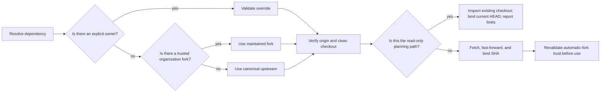

# Required repository resolution

Apply the [ASD-STE100 technical-English policy](../skills/TECHNICAL_ENGLISH.md) to all English technical prose
in this document.

**Why:** Athena must use trusted and current knowledge and automation. It must not use a repository
only because it has a similar name. It must not use a stale checkout or an unverified remote.

## At a glance

During normal resolution, Athena does these steps:

1. It resolves a trusted owner.
2. It synchronizes an exact checkout.
3. It binds use to the reported revision.

A trust, authentication, checkout, or update failure stops the dependent skill.

In planning mode, an explicit read-only path can use an existing checkout as a best-effort source.
This path does not synchronize with the upstream repository. It must do these actions:

- bind use to the current `HEAD`;
- report the current `HEAD`;
- report the freshness and trust limits;
- never substitute a different repository; and
- never make a durable write.

A skill can impose stricter requirements. The `learn` skill requires a usable checkout before it
starts discovery or writes a lesson. In planning mode, its discovery path does not create a checkout.



## Component details

### Owner selection

For dependency `<Repository>` with environment override `<OWNER_VARIABLE>`, use these steps:

1. If `<OWNER_VARIABLE>` is not empty, select `<value>/<Repository>`.

   - Before you use the owner in a path or command, validate it as a GitHub owner name.
   - If the explicit override is not valid, report an error.
   - If the explicit override is not valid, stop.
   - If the explicit override is not valid, do not use a fallback.
   - The owner name must meet these requirements:

     - It contains 1 through 39 characters.
     - It contains only ASCII letters, digits, or single hyphens.
     - It does not start or end with a hyphen.

2. If `<OWNER_VARIABLE>` is empty, get the current repository owner with this command:

   ```bash
   gh repo view --json owner --jq .owner.login
   ```

   Use `<current-owner>/<Repository>` only when all these automatic-fork trust gates pass:

   - The `owner.type` of the current repository is `Organization` and not `User`.
   - The `viewerPermission` of the authenticated viewer on the current repository is `WRITE` (push),
     `MAINTAIN`, or `ADMIN`.
   - GitHub confirms that the candidate is a fork. Its `parent.full_name` must be
     `HomericIntelligence/<Repository>`.
   - Athena can resolve and report the candidate repository and the tip SHA of its remote default
     branch.

3. If no trusted override or automatic fork applies, use `HomericIntelligence/<Repository>`.

Do not automatically select a repository with the same name in these conditions:

- The owner of the current repository is a user.
- The viewer has read, triage, or no permission.
- Athena cannot prove canonical ancestry.

Use repository metadata to make the fork decision. Do not use only the repository name:

```bash
current_owner=$(gh repo view --json owner --jq '.owner.login')
gh api "repos/${current_owner}/<Repository>" \
  --jq '.fork == true and .parent.full_name == "HomericIntelligence/<Repository>"'
```

Only the literal result `true` passes the ancestry check. Use structured application programming
interface (API) output. Quote each derived value. Resolve these values:

- the `owner.type` of the current repository;
- the `viewerPermission` of the authenticated viewer;
- the `.default_branch` of the candidate; and
- the exact tip `.sha` of that branch.

The fork can contain modified content after all automatic trust gates pass. If the same-owner
candidate is missing or not eligible, use the canonical upstream repository. If an API or
authentication error prevents a trustworthy decision, treat the error as fatal and stop.

An explicit owner override is an explicit trust decision. It can select custom fork content without
the organization and viewer-permission gate. Before you use a resolved dependency, report this
information:

- the exact repository;
- the commit SHA; and
- the trust basis: `explicit override`, `maintained organization fork`, or `canonical upstream`.

### Dependency map

| Purpose | Repository | Override | Checkout |
| --- | --- | --- | --- |
| Knowledge | `Mnemosyne` | `HOMERIC_INTELLIGENCE_MNEMOSYNE_OWNER` | `$HOME/.agent_brain/knowledge` |
| Automation | `Hephaestus` | `HOMERIC_INTELLIGENCE_HEPHAESTUS_OWNER` | `$HOME/.agent_brain/automation` |

### Checkout and revalidation

Normal resolution requires these capabilities:

- authenticated GitHub CLI (`gh`);
- `git`; and
- network access.

Create `$HOME/.agent_brain` when it is necessary. If the checkout is absent, clone the resolved
repository. For an existing checkout, do these checks and actions:

- Require `origin` to identify the resolved `owner/repository`.
- Do not overwrite local changes or silently change the remote.
- Fetch `origin`.
- Resolve the default branch of `origin`.
- Fast-forward that branch.
- Report the resolved repository and commit SHA.

For an automatically selected same-owner fork, repeat the trust checks immediately before use. Do
this before you read knowledge or execute automation. Re-query these values:

- the Organization owner of the current repository;
- the permission of the viewer;
- the `parent.full_name` of the candidate;
- the resolved repository identity;
- the default branch; and
- the tip SHA.

Require these values to agree with the reported trust decision. Require the checked-out commit to
agree with the re-queried tip SHA. Stop if a value does not agree. This check closes the race between
resolution and use.

### Read-only local best effort

Use this exception only for a read-only planning path or a `learn` discovery path. The path can
inspect an existing checkout. It can bind use to the current `HEAD` without these actions:

- clone;
- fetch;
- fast-forward; or
- revalidation of an automatic fork.

Report this information:

- the checkout;
- the revision;
- the trust basis or trust uncertainty; and
- the freshness limit.

If the checkout is missing or inspection fails, stop the dependent knowledge retrieval. The caller
can continue its primary plan only when its skill contract permits planning without guidance. The
`learn` skill does not permit this fallback. It blocks without an existing usable checkout.

For normal execution and the `learn` delivery boundary, these conditions are fatal:

- an authentication failure;
- a missing repository;
- a fork relationship that is not valid;
- an unexpected `origin`;
- conflicting local state;
- a clone failure;
- a fetch failure; or
- a fast-forward failure.

The read-only local exception never permits pull-request creation before upstream synchronization.

Mnemosyne writes use isolated worktrees and always end in a pull request. Athena reads or executes
Hephaestus from its canonical checkout. Athena never edits Hephaestus unless the user explicitly asks
for a Hephaestus change.
