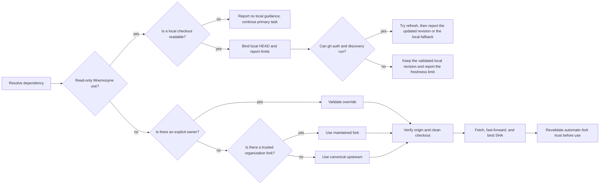

# Repository resolution

Apply the [ASD-STE100 technical-English policy](../skills/TECHNICAL_ENGLISH.md) to all English technical prose
in this document.

**Why:** Athena must use trusted and current repositories when it changes Mnemosyne or executes
Hephaestus. Read-only knowledge can use a validated local checkout and then try a best-effort
refresh. Athena must not report an unverified remote or stale checkout as current.

## At a glance

During normal resolution for a write or automation execution, Athena does these steps:

1. It resolves a trusted owner.
2. It synchronizes an exact checkout.
3. It binds use to the reported revision.

Recover trust, authentication, checkout, and update failures under the
[autonomous workflow policy](policies/autonomous-workflows.md). Withhold only actions that still
require an unresolved identity or authority. Continue safe local preparation.

All read-only Mnemosyne paths validate the local checkout first. If `gh`, authentication, and
network access are available, Athena then tries a best-effort refresh. If the refresh cannot run
or fails, Athena keeps the validated local checkout and reports the freshness limit. This path
must do these actions:

- bind use to the current `HEAD`;
- report the current `HEAD` or the refreshed revision;
- report the freshness and trust limits;
- never substitute a different repository; and
- distinguish safe local preparation from verified remote publication.

If local knowledge is unavailable, stop only knowledge retrieval. Continue the primary task. The
`learn` skill can classify and prepare a candidate. Complete required duplicate and target checks
before remote publication; report pending checks accurately.



## Component details

### Owner selection

For a route that needs normal resolution of dependency `<Repository>` with environment override
`<OWNER_VARIABLE>`, use these steps:

1. If `<OWNER_VARIABLE>` is not empty, select `<value>/<Repository>`.

   - Before you use the owner in a path or command, validate it as a GitHub owner name.
   - If the explicit override is not valid, report an error.
   - If the explicit override is not valid, stop.
   - If the explicit override is not valid, do not use a fallback.
   - The owner name must meet these requirements:

     - It contains 1 through 39 characters.
     - It contains only ASCII letters, digits, or single hyphens.
     - It does not start or end with a hyphen.

2. If `<OWNER_VARIABLE>` is empty, get the current repository owner with this command:

   ```bash
   gh repo view --json owner --jq .owner.login
   ```

   Use `<current-owner>/<Repository>` only when all these automatic-fork trust gates pass:

   - The `owner.type` of the current repository is `Organization` and not `User`.
   - The `viewerPermission` of the authenticated viewer on the current repository is `WRITE` (push),
     `MAINTAIN`, or `ADMIN`.
   - GitHub confirms that the candidate is a fork. Its `parent.full_name` must be
     `HomericIntelligence/<Repository>`.
   - Athena can resolve and report the candidate repository and the tip SHA of its remote default
     branch.

3. If no trusted override or automatic fork applies, use `HomericIntelligence/<Repository>`.

Do not automatically select a repository with the same name in these conditions:

- The owner of the current repository is a user.
- The viewer has read, triage, or no permission.
- Athena cannot prove canonical ancestry.

Use repository metadata to make the fork decision. Do not use only the repository name:

```bash
current_owner=$(gh repo view --json owner --jq '.owner.login')
gh api "repos/${current_owner}/<Repository>" \
  --jq '.fork == true and .parent.full_name == "HomericIntelligence/<Repository>"'
```

Only the literal result `true` passes the ancestry check. Use structured application programming
interface (API) output. Quote each derived value. Resolve these values:

- the `owner.type` of the current repository;
- the `viewerPermission` of the authenticated viewer;
- the `.default_branch` of the candidate; and
- the exact tip `.sha` of that branch.

The fork can contain modified content after all automatic trust gates pass. If the same-owner
candidate is missing or not eligible, use the canonical upstream repository. If an API or
authentication error prevents fork verification, retain the canonical identity or an explicit
verified override. Continue local preparation with the identity and freshness limits recorded.
Do not execute an unverified dependency.

An explicit owner override is an explicit trust decision. It can select custom fork content without
the organization and viewer-permission gate. Before you use a resolved dependency, report this
information:

- the exact repository;
- the commit SHA; and
- the trust basis: `explicit override`, `maintained organization fork`, or `canonical upstream`.

### Dependency map

| Purpose | Repository | Override | Checkout |
| --- | --- | --- | --- |
| Knowledge | `Mnemosyne` | `HOMERIC_INTELLIGENCE_MNEMOSYNE_OWNER` | `$HOME/.agent_brain/knowledge` |
| Automation | `Hephaestus` | `HOMERIC_INTELLIGENCE_HEPHAESTUS_OWNER` | `$HOME/.agent_brain/automation` |

### Checkout and revalidation

Normal resolution applies to Mnemosyne delivery and Hephaestus execution. It requires these
capabilities:

- authenticated GitHub CLI (`gh`);
- `git`; and
- network access.

Preserve existing checkouts, including those at legacy locations. Create new or additional clones
under the primary project’s ignored `.worktrees/` directory. If an existing checkout has an
unexpected origin or conflicting local state, preserve it and prepare the expected repository
separately. For the selected checkout, do these checks and actions:

- Require `origin` to identify the resolved `owner/repository`.
- Do not overwrite local changes or silently change the remote.
- Fetch `origin`.
- Resolve the default branch of `origin`.
- Fast-forward only when this preserves local work; otherwise use an isolated checkout.
- Report the resolved repository and commit SHA.

For an automatically selected same-owner fork, repeat the trust checks immediately before use. Do
this before you write knowledge or execute automation. Re-query these values:

- the Organization owner of the current repository;
- the permission of the viewer;
- the `parent.full_name` of the candidate;
- the resolved repository identity;
- the default branch; and
- the tip SHA.

Require these values to agree with the reported trust decision. Require the checked-out commit to
agree with the recorded source. If identity changed, resolve it again before dependent use. If
only source content changed, refresh affected evidence. Remote target movement alone does not
invalidate a previously bound feature branch.

### Read-only knowledge access

Use this path for all read-only Mnemosyne retrieval. Inspect the existing checkout first. Bind use
to the current `HEAD`. If `gh`, authentication, and network access are available, try a refresh. If
the refresh cannot run or fails, keep the validated local checkout and report the freshness limit.

Do not require the local checkout to have the newest Mnemosyne revision. Do not require its
revision to agree with the installed Athena revision. The installed skill supplies its own
retrieval contract.

Report this information:

- the checkout;
- the revision;
- the trust basis or trust uncertainty; and
- the freshness limit.

If the checkout is missing or inspection fails, report unavailable knowledge and continue the primary
task. Attempt scoped helper recovery. For delivery, prepare safe local changes from available
verified source and record pending freshness, duplicate, or authority checks.

Authentication, fetch, clone, or fast-forward failures are recovery inputs, not whole-task stops.
Preserve unexpected repositories and conflicting local work. Never silently retarget a checkout.
Withhold dependency execution if its identity or necessary execution contract cannot be established.
When network access remains unavailable, provide exact validation, push, and PR-publication commands.
A prepared local lesson is not a claim of remote delivery.

Mnemosyne changes use isolated worktrees and target pull-request delivery. If publication is
unavailable, preserve the prepared change and provide exact manual commands. Athena reads or executes
Hephaestus from its canonical checkout. Athena never edits Hephaestus unless the user explicitly asks
for a Hephaestus change.
