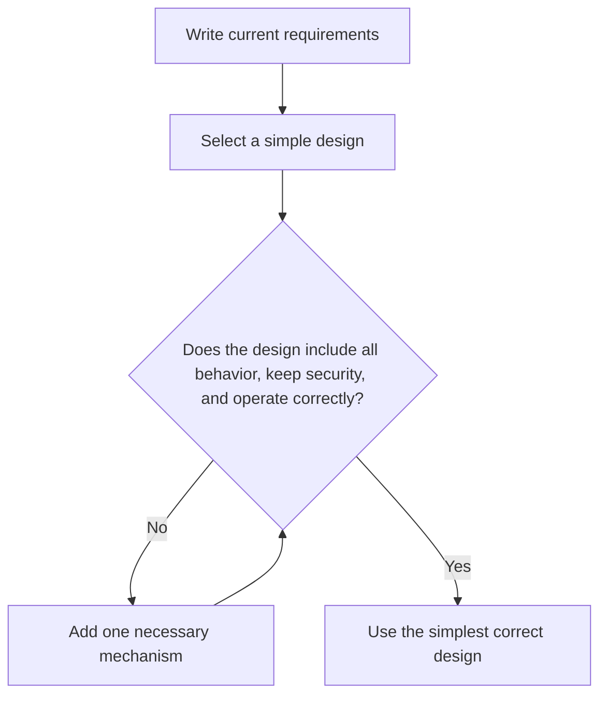

# P001 — KISS

## Definition

For **KISS** (also *Keep It Simple, Stupid*), a design must have only the minimum complexity
necessary to obey specified requirements. Indirection, abstraction, configuration, concurrency,
infrastructure, and process have costs. Each element must give clear value.

## Provenance

**Classification:** practitioner heuristic.

Many sources connect the phrase to aircraft engineer Kelly Johnson. No source from the same time
shows the wording or attribution. The idea was in engineering before software. Athena puts KISS in the
practitioner-heuristic category because no evidence shows one author.

## Decision rule

Select the simplest design that obeys current requirements. The design must be correct and keep
security. It must operate correctly for all necessary behavior. For each more complex design, find the
requirement or measured constraint that makes its complexity necessary.

## How to apply

- Start with the shortest path from input to the necessary outcome.
- Count concepts and duties in operation, not only lines of code.
- Use current language and repository mechanisms. Do not use a custom framework without a requirement.
- Remove layers that only send data or policy without a boundary that gives value.
- After tests show the behavioral cases, examine simplicity again.

## Diagram



## Language examples

The two examples use one simple branch for all parts of the requirement.

```python
def status_label(active: bool) -> str:
    if active:
        return "active"
    return "inactive"
```

```rust
fn status_label(active: bool) -> &'static str {
    if active {
        "active"
    } else {
        "inactive"
    }
}
```

## Boundaries and tensions

Simplicity does not mean short or temporarily easy. A simple design can be new to personnel. A short implementation can hide state,
remove validation, decrease the protection from validation, decrease validation coverage, or move
complexity to callers. Such an implementation does not decrease system
complexity. Necessary compatibility, security, reliability, and explicit contracts are more important than
KISS.

[P002 YAGNI](p002-yagni.md) and
[P007 Subtraction Over Addition](p007-subtraction-over-addition.md) give related rules for KISS.
[P008 Understand Before Subtracting](p008-understand-before-subtracting.md) prevents deletion
without sufficient evidence.

## Examples

**Positive:** A command with two specified modes uses a small explicit branch and does not use a plug-in
framework. The only consumers of such a framework are those modes.

**Misuse:** A contributor removes validation and error context. The function becomes shorter, but
failure semantics move to each caller.

**Athena/agent workflow:** An agent selects the narrow documentation edit and current validation
commands. The agent does not add a generator or registry only for the edit.

## Related principles

- [P002 YAGNI](p002-yagni.md)
- [P007 Subtraction Over Addition](p007-subtraction-over-addition.md)
- [P011 Minimal Coherent Change](p011-minimal-coherent-change.md)
- [P074 Prefer Existing Mechanisms](p074-prefer-existing-mechanisms.md)
- [P090 Prefer Negative Code](p090-prefer-negative-code.md)

## References

### Source information

- No source from the same time shows the phrase or its Kelly Johnson attribution.
  Athena records that this attribution is unknown.
- [PEP 20 — The Zen of Python](https://peps.python.org/pep-0020/) is a primary language-design
  source that shows simple designs are better than complex designs.

### Applicable information

- [Google Engineering Practices: What to look for in a code review](https://google.github.io/eng-practices/review/reviewer/looking-for.html)
  tells reviewers to find complexity that is not necessary and select clear code.

### More information

- [Google Engineering Practices: Small CLs](https://google.github.io/eng-practices/review/developer/small-cls.html)
  shows that narrow changes make review easier and decrease risk.

[Back to the engineering principles catalog](../README.md#p001)
