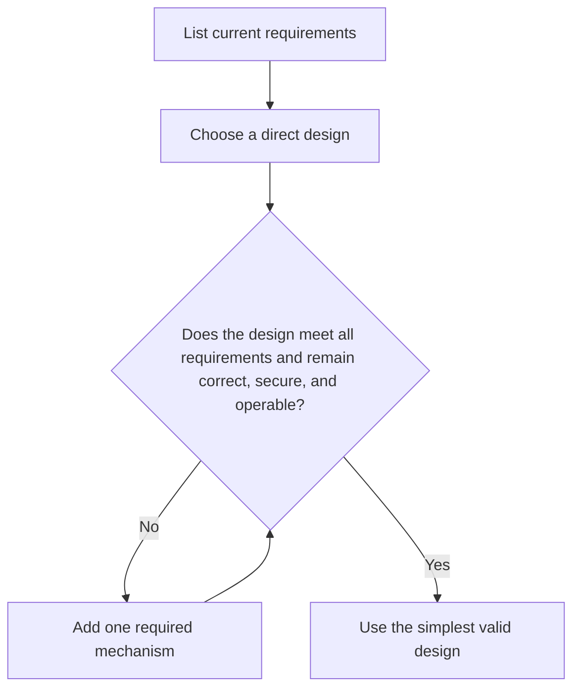

# P001 — KISS

## Definition

**KISS** (commonly expanded as *Keep It Simple, Stupid*) requires the least complexity that
satisfies demonstrated requirements. Indirection, abstraction, configuration, concurrency,
infrastructure, and process have costs. Each element must provide clear value.

## Provenance

**Classification:** practitioner heuristic.

Many sources associate the phrase with aircraft engineer Kelly Johnson. No definitive contemporary
source confirms the exact words or attribution. The broader idea predates software. Athena
therefore treats KISS as a common heuristic with no verified single author.

## Decision rule

Choose the simplest design that meets current requirements. The design must remain correct, secure,
and operable for all required behavior. For each more complex design, identify the requirement or
measured constraint that requires the extra mechanism.

## How to apply

- Start with the direct path from input to required outcome.
- Count concepts and operational duties, not only lines of code.
- Prefer existing language and repository mechanisms over custom frameworks.
- Remove layers that only relay data or policy without a useful boundary.
- Reassess simplicity after tests expose the real behavioral cases.

## Diagram



## Language examples

The two examples use one direct branch for the full requirement.

```python
def status_label(active: bool) -> str:
    if active:
        return "active"
    return "inactive"
```

```rust
fn status_label(active: bool) -> &'static str {
    if active {
        "active"
    } else {
        "inactive"
    }
}
```

## Boundaries and tensions

Simple does not mean short, familiar, or expedient. A compact implementation can hide state,
weaken validation, or transfer complexity to callers. Such an implementation does not simplify the
system. Required compatibility, security, reliability, and explicit contracts take priority over
KISS. [P002 YAGNI](p002-yagni.md) and
[P007 Subtraction Over Addition](p007-subtraction-over-addition.md) support KISS.
[P008 Understand Before Subtracting](p008-understand-before-subtracting.md) prevents careless
deletion.

## Examples

**Positive:** A command with two fixed modes uses a small explicit branch instead of a plug-in
framework whose only consumers are those modes.

**Misuse:** A contributor removes validation and error context. The function becomes shorter, but
each caller must reconstruct its failure semantics.

**Athena/agent workflow:** An agent proposes the narrow documentation edit and current validation
commands. The agent does not add a generator or registry only to manage the edit.

## Related principles

- [P002 YAGNI](p002-yagni.md)
- [P007 Subtraction Over Addition](p007-subtraction-over-addition.md)
- [P011 Minimal Coherent Change](p011-minimal-coherent-change.md)
- [P074 Prefer Existing Mechanisms](p074-prefer-existing-mechanisms.md)
- [P090 Prefer Negative Code](p090-prefer-negative-code.md)

## References

### Origin/history

- No definitive contemporary source confirms the exact phrase or its Kelly Johnson attribution.
  Athena records the common attribution as uncertain.
- [PEP 20 — The Zen of Python](https://peps.python.org/pep-0020/) is a primary language-design
  source for the related preference for simple designs over complex designs.

### Current guidance

- [Google Engineering Practices: What to look for in a code review](https://google.github.io/eng-practices/review/reviewer/looking-for.html)
  tells reviewers to challenge unnecessary complexity and prefer clear code.

### Further reading

- [Google Engineering Practices: Small CLs](https://google.github.io/eng-practices/review/developer/small-cls.html)
  explains how narrow changes improve review quality and reduce risk.

[Back to the engineering principles catalog](../README.md#p001)
