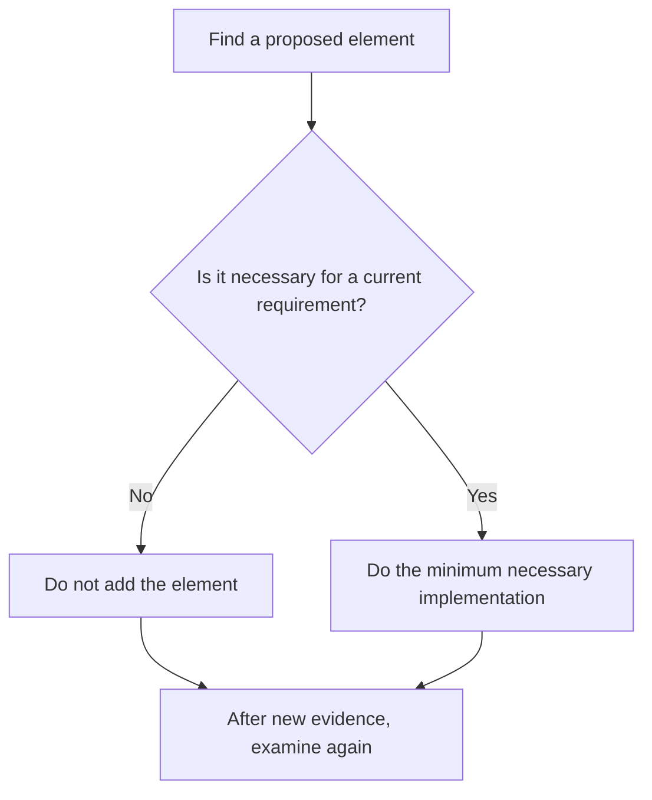

# P002 — YAGNI

## Definition

**YAGNI** (*You Aren't Going to Need It* or *You Ain't Gonna Need It*) does not let authors add elements
with no current requirement. These elements include functionality, extension points,
configuration, abstraction, and infrastructure. Do only the work that evidence shows is necessary
for the current requirement. Keep paths for change.

## Provenance

**Classification:** established principle.

Extreme Programming is the source of YAGNI. Martin Fowler gives Chet Hendrickson as the
source of the phrase after a conversation with Kent Beck. Sources give different expansions. Each expansion
gives the principle the same meaning.

## Decision rule

If a proposed element is only for a future condition with no evidence, do not add it. Add the element
for an accepted requirement, a condition that occurs more than one time, or a measured constraint.

## How to apply

- Keep current acceptance criteria isolated from future requests with no evidence.
- Delete flags, hooks, providers, compatibility paths, and configuration that have no current requirement.
- Use clear contracts and tests to make future change easy. Do not add extension points with no purpose.
- When plan information has value and has an owner or trigger, record an idea for future work.
- When evidence changes, examine the decision again.

## Diagram



## Language examples

The two examples contain only the necessary delivery modes.

```python
def shipping_cost(express: bool) -> int:
    if express:
        return 20
    return 5
```

```rust
fn shipping_cost(express: bool) -> u32 {
    if express {
        20
    } else {
        5
    }
}
```

## Boundaries and tensions

YAGNI does not let authors ignore explicit quality requirements, specified migrations, security
controls, or protocol duties in the current scope. It rejects implementation with no evidence, not
design necessary for the current requirement. [P004 SOLID](p004-solid.md) and
[P005 Modularity](p005-modularity.md) can make a boundary necessary for a current requirement. They do
not make a framework necessary when it has no current purpose.
[P013 AHA](p013-avoid-hasty-abstractions.md) gives the related rule for abstraction time.

## Examples

**Positive:** A service uses the current repository interface for the one necessary authentication
provider. It does not add a provider marketplace until approval of a second provider.

**Misuse:** Although an alternative is necessary for a deployment requirement, a contributor does
not add a configuration option for the value. This decision does not agree with the requirement.

**Athena/agent workflow:** Evidence must show a product consumer for each artifact in a plan. The plan
does not add a changelog, generator, registry, or compatibility layer for unknown requests.

## Related principles

- [P001 KISS](p001-kiss.md)
- [P010 Scope Fidelity](p010-scope-fidelity.md)
- [P013 AHA](p013-avoid-hasty-abstractions.md)
- [P073 Optimize Only With Evidence](p073-optimize-only-with-evidence.md)

## References

### Source information

- [Martin Fowler: Yagni](https://martinfowler.com/bliki/Yagni.html) gives Extreme Programming and Chet
  Hendrickson as sources of the term. It also shows the economic basis.
- [Extreme Programming Explained, second edition](https://www.pearson.com/en-us/subject-catalog/p/extreme-programming-explained-embrace-change/P200000000118/9780321278654)
  is the publisher's record for the Extreme Programming book from Kent Beck and Cynthia Andres.

### Applicable information

- [Google Engineering Practices: What to look for in a code review](https://google.github.io/eng-practices/review/reviewer/looking-for.html)
  tells reviewers to reject functionality with no current requirement.

### More information

- [Martin Fowler: Design Stamina Hypothesis](https://martinfowler.com/bliki/DesignStaminaHypothesis.html)
  gives information about design work that has value without features that have no current requirement.

[Back to the engineering principles catalog](../README.md#p002)
