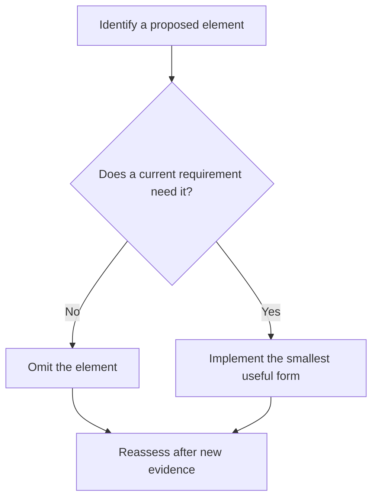

# P002 — YAGNI

## Definition

**YAGNI** (*You Aren't Going to Need It*, also rendered *You Ain't Gonna Need It*) rejects elements
with no concrete requirement. These elements include functionality, extension points,
configuration, abstraction, and infrastructure. Implement the verified current need and preserve
ordinary change paths.

## Provenance

**Classification:** established principle.

YAGNI originated in Extreme Programming. Martin Fowler reports a conversation between Kent Beck and
Chet Hendrickson as the source of the phrase. Sources use different colloquial expansions, but they
give the principle a consistent meaning.

## Decision rule

If a proposed element serves only a hypothetical future case, omit it. Add the element when an
accepted requirement, observed repeated case, or measured constraint makes its value concrete.

## How to apply

- Separate current acceptance criteria from imagined future requests.
- Delete speculative flags, hooks, providers, compatibility paths, and configuration.
- Use clear contracts and tests to make future change easy. Do not add unused flexibility.
- Record a deferred idea only when it is useful plan information with an owner or trigger.
- Revisit the decision when evidence changes.

## Diagram



## Language examples

The two examples implement only the required delivery modes.

```python
def shipping_cost(express: bool) -> int:
    if express:
        return 20
    return 5
```

```rust
fn shipping_cost(express: bool) -> u32 {
    if express {
        20
    } else {
        5
    }
}
```

## Boundaries and tensions

YAGNI does not excuse neglect of explicit quality requirements, known migrations, security
controls, or protocol duties within the current scope. It rejects speculative implementation, not
prudent design. [P004 SOLID](p004-solid.md) and [P005 Modularity](p005-modularity.md) can justify a
boundary that has a current need. They do not justify an unused framework.
[P013 AHA](p013-avoid-hasty-abstractions.md) gives the related rule for abstraction time.

## Examples

**Positive:** A service implements the one required authentication provider behind the existing
repository interface. It defers a provider marketplace until approval of another provider.

**Misuse:** A contributor refuses to make a value configurable, although a deployment requirement
requires that option. This decision leaves the requirement unmet.

**Athena/agent workflow:** A plan names only artifacts with demonstrated product consumers. It does
not add a changelog, generator, registry, or compatibility layer for unknown requests.

## Related principles

- [P001 KISS](p001-kiss.md)
- [P010 Scope Fidelity](p010-scope-fidelity.md)
- [P013 AHA](p013-avoid-hasty-abstractions.md)
- [P073 Optimize Only With Evidence](p073-optimize-only-with-evidence.md)

## References

### Origin/history

- [Martin Fowler: Yagni](https://martinfowler.com/bliki/Yagni.html) traces the term to Extreme
  Programming and explains its economic basis.
- [Extreme Programming Explained, second edition](https://www.pearson.com/en-us/subject-catalog/p/extreme-programming-explained-embrace-change/P200000000118/9780321278654)
  is the publisher's record for Kent Beck and Cynthia Andres's foundational Extreme Programming
  text.

### Current guidance

- [Google Engineering Practices: What to look for in a code review](https://google.github.io/eng-practices/review/reviewer/looking-for.html)
  tells reviewers to reject functionality with no current need.

### Further reading

- [Martin Fowler: Design Stamina Hypothesis](https://martinfowler.com/bliki/DesignStaminaHypothesis.html)
  discusses when design effort repays its cost without speculative features.

[Back to the engineering principles catalog](../README.md#p002)
