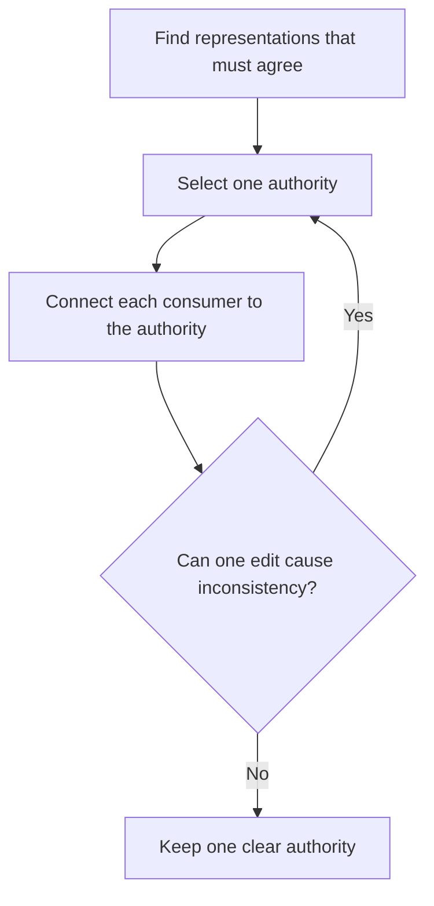

# P003 — DRY

## Definition

**DRY** (*Don't Repeat Yourself*) gives each authoritative item of knowledge one canonical
representation. DRY is for duplicate rules, schemas, calculations, and policies. It is not for
each syntax sequence that occurs more than one time.

## Provenance

**Classification:** established principle.

Andrew Hunt and David Thomas gave DRY its name and definition in *The Pragmatic Programmer*. Their definition
is about duplicate knowledge in a system. Some authors do not keep this distinction and
include all code that has almost the same text in DRY.

## Decision rule

When two representations must change together, select one authority. Derive the other representations
from that authority. Connect each other representation to that authority with a derived form or a
link. When code has only text that is almost the same, do not put it together.

## How to apply

- Find the fact or rule that must stay the same after one isolated edit.
- Give one owner.
- Connect each consumer to that authority with derivation or reference.
- When different formats are necessary for consumers, use links and derived views. Do not use
  manual copies.
- When the same text does not show the same stable concept, do not put the logic together.
- Do a test of the canonical behavior. Do not write one test for each text representation.

## Diagram



## Language examples

The two examples accept cents in the unsigned 64-bit domain. Each example uses one 20-percent
tax-rate authority and rounds half up to the nearest cent.

```python
TAX_BPS = 2_000
BASIS_POINTS = 10_000

def tax_cents(subtotal_cents: int) -> int:
    if type(subtotal_cents) is not int:
        raise TypeError("subtotal must be an integer")
    if not 0 <= subtotal_cents <= 2**64 - 1:
        raise ValueError("subtotal is not in the unsigned 64-bit domain")
    return (subtotal_cents * TAX_BPS + BASIS_POINTS // 2) // BASIS_POINTS

def total_cents(subtotal_cents: int) -> int:
    return subtotal_cents + tax_cents(subtotal_cents)
```

```rust
const TAX_BPS: u128 = 2_000;
const BASIS_POINTS: u128 = 10_000;

fn tax_cents(subtotal_cents: u64) -> u128 {
    let subtotal = u128::from(subtotal_cents);
    (subtotal * TAX_BPS + BASIS_POINTS / 2) / BASIS_POINTS
}

fn total_cents(subtotal_cents: u64) -> u128 {
    u128::from(subtotal_cents) + tax_cents(subtotal_cents)
}
```

## Boundaries and tensions

Some duplication can help local analysis or keep unrelated domains isolated. Centralization
before sufficient evidence can make an incorrect abstraction and tighter coupling. Before you
extract shared code, use [P013 AHA](p013-avoid-hasty-abstractions.md). Before you add shared mutable
state, use [P005 Modularity](p005-modularity.md). A registry or generator is not
necessary for DRY when repository discovery supplies the answer. Evidence for a product consumer
must show that each artifact is necessary.

## Examples

**Positive:** One schema is the authority. API documentation and validators derive from it or have links to it.
They do not use a manual restatement of field constraints.

**Misuse:** Two domain workflows contain the same three steps. A generic engine puts them together,
although their policies and causes of change are different.

**Athena/agent workflow:** The principles catalog has authority for IDs and definitions. Skills have links to the
applicable principles and show only the workflow effects of those principles.

## Related principles

- [P005 Modularity](p005-modularity.md)
- [P013 AHA](p013-avoid-hasty-abstractions.md)
- [P074 Prefer Existing Mechanisms](p074-prefer-existing-mechanisms.md)
- [P078 Single Source of Truth](p078-single-source-of-truth.md)
- [P084 Prefer Local Reasoning](p084-prefer-local-reasoning.md)

## References

### Source information

- [The Pragmatic Programmer DRY excerpt](https://media.pragprog.com/titles/tpp20/dry.pdf) gives
  the authors' definition and examples of duplicate knowledge.
- [The Pragmatic Programmer, 20th Anniversary Edition](https://pragprog.com/titles/tpp20/the-pragmatic-programmer-20th-anniversary-edition/)
  is the publisher's current book record.

### Applicable information

- [Google Engineering Practices: What to look for in a code review](https://google.github.io/eng-practices/review/reviewer/looking-for.html).
  The guidance tells reviewers to find if a change belongs in the codebase or a library. It
  also tells reviewers to find complexity that is not necessary.

### More information

- [Sandi Metz: The Wrong Abstraction](https://sandimetz.com/blog/2016/1/20/the-wrong-abstraction)
  shows that duplicate removal before sufficient evidence can have more cost than a temporary duplicate.

[Back to the engineering principles catalog](../README.md#p003)
