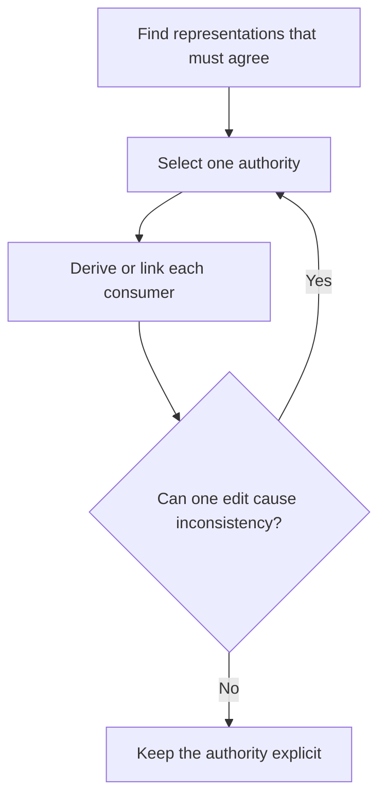

# P003 — DRY

## Definition

**DRY** (*Don't Repeat Yourself*) gives each authoritative item of knowledge one canonical
representation. DRY applies to duplicate rules, schemas, calculations, and policies. It does not
apply to every repeated syntax sequence.

## Provenance

**Classification:** established principle.

Andrew Hunt and David Thomas named and defined DRY in *The Pragmatic Programmer*. Their definition
focuses on duplicate knowledge in a system. Some interpretations lose this distinction and apply
DRY only to similar code.

## Decision rule

When two representations must change together, select one authority. Derive, reuse, or link the
other representations from that authority. Do not unify code only because its current text looks
similar.

## How to apply

- Identify the fact or rule that one isolated edit could make inconsistent.
- Assign one owner and make consumers depend on or derive from that authority.
- Prefer links and derived views over manual copies when consumers need separate representations.
- Keep coincidentally similar logic separate until it represents the same stable concept.
- Test the canonical behavior. Do not make tests depend on every text form.

## Diagram



## Language examples

The two examples accept cents in the unsigned 64-bit domain. Each example uses one 20-percent
tax-rate authority and rounds half up to the nearest cent.

```python
TAX_BPS = 2_000
BASIS_POINTS = 10_000

def tax_cents(subtotal_cents: int) -> int:
    if type(subtotal_cents) is not int:
        raise TypeError("subtotal must be an integer")
    if not 0 <= subtotal_cents <= 2**64 - 1:
        raise ValueError("subtotal is outside the unsigned 64-bit domain")
    return (subtotal_cents * TAX_BPS + BASIS_POINTS // 2) // BASIS_POINTS

def total_cents(subtotal_cents: int) -> int:
    return subtotal_cents + tax_cents(subtotal_cents)
```

```rust
const TAX_BPS: u128 = 2_000;
const BASIS_POINTS: u128 = 10_000;

fn tax_cents(subtotal_cents: u64) -> u128 {
    let subtotal = u128::from(subtotal_cents);
    (subtotal * TAX_BPS + BASIS_POINTS / 2) / BASIS_POINTS
}

fn total_cents(subtotal_cents: u64) -> u128 {
    u128::from(subtotal_cents) + tax_cents(subtotal_cents)
}
```

## Boundaries and tensions

Some duplication supports local analysis or keeps unrelated domains independent. Premature
centralization can create a false abstraction and tighter coupling. Apply
[P013 AHA](p013-avoid-hasty-abstractions.md) before shared code extraction. Apply
[P005 Modularity](p005-modularity.md) before shared mutable state. DRY does not require a registry
or generator when ordinary discovery supplies the answer. A product consumer must justify each
artifact.

## Examples

**Positive:** A schema is canonical. API documentation and validators derive from it or link to it
instead of manual restatement of field constraints.

**Misuse:** Two domain workflows contain the same three steps. A generic engine combines them,
although their policies and reasons for change differ.

**Athena/agent workflow:** The principles catalog owns IDs and definitions. Skills link the
relevant principles and explain only the workflow effects of those principles.

## Related principles

- [P005 Modularity](p005-modularity.md)
- [P013 AHA](p013-avoid-hasty-abstractions.md)
- [P074 Prefer Existing Mechanisms](p074-prefer-existing-mechanisms.md)
- [P078 Single Source of Truth](p078-single-source-of-truth.md)
- [P084 Prefer Local Reasoning](p084-prefer-local-reasoning.md)

## References

### Origin/history

- [The Pragmatic Programmer DRY excerpt](https://media.pragprog.com/titles/tpp20/dry.pdf) provides
  the authors' definition and examples of duplicate knowledge.
- [The Pragmatic Programmer, 20th Anniversary Edition](https://pragprog.com/titles/tpp20/the-pragmatic-programmer-20th-anniversary-edition/)
  is the publisher's current book record.

### Current guidance

- [Google Engineering Practices: What to look for in a code review](https://google.github.io/eng-practices/review/reviewer/looking-for.html)
  asks whether a change belongs in the codebase or a library. It also directs reviewers to identify
  excess complexity.

### Further reading

- [Sandi Metz: The Wrong Abstraction](https://sandimetz.com/blog/2016/1/20/the-wrong-abstraction)
  explains why early duplicate removal can cost more than temporary retention.

[Back to the engineering principles catalog](../README.md#p003)
