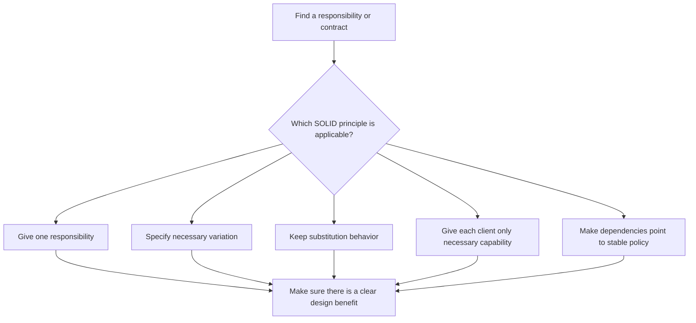

# P004 — SOLID

## Definition

**SOLID** is a family of five object-oriented design principles. The family contains Single
Responsibility, Open/Closed, Liskov Substitution, Interface Segregation, and Dependency Inversion.
Use these principles to give clear responsibilities. Make dependencies agree with stable behavioral
contracts. Classes and interfaces are not necessary for SOLID.

### The five principles

#### Single Responsibility Principle (SRP)

A module or component must have one primary responsibility and one cause of change.
Responsibility is about policy ownership, not the number of functions or lines in a file.

#### Open/Closed Principle (OCP)

A stable component must have a specified extension mechanism for necessary variation.
For each new variation, the mechanism must not change core policy. Abstractions for unknown
variations are not necessary for OCP.

#### Liskov Substitution Principle (LSP)

A subtype or implementation must keep the observable contract of its abstraction. This
contract includes applicable inputs, promised outputs, invariants, and failure semantics.

#### Interface Segregation Principle (ISP)

Clients must have dependencies only on capabilities that they use. Select cohesive, role-oriented
interfaces. Consumers of interfaces with many responsibilities must accept methods or permissions
with no purpose.

#### Dependency Inversion Principle (DIP)

High-level policy must have no dependency on low-level details that can change. High-level
policy and low-level details must have dependencies on a stable contract at the correct boundary.
Dependency injection is one method, not the principle.

## Provenance

**Classification:** established principle.

Robert C. Martin wrote separate papers about the five principles. One paper describes Single
Responsibility. A second paper includes the other four principles. Bertrand Meyer was the first
source for Open/Closed. Barbara Liskov and Jeannette Wing give Liskov Substitution a formal basis.

## Decision rule

When evidence shows a responsibility, variation point, or substitution contract, use an applicable
SOLID principle to make it clear. Do not add abstraction only for the SOLID name.

## How to apply

- Before you divide responsibilities, find actors, policy owners, and causes of change.
- Only when evidence shows a variation, add an extension seam for that variation.
- Before a substitution claim, give the behavioral contracts.
- Give consumers the narrowest capability surface for one role.
- Make dependencies point to stable policy. Keep system connections clear.

## Diagram



## Language examples

The two examples use signed 32-bit amounts and give invoice policy a dependency on a narrow tax contract.

```python
from collections.abc import Callable

I32_MIN, I32_MAX = -(2**31), 2**31 - 1

def invoice_total(subtotal: int, tax: Callable[[int], int]) -> int:
    if type(subtotal) is not int or not I32_MIN <= subtotal <= I32_MAX:
        raise OverflowError("amount is not in the i32 range")
    tax_value = tax(subtotal)
    if type(tax_value) is not int or not I32_MIN <= tax_value <= I32_MAX:
        raise OverflowError("amount is not in the i32 range")
    total = subtotal + tax_value
    if not I32_MIN <= total <= I32_MAX:
        raise OverflowError("amount is not in the i32 range")
    return total
```

```rust
trait Tax {
    fn for_subtotal(&self, subtotal: i32) -> i32;
}

fn invoice_total<T: Tax>(subtotal: i32, tax: &T) -> Result<i32, &'static str> {
    subtotal
        .checked_add(tax.for_subtotal(subtotal))
        .ok_or("amount is not in the i32 range")
}
```

## Boundaries and tensions

Object-oriented design is the source of SOLID. Keep its behavioral intent in functional,
data-oriented, or procedural systems. If evidence shows no requirement for an interface, class, or
dependency injection mechanism, that addition does not obey [P001 KISS](p001-kiss.md),
[P002 YAGNI](p002-yagni.md), and [P013 AHA](p013-avoid-hasty-abstractions.md). Current architecture and repository contracts are
more important than a SOLID interpretation with no evidence.

## Examples

**Positive:** Business policy has a dependency on a narrow storage capability. Production and test
adapters obey the same error and transaction contract.

**Misuse:** Each function receives a one-method interface, although there is only one stable
implementation. No necessary substitution makes the added indirection necessary.

**Athena/agent workflow:** A skill has responsibility for its workflow policy and uses an explicit capability boundary
to delegate execution. It records behavior for a missing capability.

## Related principles

- [P005 Modularity](p005-modularity.md)
- [P013 AHA](p013-avoid-hasty-abstractions.md)
- [P016 Separation of Concerns](p016-separation-of-concerns.md)
- [P017 High Cohesion, Low Coupling](p017-high-cohesion-low-coupling.md)
- [P018 Information Hiding](p018-information-hiding.md)
- [P019 Explicit Contracts](p019-explicit-contracts.md)

## References

### Source information

- [Robert C. Martin: The Single Responsibility Principle](https://objectmentor.com/resources/articles/srp.pdf)
  shows that responsibility is a cause of change. The paper shows that a class must have only one such
  cause.
- [Robert C. Martin: Design Principles and Design Patterns](https://objectmentor.com/resources/articles/Principles_and_Patterns.pdf)
  includes Open/Closed, Liskov Substitution, Interface Segregation, and Dependency Inversion in one
  primary paper.
- [Bertrand Meyer: Object-Oriented Software Construction](https://bertrandmeyer.com/OOSC2/)
  is the author's page for the work that is the source of the Open/Closed Principle.
- [Liskov and Wing: A Behavioral Notion of Subtyping](https://doi.org/10.1145/197320.197383)
  gives the formal basis for behavioral substitution.

### Applicable information

- [Microsoft: Architectural principles](https://learn.microsoft.com/en-us/dotnet/architecture/modern-web-apps-azure/architectural-principles)
  gives separation of concerns, explicit dependencies, single responsibility, and dependency
  inversion as application-architecture principles.

### More information

- [Bertrand Meyer: Applying Design by Contract](https://www.kth.se/social/files/59526bfb56be5b4f17000807/meyer-92-contracts.pdf)
  gives the precondition, postcondition, and invariant model for LSP analysis.

[Back to the engineering principles catalog](../README.md#p004)
