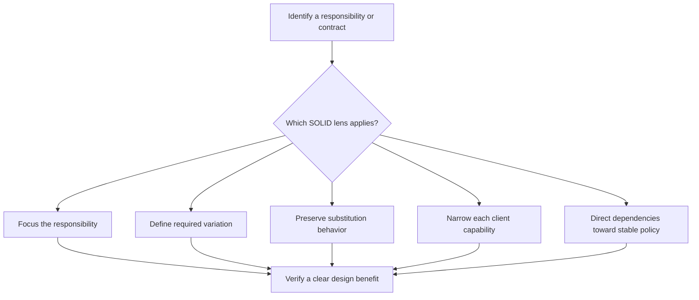

# P004 — SOLID

## Definition

**SOLID** is a family of five object-oriented design principles. The family contains Single
Responsibility, Open/Closed, Liskov Substitution, Interface Segregation, and Dependency Inversion.
Use these principles to focus responsibilities and align dependencies with stable behavioral
contracts. SOLID does not require classes or interfaces.

### The five principles

#### Single Responsibility Principle (SRP)

A module or component must have one primary responsibility and one coherent reason to change.
Responsibility is about ownership of policy, not function count or physical file size.

#### Open/Closed Principle (OCP)

A stable component must permit required variation through an intentional extension mechanism.
The mechanism must prevent repeated changes to core policy. OCP does not require forecasts or
abstractions for unknown variations.

#### Liskov Substitution Principle (LSP)

A subtype or implementation must preserve the observable contract of its abstraction. This
contract includes valid inputs, promised outputs, invariants, and failure semantics.

#### Interface Segregation Principle (ISP)

Clients must depend only on capabilities that they use. Prefer cohesive, role-oriented
interfaces. Broad interfaces force consumers to accept irrelevant methods or permissions.

#### Dependency Inversion Principle (DIP)

High-level policy must not depend directly on volatile low-level details. High-level policy and
low-level details must depend on a stable contract at the correct boundary. Dependency injection is
one technique, not the principle.

## Provenance

**Classification:** established principle.

Robert C. Martin assembled and published the five principles near 2000. Bertrand Meyer introduced
Open/Closed. Work by Barbara Liskov and Jeannette Wing gives Liskov Substitution a formal basis.

## Decision rule

Use an applicable SOLID principle when it clarifies a demonstrated responsibility, variation
point, or substitution contract. Do not add abstraction only to make a design appear SOLID.

## How to apply

- Identify real actors, policy owners, and reasons for change before responsibility separation.
- Introduce an extension seam only for an observed or required variation.
- Specify behavioral contracts before a substitution claim.
- Give consumers the narrowest coherent capability surface.
- Direct dependencies toward stable policy. Keep system connections explicit.

## Diagram



## Language examples

The two examples make invoice policy depend on a narrow tax contract.

```python
from collections.abc import Callable

def invoice_total(
    subtotal: int, tax: Callable[[int], int]
) -> int:
    return subtotal + tax(subtotal)
```

```rust
trait Tax {
    fn for_subtotal(&self, subtotal: i32) -> i32;
}

fn invoice_total<T: Tax>(subtotal: i32, tax: &T) -> i32 {
    subtotal + tax.for_subtotal(subtotal)
}
```

## Boundaries and tensions

SOLID originated in object-oriented design. Apply its behavioral intent carefully in functional,
data-oriented, or procedural systems. Excess interfaces, tiny classes, and dependency injection
mechanisms can violate [P001 KISS](p001-kiss.md), [P002 YAGNI](p002-yagni.md), and
[P013 AHA](p013-avoid-hasty-abstractions.md). Current architecture and repository contracts take
priority over a stylistic interpretation of SOLID.

## Examples

**Positive:** Business policy depends on a narrow storage capability. Production and test adapters
preserve the same error and transaction contract.

**Misuse:** Every function receives a one-method interface, although only one stable implementation
exists. No required substitution justifies the added indirection.

**Athena/agent workflow:** A skill owns its workflow policy and delegates execution through an
explicit capability boundary. It documents behavior for an absent capability.

## Related principles

- [P005 Modularity](p005-modularity.md)
- [P013 AHA](p013-avoid-hasty-abstractions.md)
- [P016 Separation of Concerns](p016-separation-of-concerns.md)
- [P017 High Cohesion, Low Coupling](p017-high-cohesion-low-coupling.md)
- [P018 Information Hiding](p018-information-hiding.md)
- [P019 Explicit Contracts](p019-explicit-contracts.md)

## References

### Origin/history

- [Robert C. Martin: The Single Responsibility Principle](https://objectmentor.com/resources/articles/srp.pdf)
  defines responsibility as a reason for change. It states that a class must have only one such
  reason.
- [Robert C. Martin: Design Principles and Design Patterns](https://objectmentor.com/resources/articles/Principles_and_Patterns.pdf)
  presents Open/Closed, Liskov Substitution, Interface Segregation, and Dependency Inversion in one
  primary paper.
- [Bertrand Meyer: Object-Oriented Software Construction](https://bertrandmeyer.com/OOSC2/)
  is the author's page for the work that introduced the Open/Closed Principle.
- [Liskov and Wing: A Behavioral Notion of Subtyping](https://doi.org/10.1145/197320.197383)
  gives the formal basis for behavioral substitution.

### Current guidance

- [Microsoft: Architectural principles](https://learn.microsoft.com/en-us/dotnet/architecture/modern-web-apps-azure/architectural-principles)
  applies separation of concerns, explicit dependencies, single responsibility, and dependency
  inversion to application architecture.

### Further reading

- [Bertrand Meyer: Applying Design by Contract](https://www.kth.se/social/files/59526bfb56be5b4f17000807/meyer-92-contracts.pdf)
  develops the precondition, postcondition, and invariant model for LSP analysis.

[Back to the engineering principles catalog](../README.md#p004)
