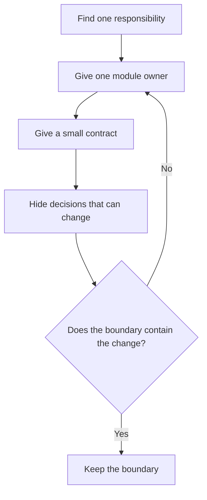

# P005 — Modularity

## Definition

**Modularity** divides a system into cohesive components with clear interfaces and a small number
of dependencies. A change in one module must have a small number of effects on unrelated
modules.

## Provenance

**Classification:** established principle.

Modular design was in engineering before modern software. David Parnas's 1972 paper is an important
source for software modularity. The paper tells designers to put decisions that can change in modules
with clear boundaries. An operation sequence is not sufficient to specify the boundaries.

## Decision rule

When a module boundary gives one responsibility a clear owner, select that boundary. A
boundary can also hide a decision that can change or contain change and failure. Do not divide a system
only to increase its module count.

## How to apply

- When behavior and data share policy and causes of change, keep them together.
- Give a small contract.
- Hide implementation decisions.
- Make dependency direction clear. Find boundary crossings that are not necessary.
- When product independence is necessary, use the same boundary for deployment, failure, and ownership.
- Do a test of each module's behavior and the contracts that connect modules.

## Diagram



## Language examples

The two examples accept only ASCII decimal digits for ports from 1 to 65,535.

```python
def parse_port(text: str) -> int:
    if not text.isascii() or not text.isdigit():
        raise ValueError("port is not correct")
    try:
        port = int(text)
    except ValueError as error:
        raise ValueError("port is not correct") from error
    if not 1 <= port <= 65_535:
        raise ValueError("port is not correct")
    return port
```

```rust
fn parse_port(text: &str) -> Result<u16, &'static str> {
    if text.is_empty() || !text.bytes().all(|byte| byte.is_ascii_digit()) {
        return Err("port is not correct");
    }
    let port = text.parse::<u16>().map_err(|_| "port is not correct")?;
    if port == 0 {
        return Err("port is not correct");
    }
    Ok(port)
}
```

## Boundaries and tensions

Physical separation is not sufficient for modularity. Small packages can make calls at all
boundaries and can share mutable state or cyclic dependencies. Such packages can have less
modularity than one cohesive component.

Distributed services add boundaries in operation. Do not add them only for code organization.
When you use [P003 DRY](p003-dry.md), keep local ownership. Before you change an established
boundary, use [P012 Evidence Before Modification](p012-evidence-before-modification.md).

## Examples

**Positive:** A parser has responsibility for external syntax and returns a stable internal value. Business policy
has a dependency on that value, not on parser details.

**Misuse:** A small application uses services that must deploy together and share one database.
This design adds network failure without a specified owner or evolution path.

**Athena/agent workflow:** Canonical skills are in `skills/`. Host manifests have links to those
skills and do not contain skill copies for one host.

## Related principles

- [P004 SOLID](p004-solid.md)
- [P015 Architecture Conformance](p015-architecture-conformance.md)
- [P016 Separation of Concerns](p016-separation-of-concerns.md)
- [P017 High Cohesion, Low Coupling](p017-high-cohesion-low-coupling.md)
- [P018 Information Hiding](p018-information-hiding.md)
- [P077 Separate Policy from Mechanism](p077-separate-policy-from-mechanism.md)

## References

### Source information

- [David Parnas: On the Criteria To Be Used in Decomposing Systems into Modules](https://doi.org/10.1145/361598.361623).
  The paper connects modular boundaries to hidden design decisions.

### Applicable information

- [Microsoft: Architectural principles](https://learn.microsoft.com/en-us/dotnet/architecture/modern-web-apps-azure/architectural-principles)
  shows that separation of concerns and encapsulation are architecture practices.
- [SEI: Quality Attribute Workshops](https://www.sei.cmu.edu/library/quality-attribute-workshops/)
  gives a method that connects architecture decisions to specified quality requirements.

### More information

- [Liskov and Wing: A Behavioral Notion of Subtyping](https://doi.org/10.1145/197320.197383)
  gives information for analysis of module contracts with substitutable implementations.

[Back to the engineering principles catalog](../README.md#p005)
