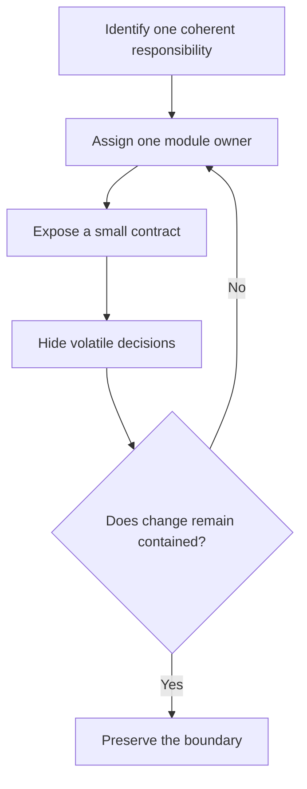

# P005 — Modularity

## Definition

**Modularity** divides a system into cohesive components with explicit interfaces and limited
dependencies. A change in one module must have few intentional effects on unrelated modules.

## Provenance

**Classification:** established principle.

Modular design predates modern software engineering. David Parnas's 1972 paper supplied a durable
software foundation. The paper directs designers to hide decisions that can change behind module
boundaries. An operation sequence alone does not define the boundaries.

## Decision rule

Create or preserve a module boundary when it gives a coherent responsibility a clear owner. A
boundary can also hide a volatile decision or contain change and failure. Do not divide a system
only to increase its module count.

## How to apply

- Group behavior and data that share policy and reasons to change.
- Expose a small contract and keep implementation choices private.
- Make dependency direction explicit and detect unwanted boundary crossings.
- Keep deployment, failure, and ownership boundaries aligned where the product needs independence.
- Test each module's behavior and the contracts between modules.

## Diagram



## Language examples

The two examples accept only ASCII decimal digits for ports from 1 through 65,535.

```python
def parse_port(text: str) -> int:
    if not text.isascii() or not text.isdigit():
        raise ValueError("invalid port")
    try:
        port = int(text)
    except ValueError as error:
        raise ValueError("invalid port") from error
    if not 1 <= port <= 65_535:
        raise ValueError("invalid port")
    return port
```

```rust
fn parse_port(text: &str) -> Result<u16, &'static str> {
    if text.is_empty() || !text.bytes().all(|byte| byte.is_ascii_digit()) {
        return Err("invalid port");
    }
    let port = text.parse::<u16>().map_err(|_| "invalid port")?;
    if port == 0 {
        return Err("invalid port");
    }
    Ok(port)
}
```

## Boundaries and tensions

Physical separation alone does not create modularity. Tiny packages can call each other across all
boundaries and can share mutable state or cyclic dependencies. Such packages can be less modular
than one cohesive component.

Distributed services add operational boundaries. Do not introduce them only for code organization.
Balance [P003 DRY](p003-dry.md) against local ownership. Apply
[P012 Evidence Before Modification](p012-evidence-before-modification.md) before a change to an
established boundary.

## Examples

**Positive:** A parser owns external syntax and returns a stable internal value. Business policy
depends on that value, not on parser details.

**Misuse:** A small application uses services that must deploy together and share one database.
This design adds network failure without independent ownership or evolution.

**Athena/agent workflow:** Canonical skills remain in `skills/`. Host manifests reference those
skills and do not contain host-specific copies.

## Related principles

- [P004 SOLID](p004-solid.md)
- [P015 Architecture Conformance](p015-architecture-conformance.md)
- [P016 Separation of Concerns](p016-separation-of-concerns.md)
- [P017 High Cohesion, Low Coupling](p017-high-cohesion-low-coupling.md)
- [P018 Information Hiding](p018-information-hiding.md)
- [P077 Separate Policy from Mechanism](p077-separate-policy-from-mechanism.md)

## References

### Origin/history

- [David Parnas: On the Criteria To Be Used in Decomposing Systems into Modules](https://doi.org/10.1145/361598.361623)
  is the foundational paper that connects modular boundaries to hidden design decisions.

### Current guidance

- [Microsoft: Architectural principles](https://learn.microsoft.com/en-us/dotnet/architecture/modern-web-apps-azure/architectural-principles)
  describes separation of concerns and encapsulation as architecture practices.
- [SEI: Quality Attribute Workshops](https://www.sei.cmu.edu/library/quality-attribute-workshops/)
  provides a method that connects architecture choices to concrete quality requirements.

### Further reading

- [Liskov and Wing: A Behavioral Notion of Subtyping](https://doi.org/10.1145/197320.197383)
  supports analysis of module contracts with substitutable implementations.

[Back to the engineering principles catalog](../README.md#p005)
