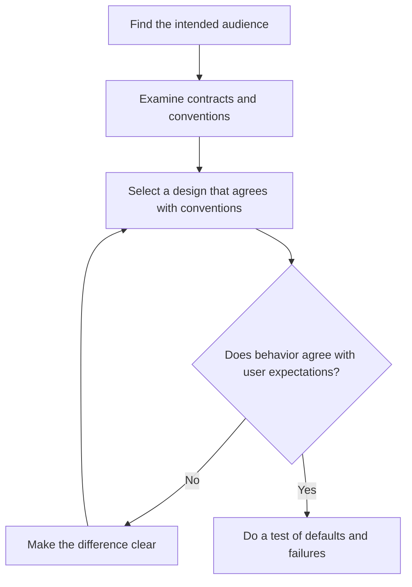

# P006 — Principle of Least Astonishment

## Definition

For the **Principle of Least Astonishment** (**POLA**, also the principle of least surprise),
behavior must agree with user expectations that evidence shows. POLA is applicable to interfaces, defaults,
state changes, and failures. The system context and specified contract give evidence for those
expectations.

## Provenance

**Classification:** practitioner heuristic.

The phrase has a long history in language and interface design. No source supplies sufficient
evidence for the source of the phrase. Context also changes POLA. User expectations are not the
same for all audiences.
Repository precedent and research with users have more value as evidence than a design that personnel select without evidence.

## Decision rule

When there are two or more correct designs, examine the public contract, local conventions, and evidence
about user expectations. Select the design that agrees with this evidence. Make each necessary
difference clear. Give a safe migration.

## How to apply

- Find the intended audience and its conventions that evidence shows.
- Make sure names, defaults, units, mutability, side effects, and errors agree with related conventions.
- Use clear confirmation or clear names for destructive behavior and behavior not in user expectations.
- Keep expectations that evidence shows for related CLI, API, and configuration operations.
- Do a test of defaults and failure behavior in the public contract.

## Diagram



## Language examples

Explicit confirmation is necessary before the destructive step in the two examples.

```python
def delete_user(user_id: str, confirmed: bool) -> None:
    if not confirmed:
        raise ValueError("confirmation is necessary")
    database.delete(user_id)
```

```rust
fn delete_user(user_id: &str, confirmed: bool) -> Result<(), &'static str> {
    if !confirmed {
        return Err("confirmation is necessary");
    }
    database_delete(user_id);
    Ok(())
}
```

## Boundaries and tensions

POLA is not applicable when personnel know that behavior is dangerous. Security controls, correct behavior, accessibility, or an
explicit specification can make an explicit change from precedent necessary. Make the difference clear.
Give a migration that is safe.
[P014 Preserve Unrequested Behavior](p014-preserve-unrequested-behavior.md) gives protection to established
contracts. [P019 Explicit Contracts](p019-explicit-contracts.md) decreases ambiguity when expectations
are not the same.

## Examples

**Positive:** A `--dry-run` flag does no external writes and gives the planned actions for a
usual operation.

**Misuse:** A command with the name `list` repairs and deletes stale resources without notice because cleanup
is easy during enumeration.

**Athena/agent workflow:** A skill uses its documented fallback when a necessary capability is
missing. It does not select a workflow with more authority without notice.

## Related principles

- [P014 Preserve Unrequested Behavior](p014-preserve-unrequested-behavior.md)
- [P019 Explicit Contracts](p019-explicit-contracts.md)
- [P049 Secure by Default](p049-secure-by-default.md)
- [P071 Consistency Over Personal Preference](p071-consistency-over-personal-preference.md)
- [P085 Explicit Is Better Than Implicit](p085-explicit-is-better-than-implicit.md)

## References

### Source information

- [The Open Group Base Specifications, Utility Syntax Guidelines](https://pubs.opengroup.org/onlinepubs/9699919799/basedefs/V1_chap12.html)
  give established consistency rules for command interfaces. They show POLA but do not
  give a source for the phrase.

### Applicable information

- [Google Cloud API Design Guide](https://cloud.google.com/apis/design) shows that resource-oriented
  conventions are important properties of API design. Related APIs that use the conventions have
  the same behavior.
- [Google API Improvement Proposals: General principles](https://google.aip.dev/general) gives
  conventions that agree for related APIs.

### More information

- [PEP 20 — The Zen of Python](https://peps.python.org/pep-0020/) gives a short example of how
  a language community records expectations for clear design in which related properties agree.

[Back to the engineering principles catalog](../README.md#p006)
