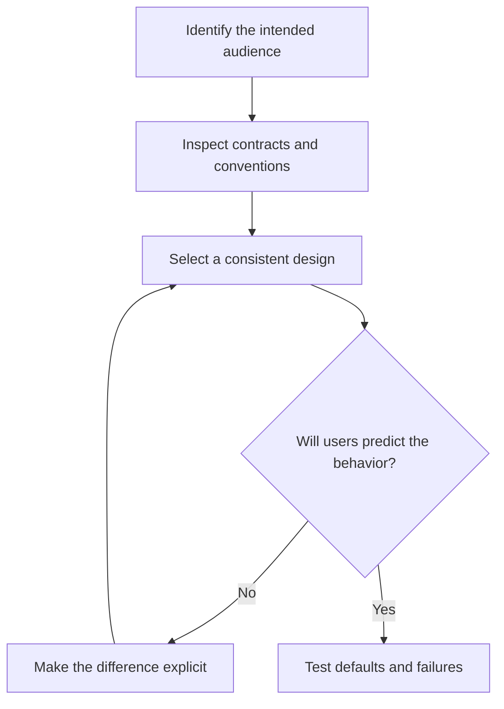

# P006 — Principle of Least Astonishment

## Definition

The **Principle of Least Astonishment** (**POLA**, also called the principle of least surprise)
requires behavior that matches reasonable user expectations. It applies to interfaces, defaults,
state changes, and failures. The surrounding system and stated contract provide evidence for those
expectations.

## Provenance

**Classification:** practitioner heuristic.

The phrase has a long history in language and interface design. No reliable source establishes one
origin. POLA also depends on context. One audience can expect behavior that surprises another.
Repository precedent and explicit user research provide stronger evidence than designer intuition.

## Decision rule

When several correct designs exist, choose the design that best matches the public contract, local
conventions, and established user model. Make each necessary difference explicit and safe for
migration.

## How to apply

- Identify the actual audience and its established conventions.
- Make names, defaults, units, mutability, side effects, and errors consistent across the surface.
- Use explicit confirmation or clear names for destructive and unusually expensive behavior.
- Preserve ordinary expectations across related CLI, API, and configuration operations.
- Test defaults and failure behavior as part of the public contract.

## Diagram



## Language examples

The two examples require explicit confirmation before the destructive action.

```python
def delete_user(user_id: str, confirmed: bool) -> None:
    if not confirmed:
        raise ValueError("confirmation required")
    database.delete(user_id)
```

```rust
fn delete_user(user_id: &str, confirmed: bool) -> Result<(), &'static str> {
    if !confirmed {
        return Err("confirmation required");
    }
    database_delete(user_id);
    Ok(())
}
```

## Boundaries and tensions

POLA does not support familiar but unsafe behavior. Security, correctness, accessibility, or an
explicit specification can require a deliberate change from precedent. In that case, explain the
difference and provide a suitable migration.
[P014 Preserve Unrequested Behavior](p014-preserve-unrequested-behavior.md) protects established
contracts. [P019 Explicit Contracts](p019-explicit-contracts.md) reduces ambiguity when expectations
differ.

## Examples

**Positive:** A `--dry-run` flag performs no external writes and reports the planned actions for a
normal run.

**Misuse:** A command named `list` silently repairs and deletes stale resources because cleanup is
convenient during enumeration.

**Athena/agent workflow:** A skill uses its documented fallback when a required capability is
absent. It does not select a workflow with broader authority without notice.

## Related principles

- [P014 Preserve Unrequested Behavior](p014-preserve-unrequested-behavior.md)
- [P019 Explicit Contracts](p019-explicit-contracts.md)
- [P049 Secure by Default](p049-secure-by-default.md)
- [P071 Consistency Over Personal Preference](p071-consistency-over-personal-preference.md)
- [P085 Explicit Is Better Than Implicit](p085-explicit-is-better-than-implicit.md)

## References

### Origin/history

- [The Open Group Base Specifications, Utility Syntax Guidelines](https://pubs.opengroup.org/onlinepubs/9699919799/basedefs/V1_chap12.html)
  document established consistency rules for command interfaces. They illustrate POLA but do not
  claim the origin of the phrase.

### Current guidance

- [Google Cloud API Design Guide](https://cloud.google.com/apis/design) treats consistency and
  predictable resource-oriented conventions as primary API design goals.
- [Google API Improvement Proposals: General principles](https://google.aip.dev/general) defines
  conventions for coherent related APIs.

### Further reading

- [PEP 20 — The Zen of Python](https://peps.python.org/pep-0020/) provides a compact example of how
  a language community records expectations for explicit and unsurprising design.

[Back to the engineering principles catalog](../README.md#p006)
