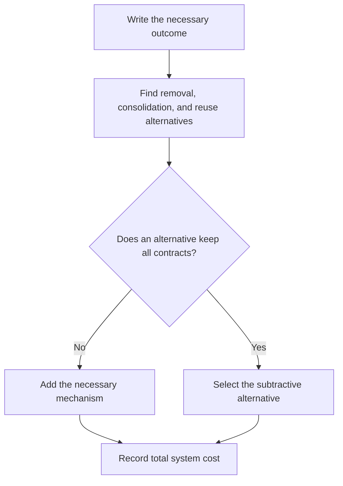

# P007 — Subtraction Over Addition

## Definition

For **Subtraction Over Addition**, an author must examine removal, consolidation, or reuse
before an addition. Possible additions include code, state, dependencies, configuration, services, and
processes. When a current mechanism obeys the requirement, select that mechanism.

## Provenance

**Classification:** Athena synthesis.

Athena gives this name to an idea from empirical research and established simplicity heuristics. Adams et al.
found that persons frequently do not examine subtractive changes that have value. The result
gives evidence for an explicit subtraction prompt. The research does not show that subtraction is always
the correct engineering decision.

## Decision rule

Before you add a component, examine all applicable subtractive or reuse alternatives. When an
alternative keeps necessary behavior, safety, clarity, and compatibility, select that alternative.

## How to apply

- Write the outcome without the proposed new mechanism.
- Find obsolete branches, redundant state, duplicate authorities, and current capabilities.
- Compare lifecycle, failure, security, and operation costs, not only implementation work.
- Before removal, record consumers and contracts.
- Only when the artifacts are not necessary for current product behavior, delete related tests or
  documentation.

## Diagram



## Language examples

The two examples derive the count from records and do not use duplicate state.

```python
def active_count(users: list[User]) -> int:
    count = 0
    for user in users:
        count += int(user.active)
    return count
```

```rust
fn active_count(users: &[User]) -> usize {
    users
        .iter()
        .filter(|user| user.active)
        .count()
}
```

## Boundaries and tensions

Subtraction is a prompt, not proof of safety. It must not remove an implicit requirement,
compatibility guarantee, security control, observability, or recovery path. First obey
[P008 Understand Before Subtracting](p008-understand-before-subtracting.md) and
[P014 Preserve Unrequested Behavior](p014-preserve-unrequested-behavior.md). A necessary new control
can increase code and decrease system risk.

## Examples

**Positive:** A product requirement specifies a mode. A contributor keeps the mode but deletes its
duplicate configuration state. The command derives the mode from the repository's configuration authority.

**Misuse:** A contributor removes a security check because tests give correct results. The contributor
does not examine the trust boundary that the check gives protection to.

**Athena/agent workflow:** Before an agent adds a documentation generator, the agent examines the
runtime package for the canonical docs tree. The agent also does a test of standard links for discovery.

## Related principles

- [P001 KISS](p001-kiss.md)
- [P008 Understand Before Subtracting](p008-understand-before-subtracting.md)
- [P074 Prefer Existing Mechanisms](p074-prefer-existing-mechanisms.md)
- [P088 Delete Dead Code](p088-delete-dead-code.md)
- [P089 Delete Obsolete Configuration and Dependencies](p089-delete-obsolete-configuration-and-dependencies.md)
- [P090 Prefer Negative Code](p090-prefer-negative-code.md)

## References

### Source information

- [Adams et al.: People systematically overlook subtractive changes](https://www.nature.com/articles/s41586-021-03380-y)
  gives results from controlled studies about the human preference for additive solutions.
- [PEP 20 — The Zen of Python](https://peps.python.org/pep-0020/) records a related rule that shows
  simple designs are better than complex designs.

### Applicable information

- [Google Engineering Practices: What to look for in a code review](https://google.github.io/eng-practices/review/reviewer/looking-for.html)
  tells reviewers to examine code complexity that is not necessary.

### More information

- [Google Engineering Practices: Small CLs](https://google.github.io/eng-practices/review/developer/small-cls.html)
  shows why small self-contained changes are easier to examine. It also shows why
  change reversal becomes safer.

[Back to the engineering principles catalog](../README.md#p007)
