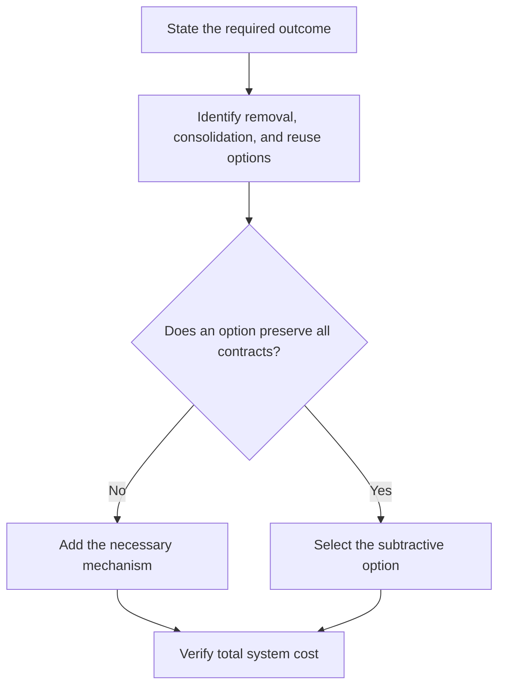

# P007 — Subtraction Over Addition

## Definition

**Subtraction Over Addition** requires an evaluation of removal, consolidation, or reuse before an
addition. Possible additions include code, state, dependencies, configuration, services, and
processes. Prefer an existing mechanism when it meets the requirement.

## Provenance

**Classification:** Athena synthesis.

Athena created this name from empirical research and established simplicity heuristics. Research
by Adams and colleagues found that people often overlook useful subtractive changes. This result
supports an explicit subtraction prompt. The research does not prove that subtraction is always
the correct engineering choice.

## Decision rule

Before you add a component, evaluate at least one full subtractive or reuse alternative. Prefer
that alternative when it preserves required behavior, safety, clarity, and compatibility.

## How to apply

- State the outcome independently from the proposed new mechanism.
- Identify obsolete branches, redundant state, duplicate authorities, and current capabilities.
- Compare lifecycle, failure, security, and operational costs, not only implementation effort.
- Verify consumers and contracts before removal.
- Delete associated tests or documentation only when the associated product behavior is obsolete.

## Diagram



## Language examples

The two examples derive the count from records and avoid duplicate state.

```python
def active_count(users: list[User]) -> int:
    count = 0
    for user in users:
        count += int(user.active)
    return count
```

```rust
fn active_count(users: &[User]) -> usize {
    users
        .iter()
        .filter(|user| user.active)
        .count()
}
```

## Boundaries and tensions

Subtraction is a prompt, not a presumption of safety. It must not remove an implicit requirement,
compatibility guarantee, security control, observability, or recovery path. First apply
[P008 Understand Before Subtracting](p008-understand-before-subtracting.md) and
[P014 Preserve Unrequested Behavior](p014-preserve-unrequested-behavior.md). A necessary new control
can increase code and reduce system risk.

## Examples

**Positive:** A contributor deletes a redundant mode and uses the repository's configuration
authority. This choice removes the need for a new option.

**Misuse:** A contributor removes a security check because tests still pass. The contributor does
not examine the trust boundary that the check protects.

**Athena/agent workflow:** Before an agent proposes a documentation generator, the agent checks the
runtime package for the canonical docs tree. The agent also tests ordinary links for discovery.

## Related principles

- [P001 KISS](p001-kiss.md)
- [P008 Understand Before Subtracting](p008-understand-before-subtracting.md)
- [P074 Prefer Existing Mechanisms](p074-prefer-existing-mechanisms.md)
- [P088 Delete Dead Code](p088-delete-dead-code.md)
- [P089 Delete Obsolete Configuration and Dependencies](p089-delete-obsolete-configuration-and-dependencies.md)
- [P090 Prefer Negative Code](p090-prefer-negative-code.md)

## References

### Origin/history

- [Adams et al.: People systematically overlook subtractive changes](https://www.nature.com/articles/s41586-021-03380-y)
  reports controlled studies about the human preference for additive solutions.
- [PEP 20 — The Zen of Python](https://peps.python.org/pep-0020/) records a related preference for
  simple over complex designs.

### Current guidance

- [Google Engineering Practices: What to look for in a code review](https://google.github.io/eng-practices/review/reviewer/looking-for.html)
  tells reviewers to assess unnecessary code complexity.

### Further reading

- [Google Engineering Practices: Small CLs](https://google.github.io/eng-practices/review/developer/small-cls.html)
  explains why smaller coherent changes are easier to understand, review, and reverse.

[Back to the engineering principles catalog](../README.md#p007)
