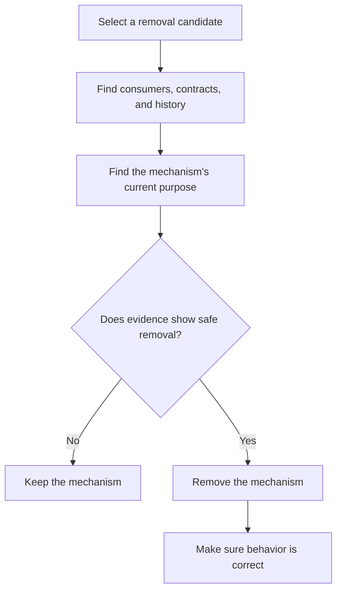

# P008 — Understand Before Subtracting

## Definition

For **Understand Before Subtracting**, evidence about the purpose of a mechanism is necessary before
its removal. History, callers, tests, contracts, deployment behavior, and architecture can show
requirements that the deletion site does not show.

## Provenance

**Classification:** Athena synthesis.

No single historical source gives this rule. The rule includes software archaeology,
information hiding, compatibility practice, and Chesterton's fence. Chesterton's fence makes
it necessary to know the purpose of a boundary before removal.

## Decision rule

Before deletion or consolidation, find the mechanism's consumers, observable behavior, owner, and
initial or current purpose. Then make sure that removal keeps each necessary contract.

## How to apply

- Find all consumers. Also find consumers with connections from other components.
- Read the claims in tests and documentation. Make sure they agree with implementation and history.
- Examine version history and issue context for compatibility or failure lessons.
- Find security, migration, cleanup, and operation roles that calls with correct results do not always show.
- When coverage is not sufficient, add more behavioral evidence before deletion.

## Diagram



## Language examples

The two examples reject removal for an active consumer and make removal of a missing handler have no effect.

```python
def remove_handler(name: str, routes: list[Route], handlers: dict[str, Handler]) -> None:
    if any(route.handler == name for route in routes):
        raise ValueError("handler has a route")
    handlers.pop(name, None)
```

```rust
fn remove_handler(
    name: &str, routes: &[Route], handlers: &mut HashMap<String, Handler>,
) -> Result<(), &'static str> {
    if routes.iter().any(|route| route.handler == name) {
        return Err("handler has a route");
    }
    handlers.remove(name);
    Ok(())
}
```

## Boundaries and tensions

The investigation must be sufficient for the risk. If evidence shows no consumers for an isolated
local mechanism, do not examine all history. History is evidence, not an instruction to
keep obsolete design. After analysis of purpose and consumers,
[P007 Subtraction Over Addition](p007-subtraction-over-addition.md) and
[P088 Delete Dead Code](p088-delete-dead-code.md) give evidence for safe removal. Repository policy and task
authority specify if deletion is in scope.

## Examples

**Positive:** Before deletion of a compatibility parser, a maintainer examines callers, release
notes, fixtures, telemetry, and supported-version policy. The maintainer removes it after support
for the previous format stops.

**Misuse:** A contributor deletes a branch because the current unit test does not select it. The
contributor has no evidence about execution paths to the branch. Production configuration can select it.

**Athena/agent workflow:** An agent reads the package builder and archive tests before a new
manifest proposal. The agent also examines all consumers before documentation deletion.

## Related principles

- [P007 Subtraction Over Addition](p007-subtraction-over-addition.md)
- [P012 Evidence Before Modification](p012-evidence-before-modification.md)
- [P014 Preserve Unrequested Behavior](p014-preserve-unrequested-behavior.md)
- [P018 Information Hiding](p018-information-hiding.md)
- [P066 Preserve Existing Work](p066-preserve-existing-work.md)
- [P088 Delete Dead Code](p088-delete-dead-code.md)

## References

### Source information

- [David Parnas: On the Criteria To Be Used in Decomposing Systems into Modules](https://doi.org/10.1145/361598.361623)
  shows why local selections can hide decisions that are important to consumers. Athena gives Parnas
  no source attribution for this rule.

### Applicable information

- [Google Engineering Practices: Navigating a CL in review](https://google.github.io/eng-practices/review/reviewer/navigate.html)
  recommends analysis of a change in its related files and system.
- [Semantic Versioning 2.0.0](https://semver.org/spec/v2.0.0.html) gives information about why
  removal of public behavior can cause a change that is not compatible.

### More information

- [Git documentation: git-log](https://git-scm.com/docs/git-log) is the primary tool to examine
  change history and applicable context.

[Back to the engineering principles catalog](../README.md#p008)
