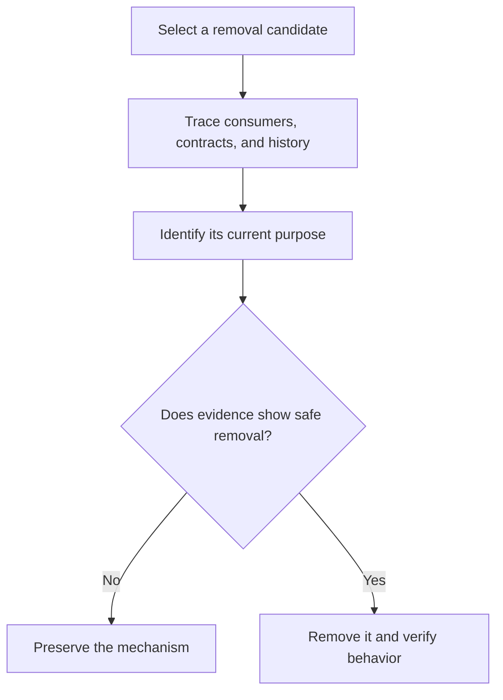

# P008 — Understand Before Subtracting

## Definition

**Understand Before Subtracting** requires evidence about the purpose of a mechanism before its
removal. History, callers, tests, contracts, deployment behavior, and architecture can reveal
requirements that the deletion site does not show.

## Provenance

**Classification:** Athena synthesis.

No single historical source defines this rule. The rule combines software archaeology,
information hiding, compatibility practice, and Chesterton's fence. Chesterton's fence warns
against removal of a boundary before comprehension of its purpose.

## Decision rule

Before deletion or consolidation, identify the mechanism's consumers, observable behavior, owner,
and original or current purpose. Then verify that removal preserves every required contract.

## How to apply

- Search all direct and indirect consumers. Include generated, configured, and external use.
- Read tests and documentation as claims. Verify those claims against implementation and history.
- Inspect version history and issue context for compatibility or failure lessons.
- Identify security, migration, cleanup, and operational roles that happy-path calls may not show.
- Add or strengthen behavioral evidence before deletion when coverage is insufficient.

## Diagram



## Language examples

The two examples verify active consumers before removal of a handler.

```python
def remove_handler(name: str, routes: list[Route]) -> None:
    if any(route.handler == name for route in routes):
        raise ValueError("handler is still in use")
    handlers.pop(name)
```

```rust
fn remove_handler(name: &str, routes: &[Route]) -> Result<(), &'static str> {
    if routes.iter().any(|route| route.handler == name) {
        return Err("handler is still in use");
    }
    handlers_remove(name);
    Ok(())
}
```

## Boundaries and tensions

The investigation depth must match the risk. This rule does not require exhaustive archaeology
for an isolated local item with no verified consumers. History is evidence, not an instruction to
preserve obsolete design. After analysis of purpose and consumers,
[P007 Subtraction Over Addition](p007-subtraction-over-addition.md) and
[P088 Delete Dead Code](p088-delete-dead-code.md) support safe removal. Repository and task
authority still determine whether deletion is within scope.

## Examples

**Positive:** Before deletion of a compatibility parser, a maintainer checks callers, release
notes, fixtures, telemetry, and supported-version policy. The maintainer removes it after support
for the old format ends.

**Misuse:** A contributor deletes a branch as unreachable because the current unit test never
selects it. Production configuration can select the branch.

**Athena/agent workflow:** An agent reads the package builder and archive tests before a new
manifest proposal. The agent also checks all consumers before documentation deletion.

## Related principles

- [P007 Subtraction Over Addition](p007-subtraction-over-addition.md)
- [P012 Evidence Before Modification](p012-evidence-before-modification.md)
- [P014 Preserve Unrequested Behavior](p014-preserve-unrequested-behavior.md)
- [P018 Information Hiding](p018-information-hiding.md)
- [P066 Preserve Existing Work](p066-preserve-existing-work.md)
- [P088 Delete Dead Code](p088-delete-dead-code.md)

## References

### Origin/history

- [David Parnas: On the Criteria To Be Used in Decomposing Systems into Modules](https://doi.org/10.1145/361598.361623)
  explains why local implementation choices can hide decisions that consumers need. Athena does
  not claim that Parnas created this rule.

### Current guidance

- [Google Engineering Practices: Navigating a CL in review](https://google.github.io/eng-practices/review/reviewer/navigate.html)
  recommends analysis of a change within its related files and broader system.
- [Semantic Versioning 2.0.0](https://semver.org/spec/v2.0.0.html) documents why removal of public
  behavior can create an incompatible change.

### Further reading

- [Git documentation: git-log](https://git-scm.com/docs/git-log) describes the primary tool for
  inspection of change history and relevant context.

[Back to the engineering principles catalog](../README.md#p008)
