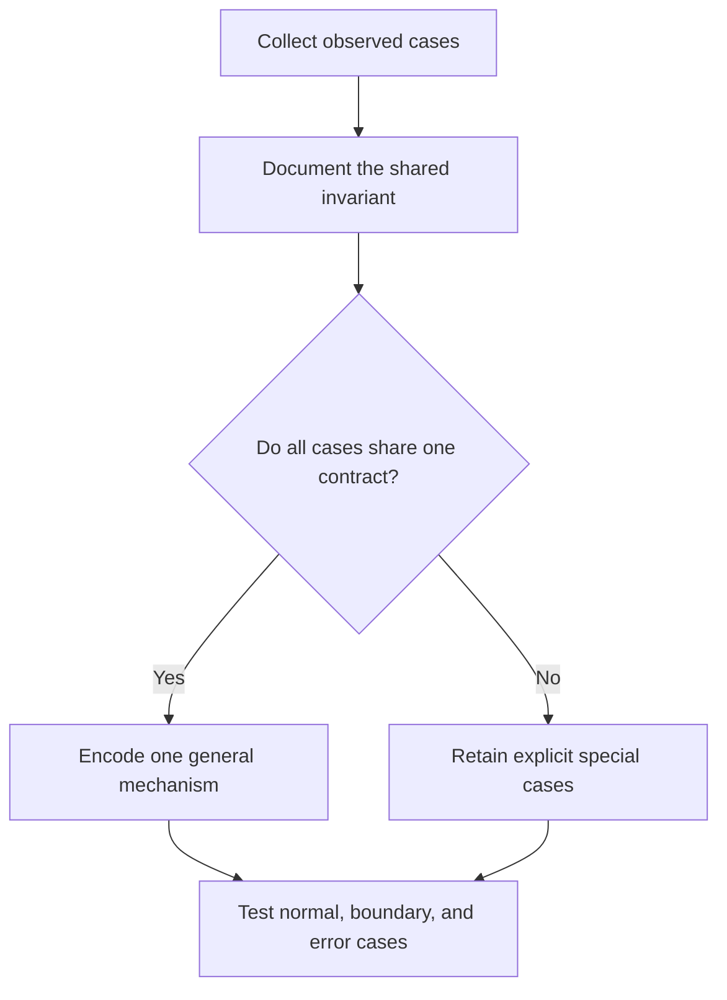

# P009 — General Mechanisms Over Special Cases

## Definition

**General Mechanisms Over Special Cases** favors one coherent rule, algorithm, data model, or error
path for observed cases. It rejects collections of case-specific branches when one invariant
covers them. A general mechanism captures a real invariant. It does not provide speculative
extensibility.

## Provenance

**Classification:** practitioner heuristic.

The idea appears throughout mathematics, language design, and software engineering. No verified
single origin exists. PEP 20 gives a prominent software statement of the idea. It states that
special cases do not defeat sound rules.

## Decision rule

When multiple cases share one demonstrated rule, encode that rule once. Represent variation as data
or a contract. Retain a special case when it reflects a different requirement.

## How to apply

- Document the invariant that the cases share before selection of an abstraction.
- Separate essential policy differences from incidental input differences.
- Prefer a table, normalized representation, or stable protocol to scattered branches.
- Exercise normal, boundary, and exceptional cases against the common rule.
- Retain explicit exceptions if one mechanism obscures a distinct contract.

## Diagram



## Language examples

The two examples represent mode variation as data under one lookup rule.

```python
RATES = {"standard": 5, "express": 20}

def shipping_cost(mode: str) -> int | None:
    cost = RATES.get(mode)
    return cost
```

```rust
const RATES: [(&str, u32); 2] = [("standard", 5), ("express", 20)];

fn shipping_cost(mode: &str) -> Option<u32> {
    RATES.iter().find(|(name, _)| *name == mode).map(|(_, cost)| *cost)
}
```

## Boundaries and tensions

Generalization has a maintenance cost. Similar behavior in two examples can be a coincidence, not
evidence of a stable concept. [P013 AHA](p013-avoid-hasty-abstractions.md) and
[P002 YAGNI](p002-yagni.md) therefore
constrain this principle. A clear explicit branch can be better than a universal engine with hidden
policy. General mechanisms must preserve specific failure causes and useful diagnostics.

## Examples

**Positive:** Several command variants share one parser and validation pipeline. Data represents
their valid options.

**Misuse:** A configurable state-machine framework combines unrelated deployment workflows because
the two workflows currently have three steps.

**Athena/agent workflow:** Review skills use one shared finding contract and add surface-specific
criteria. They do not create unrelated verdict formats for each review type.

## Related principles

- [P002 YAGNI](p002-yagni.md)
- [P003 DRY](p003-dry.md)
- [P013 AHA](p013-avoid-hasty-abstractions.md)
- [P029 Generalize Error Policy; Preserve Specific Cause](p029-generalize-error-policy-preserve-specific-cause.md)
- [P075 Make Invalid States Hard to Represent](p075-make-invalid-states-hard-to-represent.md)

## References

### Origin/history

- [PEP 20 — The Zen of Python](https://peps.python.org/pep-0020/) is a primary language-design
  statement about general rules, practicality, readability, and explicitness.

### Current guidance

- [Google Engineering Practices: What to look for in a code review](https://google.github.io/eng-practices/review/reviewer/looking-for.html)
  asks reviewers to assess design, functionality, complexity, and excess architecture.

### Further reading

- [Sandi Metz: The Wrong Abstraction](https://sandimetz.com/blog/2016/1/20/the-wrong-abstraction)
  explains that correction of a false generalization can cost more than duplication.

[Back to the engineering principles catalog](../README.md#p009)
