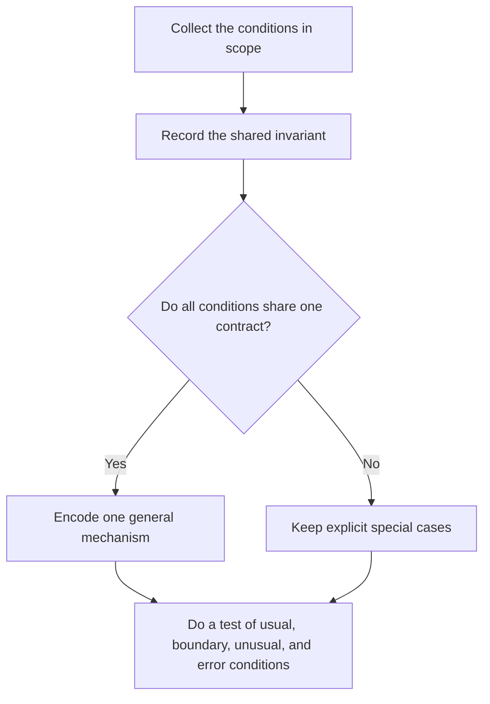

# P009 — General Mechanisms Over Special Cases

## Definition

For **General Mechanisms Over Special Cases**, use one rule, algorithm, data model, or error
path for the conditions in scope. When one invariant includes the conditions, do not use collections of
branches for each condition. A general mechanism encodes an invariant that evidence shows. It does not add
extensibility with no evidence.

## Provenance

**Classification:** practitioner heuristic.

The idea occurs in mathematics, language design, and software engineering. No source supplies
sufficient evidence for the initial statement. PEP 20 gives a software statement of the idea. It shows that special cases
must obey correct rules.

## Decision rule

When two or more conditions share one rule that evidence shows, encode that rule one time. When
variation does not change the rule, show it in data or a contract. When a special case is for a
different requirement, keep it.

## How to apply

- Before you select an abstraction, record the invariant that the conditions share.
- Do not put necessary policy differences together with input differences that do not change policy.
- Select a table, normalized representation, or stable protocol. Do not use branches in many locations.
- Use the same rule to do a test of usual conditions, boundary conditions, unusual conditions, and errors.
- If a different contract is not clear in one mechanism, keep clear exceptions.

## Diagram



## Language examples

The two examples show mode variation in data with one lookup rule.

```python
RATES = {"standard": 5, "express": 20}

def shipping_cost(mode: str) -> int | None:
    cost = RATES.get(mode)
    return cost
```

```rust
const RATES: [(&str, u32); 2] = [("standard", 5), ("express", 20)];

fn shipping_cost(mode: &str) -> Option<u32> {
    RATES.iter().find(|(name, _)| *name == mode).map(|(_, cost)| *cost)
}
```

## Boundaries and tensions

Generalization has a maintenance cost. Two examples can have almost the same behavior without a
shared invariant. [P013 AHA](p013-avoid-hasty-abstractions.md) and
[P002 YAGNI](p002-yagni.md) give constraints for this principle. A clear explicit branch can have less
complexity than a general engine with hidden policy. General mechanisms must keep specified
failure causes and diagnostics that give value.

## Examples

**Positive:** Command variants share one parser and validation pipeline. Data shows
their correct alternatives.

**Misuse:** A configurable state-machine framework puts unrelated deployment workflows together because
the two workflows have three steps.

**Athena/agent workflow:** Review skills use one shared finding contract and add criteria for each
surface. They do not make unrelated verdict formats for each review type.

## Related principles

- [P002 YAGNI](p002-yagni.md)
- [P003 DRY](p003-dry.md)
- [P013 AHA](p013-avoid-hasty-abstractions.md)
- [P029 Generalize Error Policy; Preserve Specific Cause](p029-generalize-error-policy-preserve-specific-cause.md)
- [P075 Make Invalid States Hard to Represent](p075-make-invalid-states-hard-to-represent.md)

## References

### Source information

- [PEP 20 — The Zen of Python](https://peps.python.org/pep-0020/) is a primary language-design
  statement about general rules, practicality, readability, and explicitness.

### Applicable information

- [Google Engineering Practices: What to look for in a code review](https://google.github.io/eng-practices/review/reviewer/looking-for.html)
  tells reviewers to examine design, functionality, complexity, and architecture that is not necessary.

### More information

- [Sandi Metz: The Wrong Abstraction](https://sandimetz.com/blog/2016/1/20/the-wrong-abstraction)
  shows that correction of an incorrect generalization can cost more than duplication.

[Back to the engineering principles catalog](../README.md#p009)
