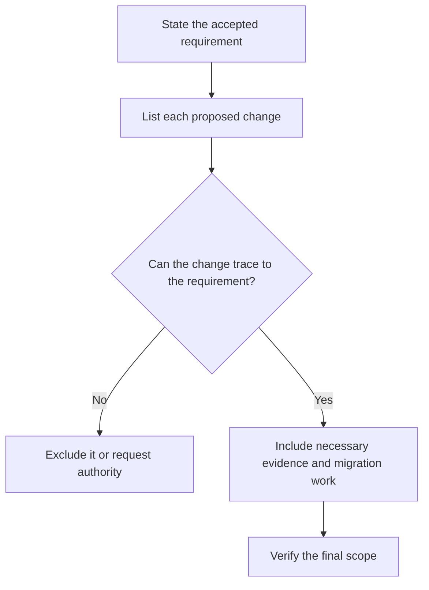

# P010 — Scope Fidelity

## Definition

**Scope Fidelity** limits a change to the stated requirement and necessary work. Adjacent features,
broad cleanup, dependency upgrades, redesign, and speculative improvements remain outside the change
without separate authority.

## Provenance

**Classification:** Athena synthesis.

Athena created the name from established change management, iterative development, and review
practices. Athena claims no single historical origin for the rule.

## Decision rule

Every substantive artifact change must trace to a requirement, acceptance criterion, defect,
invariant, or necessary implementation dependency. Exclude an untraceable change or obtain explicit
scope expansion.

## How to apply

- Restate the requested outcome, constraints, and acceptance criteria before an edit.
- Distinguish required support work from convenient cleanup.
- Keep a visible mapping from changed behavior to task justification.
- Report adjacent problems. Do not solve them without authority.
- Split independent work into a separate issue or change when practical.

## Diagram



## Language examples

The two examples change only the requested timeout field.

```python
def with_timeout(config: dict, timeout: int) -> dict:
    if timeout <= 0:
        raise ValueError("timeout must be positive")
    updated = config.copy()
    updated["timeout"] = timeout
    return updated
```

```rust
fn with_timeout(mut config: Config, timeout: u64) -> Result<Config, &'static str> {
    if timeout == 0 {
        return Err("timeout must be positive");
    }
    config.timeout = timeout;
    Ok(config)
}
```

## Boundaries and tensions

Scope fidelity does not permit an incomplete patch. Required tests, documentation, migration,
security controls, and compatibility work form part of a full solution. An unrelated refactor
does not become necessary when someone labels it a prerequisite. Repository safety and quality
rules remain mandatory when the prompt omits them. Use
[P011 Minimal Coherent Change](p011-minimal-coherent-change.md) to determine the full boundary.

## Examples

**Positive:** A parser defect correction changes the parser, adds a regression test, and updates its
public behavior note. It does not reformat adjacent modules.

**Misuse:** A contributor corrects one flag, renames the entire command family, and upgrades
unrelated dependencies.

**Athena/agent workflow:** An agent records unrelated findings for later work. The current diff
contains only work for the user request and repository evidence requirements.

## Related principles

- [P002 YAGNI](p002-yagni.md)
- [P011 Minimal Coherent Change](p011-minimal-coherent-change.md)
- [P012 Evidence Before Modification](p012-evidence-before-modification.md)
- [P014 Preserve Unrequested Behavior](p014-preserve-unrequested-behavior.md)
- [P063 Requirement-to-Code Traceability](p063-requirement-to-code-traceability.md)
- [P066 Preserve Existing Work](p066-preserve-existing-work.md)

## References

### Origin/history

- [Manifesto for Agile Software Development: Principles](https://agilemanifesto.org/principles.html)
  provides historical primary statements about early, continuous, and simple delivery. It does not
  use Athena's term “scope fidelity.”

### Current guidance

- [Athena development and delivery policy](../../policies/development.md) defines the repository's
  mandatory scope, artifact, and validation rules.
- [Google Engineering Practices: Small CLs](https://google.github.io/eng-practices/review/developer/small-cls.html)
  explains why one self-contained change addresses one issue.

### Further reading

- [Google Engineering Practices: The standard of code review](https://google.github.io/eng-practices/review/reviewer/standard.html)
  connects review decisions to code health without a demand for unrelated perfection.

[Back to the engineering principles catalog](../README.md#p010)
