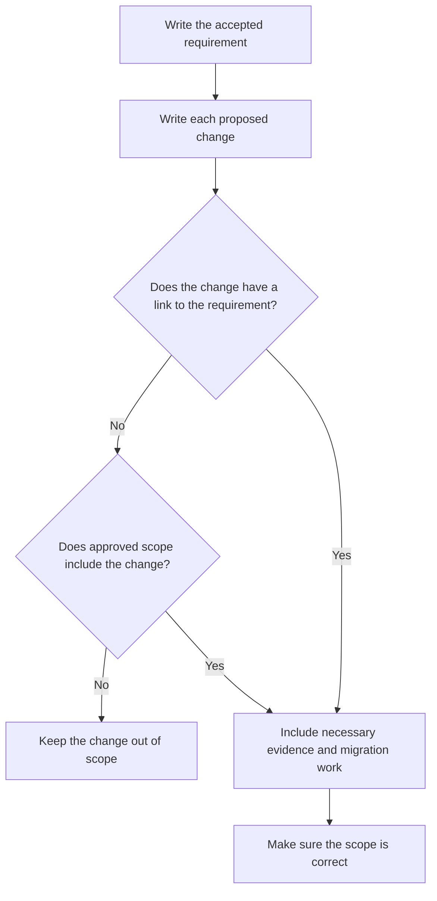

# P010 — Scope Fidelity

## Definition

**Scope Fidelity** keeps a change in the scope of the specified requirement and necessary work. Cleanup that changes
more code than necessary is not part of the change without authority for that work. This rule also
includes cleanup in a component that contains the necessary change. Adjacent features, dependency
upgrades, redesign, and improvements with no requirement are also out of scope without authority.

## Provenance

**Classification:** Athena synthesis.

Athena gives this name to a rule from established change management, iterative development, and review
practices. Athena gives no single historical source for the rule.

## Decision rule

Each artifact change must have a clear link to a requirement, acceptance criterion,
defect, invariant, or necessary implementation dependency. If a change has no trace, keep it out of
scope. With approved scope expansion, add the change to the scope.

## How to apply

- Before an edit, write the requested outcome, constraints, and acceptance criteria.
- Keep necessary work isolated from cleanup that has no requirement.
- Keep a clear link from each artifact change to the task requirement.
- Give information about adjacent problems. Do not change them without authority.
- When possible, put work with a different purpose in a different issue or change.

## Diagram



## Language examples

The two examples use timeout values from 1 to 18,446,744,073,709,551,615 and change only the requested field.

```python
U64_MAX = 2**64 - 1

def with_timeout(config: dict, timeout: int) -> dict:
    if type(timeout) is not int or not 1 <= timeout <= U64_MAX:
        raise ValueError("timeout is not in the u64 range")
    updated = config.copy()
    updated["timeout"] = timeout
    return updated
```

```rust
fn with_timeout(mut config: Config, timeout: u64) -> Result<Config, &'static str> {
    if timeout == 0 {
        return Err("timeout is not in the u64 range");
    }
    config.timeout = timeout;
    Ok(config)
}
```

## Boundaries and tensions

All necessary parts must be in a scope-faithful patch. Necessary tests, documentation, migration,
security controls, and compatibility work are necessary for a solution that obeys all requirements. An unrelated refactor
is not necessary only because a person tells authors to do the refactor first. Repository safety and
quality rules are mandatory when the prompt does not include them. Use
[P011 Minimal Coherent Change](p011-minimal-coherent-change.md) to find the necessary boundary.

## Examples

**Positive:** A parser defect correction changes the parser, adds a regression test, and changes its
public behavior note. It does not reformat adjacent modules.

**Misuse:** A contributor corrects one flag, renames all commands in the family, and upgrades
unrelated dependencies.

**Athena/agent workflow:** An agent records unrelated findings for future work. The current diff
contains only work for the user request and repository evidence requirements.

## Related principles

- [P002 YAGNI](p002-yagni.md)
- [P011 Minimal Coherent Change](p011-minimal-coherent-change.md)
- [P012 Evidence Before Modification](p012-evidence-before-modification.md)
- [P014 Preserve Unrequested Behavior](p014-preserve-unrequested-behavior.md)
- [P063 Requirement-to-Code Traceability](p063-requirement-to-code-traceability.md)
- [P066 Preserve Existing Work](p066-preserve-existing-work.md)

## References

### Source information

- [Manifesto for Agile Software Development: Principles](https://agilemanifesto.org/principles.html)
  gives historical primary statements about initial, continuous, and simple delivery. It does not
  include Athena's term “scope fidelity.”

### Applicable information

- [Athena development and delivery policy](../../policies/development.md) gives the repository's
  mandatory scope, artifact, and validation rules.
- [Google Engineering Practices: Small CLs](https://google.github.io/eng-practices/review/developer/small-cls.html)
  shows why one self-contained change is for one issue.

### More information

- [Google Engineering Practices: The standard of code review](https://google.github.io/eng-practices/review/reviewer/standard.html)
  connects review decisions to code health without a requirement to correct unrelated defects.

[Back to the engineering principles catalog](../README.md#p010)
