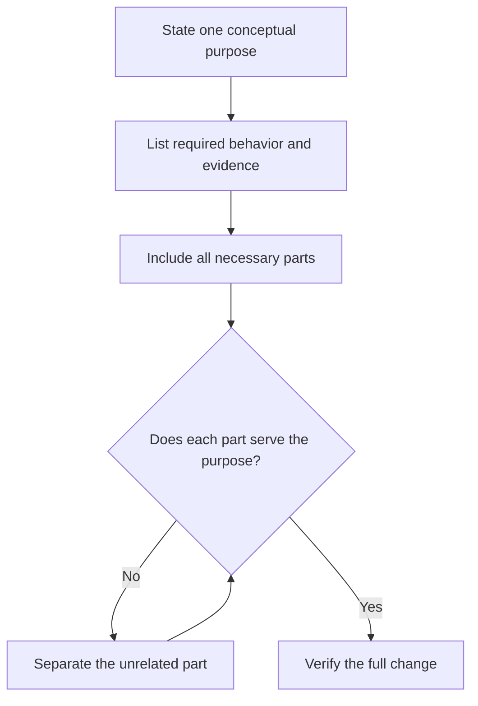

# P011 — Minimal Coherent Change

## Definition

A **Minimal Coherent Change** is the smallest self-contained change that fully satisfies one
purpose. It includes the required tests, documentation, migration, and safety work. All parts serve
that purpose. The change excludes unrelated work.

## Provenance

**Classification:** Athena synthesis.

Athena created the name from established incremental delivery and code review guidance. Small
changes are easier to understand. A change must also permit full evaluation and safe operation.

## Decision rule

Choose the narrowest boundary that leaves the requested behavior correct and verifiable. Separate
parts with independent purposes. Keep parts together if separation creates an invalid,
untestable, or false intermediate state.

## How to apply

- State the change's single conceptual purpose.
- Include all necessary behavior, tests, contract updates, and migration handling.
- Separate opportunistic cleanup, formatting, dependency updates, and unrelated refactors.
- Order commits so each is reviewable and preserves repository invariants when practical.
- Inspect the final diff for files or hunks that do not serve the stated purpose.

## Diagram



## Language examples

The two examples trim the same ASCII whitespace, accept ASCII digits from 1 through 4,294,967,295,
and report `invalid limit` for all invalid input.

```python
MAX_LIMIT = 4_294_967_295

def parse_limit(text: str) -> int:
    normalized = text.strip(" \t\r\n")
    if not normalized.isascii() or not normalized.isdigit():
        raise ValueError("invalid limit")
    try:
        limit = int(normalized)
    except ValueError as error:
        raise ValueError("invalid limit") from error
    if not 1 <= limit <= MAX_LIMIT:
        raise ValueError("invalid limit")
    return limit
```

```rust
fn parse_limit(text: &str) -> Result<u32, &'static str> {
    let normalized = text.trim_matches(|ch| matches!(ch, ' ' | '\t' | '\r' | '\n'));
    if normalized.is_empty() || !normalized.bytes().all(|byte| byte.is_ascii_digit()) {
        return Err("invalid limit");
    }
    let limit = normalized.parse::<u32>().map_err(|_| "invalid limit")?;
    if limit == 0 {
        return Err("invalid limit");
    }
    Ok(limit)
}
```

## Boundaries and tensions

Minimal does not mean the fewest lines or an incomplete patch. A one-line schema change without its
migration and verification can be smaller but not coherent. Cleanup does not become necessary only
because it affects the same file. [P010 Scope Fidelity](p010-scope-fidelity.md) limits purpose.
[P014 Preserve Unrequested Behavior](p014-preserve-unrequested-behavior.md) and
[P021 Evolutionary and Reversible Design](p021-evolutionary-and-reversible-design.md) constrain
delivery of the change.

## Examples

**Positive:** A configuration rename includes compatible parsing, migration documentation, and
tests in one change. Unrelated configuration cleanup stays separate.

**Misuse:** A defect correction has two parts. The first commit deliberately breaks the build, and
the second commit restores it. Neither commit permits independent review.

**Athena/agent workflow:** An agent edits only the canonical skills and shared docs for one issue.
The agent runs repository validation and excludes unrelated files from the diff.

## Related principles

- [P001 KISS](p001-kiss.md)
- [P010 Scope Fidelity](p010-scope-fidelity.md)
- [P014 Preserve Unrequested Behavior](p014-preserve-unrequested-behavior.md)
- [P021 Evolutionary and Reversible Design](p021-evolutionary-and-reversible-design.md)
- [P063 Requirement-to-Code Traceability](p063-requirement-to-code-traceability.md)
- [P065 Verify Before Claiming Completion](p065-verify-before-claiming-completion.md)

## References

### Origin/history

- [Manifesto for Agile Software Development: Principles](https://agilemanifesto.org/principles.html)
  is a primary historical source for incremental delivery and simplicity. It does not define
  Athena's exact term.

### Current guidance

- [Google Engineering Practices: Small CLs](https://google.github.io/eng-practices/review/developer/small-cls.html)
  explains why a small, self-contained change addresses one issue and includes its tests.
- [Athena development and delivery policy](../../policies/development.md) defines the repository's
  mandatory coherent-change and artifact requirements.

### Further reading

- [Conventional Commits 1.0.0](https://www.conventionalcommits.org/en/v1.0.0/) provides a current
  convention for communication of commit purpose and compatibility effects.

[Back to the engineering principles catalog](../README.md#p011)
