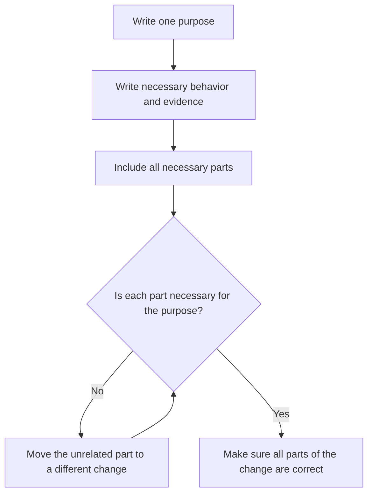

# P011 — Minimal Coherent Change

## Definition

A **Minimal Coherent Change** is the smallest self-contained change for one specified purpose.
It includes the necessary tests, documentation, migration, and safety work. Each part is
necessary for that purpose. The change keeps unrelated work out.

## Provenance

**Classification:** Athena synthesis.

Athena gives this name to a rule from established incremental delivery and code review guidance. Small
changes are easier to examine. A change must also let a reviewer examine all parts and let the
system operate safely.

## Decision rule

Select the narrowest boundary that keeps the specified behavior correct and that evidence shows is necessary.
Put parts with different purposes in different changes. If separation causes an incorrect state
after one step or prevents an applicable test, keep the parts together.

## How to apply

- Write the change's single purpose.
- Include all necessary behavior, tests, contract updates, and migration handling.
- Put cleanup, formatting, dependency updates, and refactors that the requirement does not include
  in a different change.
- Write commits that keep repository invariants and let a reviewer examine each commit.
- After the change, examine the diff for files or hunks that are not necessary for the specified purpose.

## Diagram



## Language examples

The two examples remove the same ASCII whitespace, accept ASCII digits from 1 to 4,294,967,295,
and give the `limit is not correct` error for all incorrect input.

```python
MAX_LIMIT = 4_294_967_295
def parse_limit(text: str) -> int:
    normalized = text.strip(" \t\r\n")
    if not normalized.isascii() or not normalized.isdigit():
        raise ValueError("limit is not correct")
    try:
        limit = int(normalized)
    except ValueError as error:
        raise ValueError("limit is not correct") from error
    if not 1 <= limit <= MAX_LIMIT:
        raise ValueError("limit is not correct")
    return limit
```

```rust
fn parse_limit(text: &str) -> Result<u32, &'static str> {
    let normalized = text.trim_matches(|ch| matches!(ch, ' ' | '\t' | '\r' | '\n'));
    if normalized.is_empty() || !normalized.bytes().all(|byte| byte.is_ascii_digit()) {
        return Err("limit is not correct");
    }
    let limit = normalized.parse::<u32>().map_err(|_| "limit is not correct")?;
    if limit == 0 {
        return Err("limit is not correct");
    }
    Ok(limit)
}
```

## Boundaries and tensions

Minimal does not mean the minimum number of lines or a patch without all necessary parts. A one-line
schema change without its migration and checks can be smaller but does not contain all necessary parts. Cleanup does
not become necessary only because it changes the same file.
[P010 Scope Fidelity](p010-scope-fidelity.md) gives the necessary purpose boundary.
[P014 Preserve Unrequested Behavior](p014-preserve-unrequested-behavior.md) and
[P021 Evolutionary and Reversible Design](p021-evolutionary-and-reversible-design.md) give constraints for
delivery of the change.

## Examples

**Positive:** A configuration rename includes compatible parsing, migration documentation, and
tests in one change. Unrelated configuration cleanup is in a different change.

**Misuse:** A defect correction has two parts. The design of the first commit makes the build
incorrect. The second commit makes it correct again. A reviewer cannot examine each commit independently.

**Athena/agent workflow:** An agent edits only the canonical skills and shared docs for one issue.
The agent does repository validation and keeps unrelated files out of the diff.

## Related principles

- [P001 KISS](p001-kiss.md)
- [P010 Scope Fidelity](p010-scope-fidelity.md)
- [P014 Preserve Unrequested Behavior](p014-preserve-unrequested-behavior.md)
- [P021 Evolutionary and Reversible Design](p021-evolutionary-and-reversible-design.md)
- [P063 Requirement-to-Code Traceability](p063-requirement-to-code-traceability.md)
- [P065 Verify Before Claiming Completion](p065-verify-before-claiming-completion.md)

## References

### Source information

- [Manifesto for Agile Software Development: Principles](https://agilemanifesto.org/principles.html)
  is a primary historical source for incremental delivery and simplicity. It does not give
  Athena's specified term.

### Applicable information

- [Google Engineering Practices: Small CLs](https://google.github.io/eng-practices/review/developer/small-cls.html)
  shows why a small, self-contained change is for one issue and includes its tests.
- [Athena development and delivery policy](../../policies/development.md) gives the repository's
  mandatory rules for change scope and artifacts.

### More information

- [Conventional Commits 1.0.0](https://www.conventionalcommits.org/en/v1.0.0/) gives a
  convention for communication of commit purpose and compatibility effects.

[Back to the engineering principles catalog](../README.md#p011)
