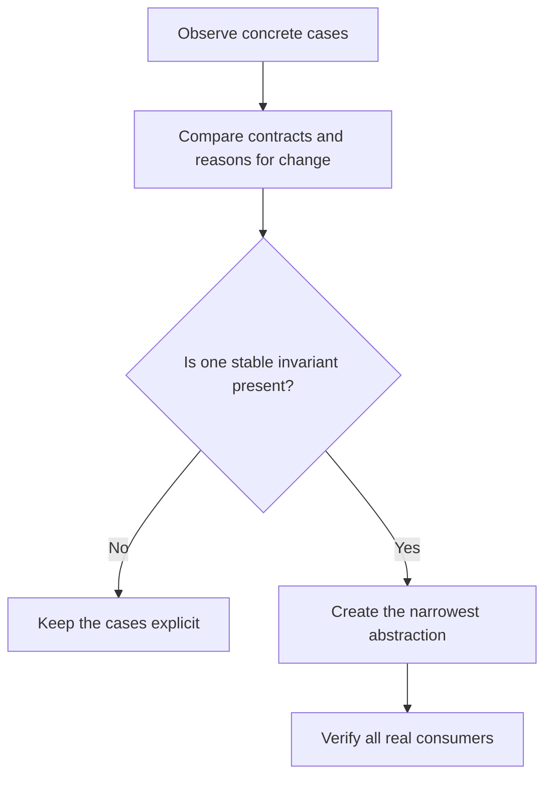

# P013 — AHA

## Definition

**AHA** (*Avoid Hasty Abstractions*) permits generalization only after concrete cases reveal a
stable, shared concept. A temporary duplicate can be safer than a wrong abstraction that connects
unrelated behavior.

## Provenance

**Classification:** practitioner heuristic.

Kent C. Dodds popularized the name and credits Cher Scarlett with the AHA acronym. The warning uses
Sandi Metz's account of the “wrong abstraction.” It also uses earlier guidance against premature
generalization.

## Decision rule

Extract an abstraction when multiple real consumers share the same responsibility, contract, and
reason for change. Keep cases explicit when only surface syntax matches or future consumers are
hypothetical.

## How to apply

- Permit a small amount of duplication until the domain boundary becomes clear.
- Compare why cases change, not merely how their current code looks.
- Name the shared invariant and intended owner before extraction.
- Design the narrowest abstraction required by actual consumers.
- Remove a wrong abstraction before you add flags and exceptions.

## Diagram



## Language examples

The two examples keep an at-sign check separate from a username-character check.

```python
def contains_at_sign(value: str) -> bool:
    return "@" in value

def valid_username(value: str) -> bool:
    return bool(value) and all(ch.isalnum() or ch == "_" for ch in value)
```

```rust
fn contains_at_sign(value: &str) -> bool {
    value.contains('@')
}

fn valid_username(value: &str) -> bool {
    !value.is_empty() && value.chars().all(|ch| ch.is_alphanumeric() || ch == '_')
}
```

## Boundaries and tensions

AHA does not permit indefinite copies. When duplicate knowledge must stay synchronized,
[P003 DRY](p003-dry.md) requires one authority. The required evidence must match the cost of later
change. Stable protocols and repository-mandated boundaries can justify an abstraction before
several repository implementations exist.

## Examples

**Positive:** Two validation paths stay separate. A third case reveals that the two paths enforce
the same domain invariant. That invariant then receives one owner.

**Misuse:** One configurable engine combines similar billing and access-control workflows. The
engine then accumulates switches because billing and access-control policies differ.

**Athena/agent workflow:** An agent links skills to one canonical principles catalog. Each skill
keeps the skill-specific workflow policy local without a universal generated template.

## Related principles

- [P002 YAGNI](p002-yagni.md)
- [P003 DRY](p003-dry.md)
- [P004 SOLID](p004-solid.md)
- [P009 General Mechanisms Over Special Cases](p009-general-mechanisms-over-special-cases.md)
- [P084 Prefer Local Reasoning](p084-prefer-local-reasoning.md)

## References

### Origin/history

- [Kent C. Dodds: AHA Programming](https://kentcdodds.com/blog/aha-programming) introduces and
  attributes the acronym and describes the correct time for abstraction.
- [Sandi Metz: The Wrong Abstraction](https://sandimetz.com/blog/2016/1/20/the-wrong-abstraction)
  provides the influential earlier account of duplication as a cheaper choice than a false shared
  abstraction.

### Current guidance

- [Google Engineering Practices: What to look for in a code review](https://google.github.io/eng-practices/review/reviewer/looking-for.html)
  asks reviewers to assess design, complexity, and excess architecture against current needs.

### Further reading

- [Martin Fowler: Yagni](https://martinfowler.com/bliki/Yagni.html) explains the related economic
  case against speculative flexibility.

[Back to the engineering principles catalog](../README.md#p013)
