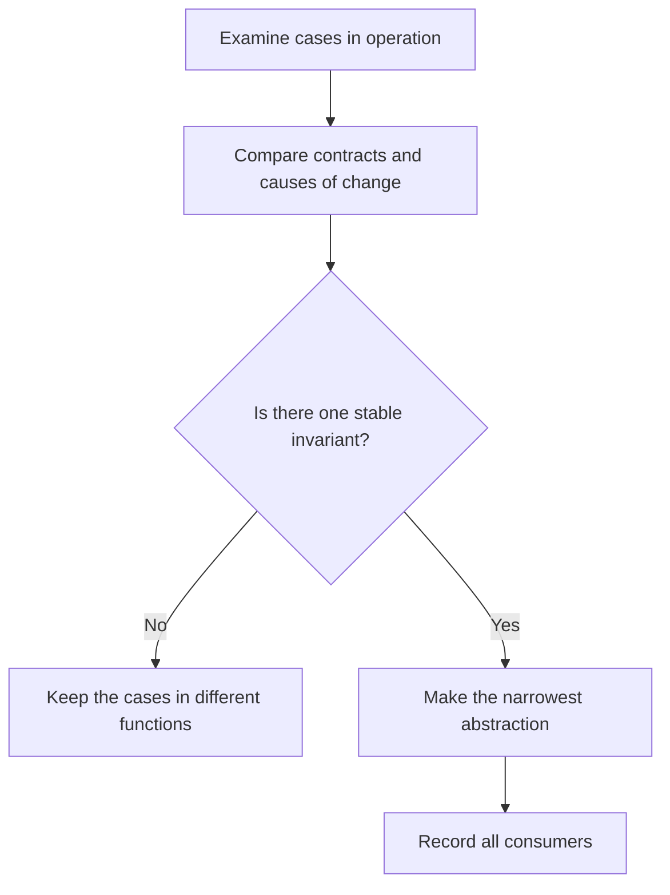

# P013 — AHA

## Definition

**AHA** (*Avoid Hasty Abstractions*) lets authors generalize only after cases in operation show the
same stable concept. A temporary duplicate can be safer than an incorrect abstraction that
connects unrelated behavior.

## Provenance

**Classification:** practitioner heuristic.

Kent C. Dodds gave the principle its name and records Cher Scarlett as the source of the AHA acronym. Sandi Metz's
“wrong abstraction” source and previous guidance that rejects generalization before evidence are sources
for the principle.

## Decision rule

When evidence shows that two or more consumers share the same responsibility, contract, and cause of
change, make an abstraction. When only surface syntax is the same or no evidence shows future
consumers, do not put the cases together.

## How to apply

- Let small duplication stay until the domain boundary becomes clear.
- Compare why cases change, not only their current code structure.
- Before extraction, give the shared invariant and intended owner.
- Select the narrowest abstraction necessary for the consumers that evidence shows.
- Before you add flags and exceptions, remove an incorrect abstraction.

## Diagram



## Language examples

The two examples use different functions for an at-sign check and a username-character check.

```python
def contains_at_sign(value: str) -> bool:
    return "@" in value

def valid_username(value: str) -> bool:
    return bool(value) and all(ch.isascii() and (ch.isalnum() or ch == "_") for ch in value)
```

```rust
fn contains_at_sign(value: &str) -> bool {
    value.contains('@')
}

fn valid_username(value: &str) -> bool {
    !value.is_empty() && value.chars().all(|ch| ch.is_ascii_alphanumeric() || ch == '_')
}
```

## Boundaries and tensions

AHA does not let copies stay without a specified removal condition. When duplicate knowledge must stay synchronized,
one authority is necessary for [P003 DRY](p003-dry.md). The necessary evidence must increase with the cost of subsequent
change. Stable protocols and boundaries that repository rules specify can make an abstraction necessary before the
repository has two implementations.

## Examples

**Positive:** Two validation paths stay isolated. A new condition shows that the two paths have
the same domain invariant. That invariant then receives one owner.

**Misuse:** One configurable engine puts billing and access-control workflows together with almost the
same structure. The engine then adds switches because billing and access-control policies
are different.

**Athena/agent workflow:** An agent gives skills links to one canonical principles catalog. Each skill
keeps the workflow policy for each skill local without a generated template for all workflows.

## Related principles

- [P002 YAGNI](p002-yagni.md)
- [P003 DRY](p003-dry.md)
- [P004 SOLID](p004-solid.md)
- [P009 General Mechanisms Over Special Cases](p009-general-mechanisms-over-special-cases.md)
- [P084 Prefer Local Reasoning](p084-prefer-local-reasoning.md)

## References

### Source information

- [Kent C. Dodds: AHA Programming](https://kentcdodds.com/blog/aha-programming) gives the acronym and
  gives Cher Scarlett as the source of the acronym. The source shows the correct time for abstraction.
- [Sandi Metz: The Wrong Abstraction](https://sandimetz.com/blog/2016/1/20/the-wrong-abstraction)
  shows that duplication is a less expensive alternative than an incorrect shared
  abstraction.

### Applicable information

- [Google Engineering Practices: What to look for in a code review](https://google.github.io/eng-practices/review/reviewer/looking-for.html).
  When there is no current requirement, the guidance makes review of design, complexity, and
  architecture necessary.

### More information

- [Martin Fowler: Yagni](https://martinfowler.com/bliki/Yagni.html) shows the related cost of
  extension points that have no evidence.

[Back to the engineering principles catalog](../README.md#p013)
