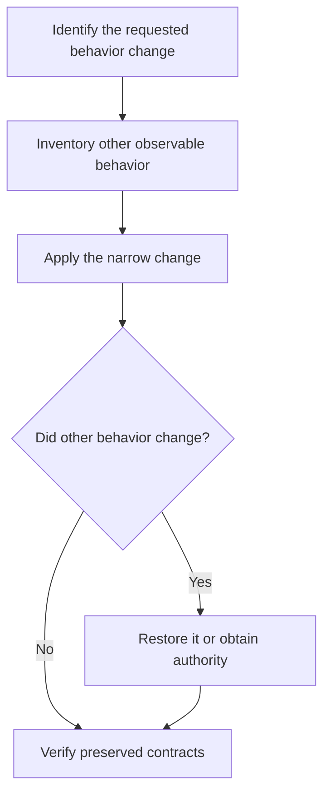

# P014 — Preserve Unrequested Behavior

## Definition

**Preserve Unrequested Behavior** treats observable behavior outside the accepted requirement as an
invariant. This behavior includes public APIs, schemas, file formats, persistence, command behavior,
order, security properties, side effects, and failure contracts. Do not alter it without authority.

## Provenance

**Classification:** Athena synthesis.

Athena created the name from compatibility practice. Compatibility policies, semantic versioning,
and regression tests provide established foundations. No single source defines the full principle
for every type of software change.

## Decision rule

Treat observable behavior outside the requested change as an invariant. Alter it only with specific
authority from the requirement, a mandatory security correction, or an approved compatibility
plan. Provide the required migration.

## How to apply

- Inventory public and operational behavior touched by the change.
- Characterize existing behavior with tests when its contract is unclear.
- Preserve defaults, ordering, errors, formats, and side effects not named in the requirement.
- Provide compatibility or migration paths for intentionally changed contracts when required.
- Report unavoidable collateral behavior changes. Do not hide them in implementation details.

## Diagram



## Language examples

The two examples change the name and preserve every other field.

```python
def rename_user(user: dict, name: str) -> dict:
    updated = user.copy()
    updated["name"] = name
    return updated
```

```rust
fn rename_user(mut user: User, name: String) -> User {
    user.name = name;
    user
}
```

## Boundaries and tensions

This principle does not preserve vulnerabilities, data corruption, or behavior that the contract
explicitly marks as unsupported. Repository policy and authorized requirements can require an
incompatible change. It does not require reproduction of private implementation details when
observable behavior stays the same. [P010 Scope Fidelity](p010-scope-fidelity.md) limits the change.
[P021 Evolutionary and Reversible Design](p021-evolutionary-and-reversible-design.md) guides an
authorized transition.

## Examples

**Positive:** A parser correction accepts a new required input. It preserves serialized output,
error categories, and order for all other inputs.

**Misuse:** A documentation task silently changes a CLI default because the new value seems more
convenient.

**Athena/agent workflow:** An update to skill guidance preserves frontmatter triggers, capability
fallbacks, and host-neutral behavior. An explicit issue requirement can authorize a change.

## Related principles

- [P006 Principle of Least Astonishment](p006-principle-of-least-astonishment.md)
- [P010 Scope Fidelity](p010-scope-fidelity.md)
- [P011 Minimal Coherent Change](p011-minimal-coherent-change.md)
- [P021 Evolutionary and Reversible Design](p021-evolutionary-and-reversible-design.md)
- [P022 Test Behavior, Not Implementation](p022-test-behavior-not-implementation.md)
- [P066 Preserve Existing Work](p066-preserve-existing-work.md)

## References

### Origin/history

- [Semantic Versioning 2.0.0](https://semver.org/spec/v2.0.0.html) formalizes compatibility effects
  for public APIs. It is a version standard, not the origin of Athena's broader rule.

### Current guidance

- [The Go 1 Compatibility Promise](https://go.dev/doc/go1compat) is a concrete language project's
  current policy for behavior preservation and permitted exceptions.
- [Google Engineering Practices: What to look for in a code review](https://google.github.io/eng-practices/review/reviewer/looking-for.html)
  requires reviewer analysis of user effects, compatibility, and tests.

### Further reading

- [Martin Fowler: Is High Quality Software Worth the Cost?](https://martinfowler.com/articles/is-quality-worth-cost.html)
  discusses the long-term value of internal quality and its relation to visible functionality.

[Back to the engineering principles catalog](../README.md#p014)
