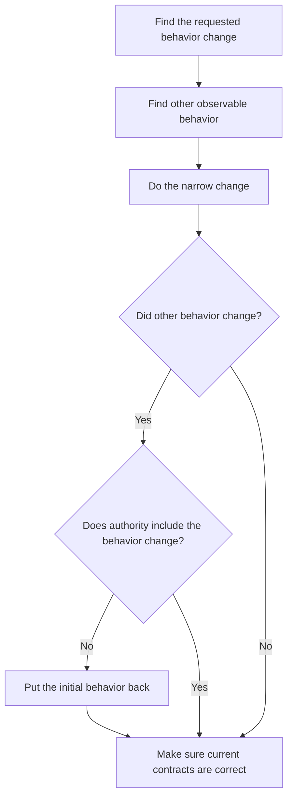

# P014 — Preserve Unrequested Behavior

## Definition

**Preserve Unrequested Behavior** makes observable behavior that is not in the accepted requirement an
invariant. This behavior includes public APIs, schemas, file formats, persistence, command behavior,
order, security properties, side effects, and failure contracts. Do not change it without authority.

## Provenance

**Classification:** Athena synthesis.

Athena gives this name to a rule from compatibility practice. Compatibility policies, semantic versioning,
and regression tests are established sources. No single source gives all parts of this principle
for each type of software change.

## Decision rule

Make observable behavior that is not in the requested change an invariant. Change it only with specified
authority from the requirement, a mandatory security correction, or an approved compatibility
plan. Give the necessary migration.

## How to apply

- Find public behavior and behavior in operation that the change touches.
- When the contract is not clear, record current behavior in tests.
- Keep defaults, ordering, errors, formats, and side effects that the requirement does not include.
- When a clear decision changes a contract, give necessary compatibility or migration paths.
- If the implementation cannot prevent behavior changes, give information about the changes. Do not hide the changes in implementation details.

## Diagram



## Language examples

The two examples change the name and keep all other fields.

```python
def rename_user(user: dict, name: str) -> dict:
    updated = user.copy()
    updated["name"] = name
    return updated
```

```rust
fn rename_user(mut user: User, name: String) -> User {
    user.name = name;
    user
}
```

## Boundaries and tensions

This principle does not keep vulnerabilities, data corruption, or behavior that the contract does
not include. Repository policy and approved requirements can make a change that is not compatible
necessary. When observable behavior stays the same, do not reproduce private implementation details.
[P010 Scope Fidelity](p010-scope-fidelity.md) gives the change boundary.
[P021 Evolutionary and Reversible Design](p021-evolutionary-and-reversible-design.md) is applicable to an
approved transition.

## Examples

**Positive:** A parser correction accepts a new necessary input. It keeps serialized output,
error categories, and order for all other inputs.

**Misuse:** A documentation task changes a CLI default without notice and without a requirement.

**Athena/agent workflow:** An update to skill guidance keeps frontmatter triggers, capability
fallbacks, and host-neutral behavior. An explicit issue requirement can authorize a change.

## Related principles

- [P006 Principle of Least Astonishment](p006-principle-of-least-astonishment.md)
- [P010 Scope Fidelity](p010-scope-fidelity.md)
- [P011 Minimal Coherent Change](p011-minimal-coherent-change.md)
- [P021 Evolutionary and Reversible Design](p021-evolutionary-and-reversible-design.md)
- [P022 Test Behavior, Not Implementation](p022-test-behavior-not-implementation.md)
- [P066 Preserve Existing Work](p066-preserve-existing-work.md)

## References

### Source information

- [Semantic Versioning 2.0.0](https://semver.org/spec/v2.0.0.html) specifies compatibility effects
  for public APIs. It is a version standard, not the source of all parts of Athena's rule.

### Applicable information

- [The Go 1 Compatibility Promise](https://go.dev/doc/go1compat) is the current policy of the Go
  language project for behavior preservation and applicable exceptions.
- [Google Engineering Practices: What to look for in a code review](https://google.github.io/eng-practices/review/reviewer/looking-for.html)
  makes reviewer analysis of user effects, compatibility, and tests necessary.

### More information

- [Martin Fowler: Is High Quality Software Worth the Cost?](https://martinfowler.com/articles/is-quality-worth-cost.html)
  gives information about the long-term value of internal quality and its relation to observable functionality.

[Back to the engineering principles catalog](../README.md#p014)
