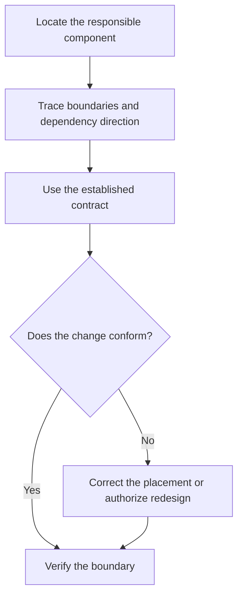

# P015 — Architecture Conformance

## Definition

**Architecture Conformance** requires use of a system's established structure. This structure
includes boundaries, dependency direction, layers, ownership, names, data flow, and extension
mechanisms. A local change must integrate with that structure. The change must not bypass a boundary
or create a parallel architecture for convenience.

## Provenance

**Classification:** established principle.

Architecture conformance is an established practice. It uses modularity, architecture
evaluation, and automated dependency checks. Athena expresses it as a decision rule and claims no
single author for the phrase or this exact form.

## Decision rule

Place a change in the responsible component and use its intended contracts. Depart from the
architecture only when evidence proves that the architecture must change. Explicit authority must
cover the broader change.

## How to apply

- Identify authoritative architecture documentation and verify it against executable structure.
- Trace dependency direction, data ownership, runtime boundaries, and extension points.
- Follow nearby patterns when they still serve the same architectural purpose.
- Evaluate a proposed exception at system scale. Include deployment and failure behavior.
- Mechanically enforce important boundaries with types, tests, static checks, or CI where valuable.

## Diagram



## Language examples

The two examples route persistence through the established storage contract.

```python
from typing import Protocol

class UserStore(Protocol):
    def save(self, user: User) -> None: ...

def register(user: User, store: UserStore) -> None:
    store.save(user)
```

```rust
trait UserStore {
    fn save(&self, user: &User);
}

fn register(user: &User, store: &impl UserStore) {
    store.save(user);
}
```

## Boundaries and tensions

Conformance does not require blind consistency. Use an explicit, evidence-backed decision to evolve
outdated architecture. A local task does not authorize that redesign by default.

Documentation that contradicts executable behavior requires investigation. Do not automatically
obey either source. Repository and user instructions remain the governing authority.
[P071 Consistency Over Personal Preference](p071-consistency-over-personal-preference.md) yields to
[P072 Technical Evidence Over Preference](p072-technical-evidence-over-preference.md) when evidence
justifies a change.

## Examples

**Positive:** A contributor adds a persistence operation behind the established repository
boundary. Domain code depends on its contract, not on the database client.

**Misuse:** A feature writes directly to a shared database from the presentation layer. The
responsible application service needs only a small extension.

**Athena/agent workflow:** A contribution edits canonical sources under `skills/` and updates host
metadata that consumes them. It does not create a host-specific skill copy.

## Related principles

- [P005 Modularity](p005-modularity.md)
- [P012 Evidence Before Modification](p012-evidence-before-modification.md)
- [P016 Separation of Concerns](p016-separation-of-concerns.md)
- [P020 Executable Architecture](p020-executable-architecture.md)
- [P071 Consistency Over Personal Preference](p071-consistency-over-personal-preference.md)
- [P077 Separate Policy from Mechanism](p077-separate-policy-from-mechanism.md)

## References

### Origin/history

- [David Parnas: On the Criteria To Be Used in Decomposing Systems into Modules](https://doi.org/10.1145/361598.361623)
  supplies foundational analysis of architecture boundaries and hidden design decisions.

### Current guidance

- [Software Engineering Institute: Software Architecture](https://www.sei.cmu.edu/software-architecture/)
  describes methods for architecture analysis and maintenance against quality goals.
- [Microsoft: Validate code with layer diagrams](https://learn.microsoft.com/en-us/visualstudio/modeling/validate-code-with-layer-diagrams?view=vs-2022)
  demonstrates automated enforcement of dependency constraints in builds.

### Further reading

- [ArchUnit User Guide](https://www.archunit.org/userguide/html/000_Index.html) documents a current
  architecture test tool and examples of executable layer and dependency rules.

[Back to the engineering principles catalog](../README.md#p015)
