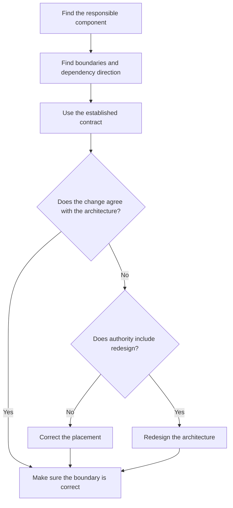

# P015 — Architecture Conformance

## Definition

For **Architecture Conformance**, a change must agree with a system's established structure. This structure
includes boundaries, dependency direction, layers, ownership, names, data flow, and extension
mechanisms. A local change must integrate with that structure. The change must not bypass a boundary
or make a parallel architecture without a requirement.

## Provenance

**Classification:** established principle.

Architecture conformance is an established practice. Modularity, architecture analysis, and
automated dependency checks are sources for this principle. Athena gives the principle as a
decision rule. Athena gives no single author for the phrase or rule.

## Decision rule

Put a change in the responsible component. Use its intended contracts. When evidence shows that an
architecture change is necessary, change the architecture only with authority for that change.

## How to apply

- Find architecture documentation that controls the change.
- Make sure the documentation agrees with executable structure.
- Find dependency direction, data ownership, runtime boundaries, and extension points.
- When adjacent patterns continue to have the same architectural purpose, use those patterns.
- Examine effects of a proposed exception on all system components. Include deployment and failure behavior.
- When evidence shows that types, tests, static checks, or CI help, use them to make sure architecture
  boundaries stay correct.

## Diagram



## Language examples

The two examples use the established storage contract for persistence.

```python
from typing import Protocol

class UserStore(Protocol):
    def save(self, user: User) -> None: ...

def register(user: User, store: UserStore) -> None:
    store.save(user)
```

```rust
trait UserStore {
    fn save(&self, user: &User);
}

fn register(user: &User, store: &impl UserStore) {
    store.save(user);
}
```

## Boundaries and tensions

Consistency without evidence is not necessary for conformance. Use an explicit, evidence-backed decision
to change obsolete architecture. Unless instructions give authority, a local task does not authorize
that redesign.

Investigation is necessary when documentation does not agree with executable behavior. Do not select one of
the two sources without investigation. Repository and user instructions are the authority.
When evidence shows that a change is necessary, apply
[P072 Technical Evidence Over Preference](p072-technical-evidence-over-preference.md) before
[P071 Consistency Over Personal Preference](p071-consistency-over-personal-preference.md).

## Examples

**Positive:** A contributor adds a persistence operation to the established repository component.
Domain code has a dependency on its contract, not on the database client.

**Misuse:** A feature writes to a shared database from the presentation layer without the repository boundary. Only a
small extension to the responsible application service is necessary.

**Athena/agent workflow:** A contribution edits canonical sources in `skills/` and updates host
metadata that consumes them. It does not make a skill copy for one host.

## Related principles

- [P005 Modularity](p005-modularity.md)
- [P012 Evidence Before Modification](p012-evidence-before-modification.md)
- [P016 Separation of Concerns](p016-separation-of-concerns.md)
- [P020 Executable Architecture](p020-executable-architecture.md)
- [P071 Consistency Over Personal Preference](p071-consistency-over-personal-preference.md)
- [P077 Separate Policy from Mechanism](p077-separate-policy-from-mechanism.md)

## References

### Source information

- [David Parnas: On the Criteria To Be Used in Decomposing Systems into Modules](https://doi.org/10.1145/361598.361623)
  gives primary analysis of architecture boundaries and hidden design decisions.

### Applicable information

- [Software Engineering Institute: Software Architecture](https://www.sei.cmu.edu/software-architecture/)
  gives information about methods that use quality requirements for architecture analysis and maintenance.
- [Microsoft: Validate code with layer diagrams](https://learn.microsoft.com/en-us/visualstudio/modeling/validate-code-with-layer-diagrams?view=vs-2022)
  shows automated architecture-rule checks in builds.

### More information

- [ArchUnit User Guide](https://www.archunit.org/userguide/html/000_Index.html) gives information
  about a tool for tests of current architecture rules. It also gives examples of executable layer
  and dependency rules.

[Back to the engineering principles catalog](../README.md#p015)
