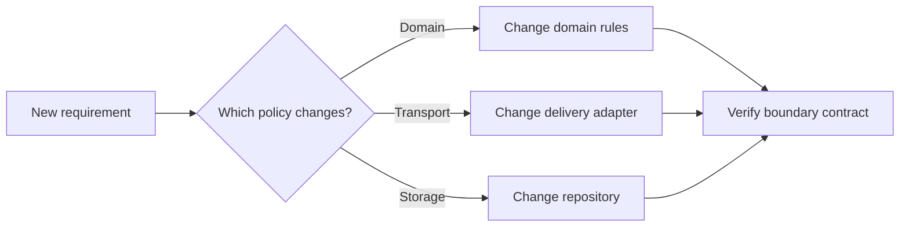

# P016 — Separation of Concerns

## Definition

Separate system concerns that serve different purposes or follow different policies. This
separation lets each concern change without needless effects on other concerns.

Common concerns include domain rules, persistence, transport, presentation, security policy, and
orchestration.

**Aliases:** concern separation, separation of responsibilities.

## Provenance

**Classification:** established principle.

Edsger W. Dijkstra used the phrase "separation of concerns" in EWD447 (1974). Earlier modular
design work described related ideas. Therefore, the broader practice has no single origin.

## Decision rule

Define an explicit boundary when two responsibilities have different change reasons, rates, or
authorities. Do not add a boundary when its coordination cost exceeds its value.

## How to apply

- Identify each policy in a workflow before you select files, layers, or services.
- Keep domain decisions independent from delivery methods such as HTTP, CLI, and storage.
- Place each shared concern behind one explicit facility.
- Test each concern through its contract. Add integration tests at each boundary.
- Reassess the split when one change often requires edits to each side.

## Diagram



## Language examples

The two examples keep the domain rule separate from transport status selection.

Python:

```python
def refund_allowed(days_since_purchase: int) -> bool:
    return days_since_purchase <= 30


def refund_status(days_since_purchase: int) -> int:
    return 200 if refund_allowed(days_since_purchase) else 409
```

Rust:

```rust
fn refund_allowed(days_since_purchase: u32) -> bool {
    days_since_purchase <= 30
}

fn refund_status(days_since_purchase: u32) -> u16 {
    if refund_allowed(days_since_purchase) { 200 } else { 409 }
}
```

## Boundaries and tensions

Separation is conceptual. It does not require one service, class, or file for each concern. A
small, cohesive function can combine mechanics that always change together.

Excessive separation can add indirection, distributed state, and difficult local analysis. Balance
this principle with [P017](p017-high-cohesion-low-coupling.md). Preserve one owner for shared
policy.

## Examples

### Positive application

An order module decides whether a refund is valid. An adapter converts that decision to an HTTP
response. A repository records the refund.

Tests can verify the refund rule without a web server or database.

### Misuse or counterexample

A team divides a ten-line validation operation among a policy object, coordinator, factory, and
remote service. These parts have no independent change reason.

### Athena or agent workflow

A review skill owns review policy. A helper script owns deterministic parsing. Neither component
duplicates the responsibility of the other component.

## Related principles

- [P017 — High Cohesion, Low Coupling](p017-high-cohesion-low-coupling.md)
- [P018 — Information Hiding](p018-information-hiding.md)
- [P019 — Explicit Contracts](p019-explicit-contracts.md)

## References

### Origin and history

- [Dijkstra, "On the role of scientific thought" (EWD447, 1974)](https://www.cs.utexas.edu/~EWD/transcriptions/EWD04xx/EWD447.html)
  describes separate analysis of one aspect without rejection of other aspects.

### Current guidance

- [Microsoft Azure Architecture Center, "Design for evolution"](https://learn.microsoft.com/en-us/azure/architecture/guide/design-principles/design-for-evolution)
  recommends separation of cross-cutting concerns and cohesive, loosely coupled services.

### Further reading

- [Parnas, "On the Criteria To Be Used in Decomposing Systems into Modules" (1972)](https://doi.org/10.1145/361598.361623)
  describes decomposition around design decisions that can change.

[Back to the engineering principles catalog](../README.md#p016)
