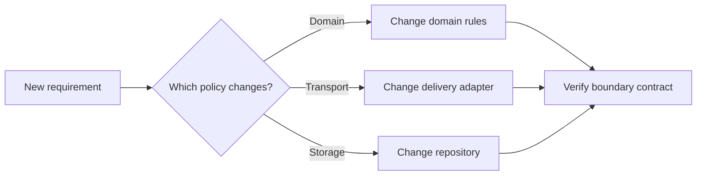

# P016 — Separation of Concerns

## Definition

Put system concerns with different functions or policies in different components. This structure
keeps the effects of a concern change small for other concerns.

Concern categories include domain rules, persistence, transport, presentation, security policy,
and orchestration.

**Aliases:** concern separation, separation of responsibilities.

## Provenance

**Classification:** established principle.

Edsger W. Dijkstra used the phrase "separation of concerns" in EWD447 (1974). Modular design work
before 1974 gave related ideas. Thus, more than one source gave ideas for the practice.

## Decision rule

If two responsibilities have different change reasons, rates, or authorities, give an explicit
boundary. If a boundary adds more coordination work than it removes, do not add the boundary.

## How to apply

- Before you select files, layers, or services, find each policy in a workflow.
- Do not include delivery methods, for example HTTP, CLI, and storage, in domain decisions.
- Give each shared concern one explicit owner.
- Do a test of each concern through its contract. Add integration tests at each boundary.
- If one change frequently causes edits on the two sides, examine the split again.

## Diagram



## Language examples

In the two examples, transport status selection does not change the domain rule.

Python:

```python
def refund_allowed(days_since_purchase: int) -> bool:
    if type(days_since_purchase) is not int or not 0 <= days_since_purchase <= 0xFFFF_FFFF:
        raise ValueError("days_since_purchase must be u32")
    return days_since_purchase <= 30


def refund_status(days_since_purchase: int) -> int:
    return 200 if refund_allowed(days_since_purchase) else 409
```

Rust:

```rust
fn refund_allowed(days_since_purchase: u32) -> bool {
    days_since_purchase <= 30
}

fn refund_status(days_since_purchase: u32) -> u16 {
    if refund_allowed(days_since_purchase) { 200 } else { 409 }
}
```

## Boundaries and tensions

Separation is applicable to responsibilities. One service, class, or file for each concern is not
necessary. A small, cohesive function can contain mechanics that change together.

Too much separation can add indirection, distributed state, and local analysis that is not easy.
Apply [P017](p017-high-cohesion-low-coupling.md) with this principle. Keep one owner for shared policy.

## Examples

### Positive application

An order module applies the refund permission rule. An adapter converts that decision to an HTTP
response. A repository records the refund.

Tests can verify the refund rule without a web server or database.

### Misuse or counterexample

A team divides a ten-line validation operation into a policy object, coordinator, factory, and
remote service. These parts do not have different change reasons.

### Athena or agent workflow

A review skill owns review policy. A helper script owns deterministic parsing. The two components
do not duplicate responsibilities.

## Related principles

- [P017 — High Cohesion, Low Coupling](p017-high-cohesion-low-coupling.md)
- [P018 — Information Hiding](p018-information-hiding.md)
- [P019 — Explicit Contracts](p019-explicit-contracts.md)

## References

### Source information

- [Dijkstra, "On the role of scientific thought" (EWD447, 1974)](https://www.cs.utexas.edu/~EWD/transcriptions/EWD04xx/EWD447.html)
  gives an analysis method that examines one aspect at a time.

### Applicable information

- [Microsoft Azure Architecture Center, "Design for evolution"](https://learn.microsoft.com/en-us/azure/architecture/guide/design-principles/design-for-evolution)
  recommends separation of cross-cutting concerns and cohesive, loosely coupled services.

### More information

- [Parnas, "On the Criteria To Be Used in Decomposing Systems into Modules" (1972)](https://doi.org/10.1145/361598.361623)
  gives decomposition around design decisions that can change.

[Back to the engineering principles catalog](../README.md#p016)
