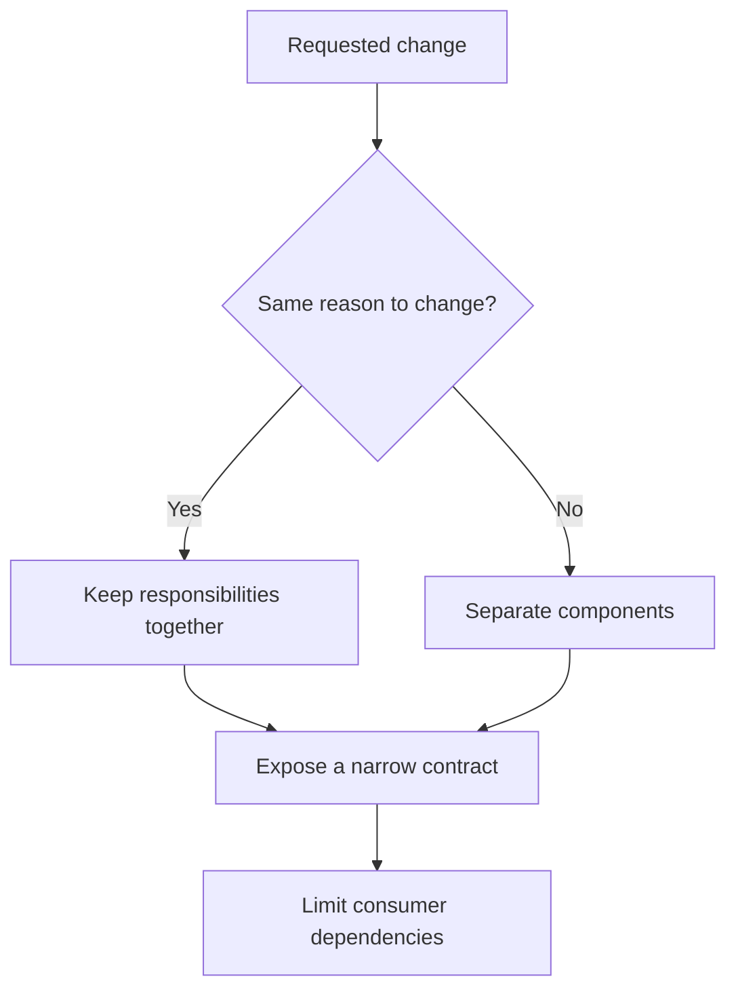

# P017 — High Cohesion, Low Coupling

## Definition

Place related responsibilities and data in one component. Minimize the number and strength of
dependencies between components.

Cohesion measures internal relation. Coupling measures dependence across a boundary.

**Aliases:** strong cohesion and loose coupling, functional cohesion and weak coupling.

## Provenance

**Classification:** established principle.

Stevens, Myers, and Constantine formalized coupling and cohesion in structured design during the
1970s. The compact maxim is later practitioner language. The maxim has no single source.

## Decision rule

Group elements that change for the same reason. Connect groups through the smallest stable
contract that preserves required behavior.

## How to apply

- Use change history and domain ownership to identify cohesive boundaries.
- Keep each invariant with the state that it governs.
- Pass only data or capability that a collaborator needs. Avoid shared mutable global data.
- Inspect repeated cross-module changes, dependency cycles, and wide interfaces.
- Use coupling metrics only as evidence. Confirm each result with domain knowledge.

## Diagram



## Language examples

The two examples keep price rules cohesive and restrict checkout to a narrow quote contract.

Python:

```python
from typing import Protocol

class Quoter(Protocol):
    def quote(self, subtotal: int) -> int: ...

class Pricing:
    def quote(self, subtotal: int) -> int:
        return subtotal - (10 if subtotal >= 100 else 0)

def checkout_total(quoter: Quoter, subtotal: int) -> int:
    return quoter.quote(subtotal)
```

Rust:

```rust
trait Quoter {
    fn quote(&self, subtotal: u32) -> u32;
}
struct Pricing;
impl Quoter for Pricing {
    fn quote(&self, subtotal: u32) -> u32 {
        subtotal - if subtotal >= 100 { 10 } else { 0 }
    }
}
fn checkout_total(quoter: &impl Quoter, subtotal: u32) -> u32 {
    quoter.quote(subtotal)
}
```

## Boundaries and tensions

Every useful system has some coupling. Event buses, generic data maps, and duplicate state can
conceal coupling.

An overly broad definition of related can create a large component. Prefer explicit dependencies
to implicit coordination. Balance component independence with transaction consistency.

## Examples

### Positive application

A pricing component owns discount rules and their required inputs. Checkout uses only a narrow
quote contract. Checkout does not use pricing tables or cache details.

### Misuse or counterexample

Two services exchange many events and share a database. The absence of synchronous calls does not
make these services loosely coupled.

### Athena or agent workflow

A skill-local helper performs one parsing task and exposes a stable CLI. The skill uses only that
CLI. Other skills do not import private helper code.

## Related principles

- [P016 — Separation of Concerns](p016-separation-of-concerns.md)
- [P018 — Information Hiding](p018-information-hiding.md)
- [P019 — Explicit Contracts](p019-explicit-contracts.md)

## References

### Origin and history

- [Stevens, Myers, and Constantine, "Structured Design" (1974)](https://doi.org/10.1147/sj.132.0115)
  presents a systematic treatment of module coupling and cohesion.

### Current guidance

- [Microsoft Azure Architecture Center, "Design for evolution"](https://learn.microsoft.com/en-us/azure/architecture/guide/design-principles/design-for-evolution)
  connects cohesion and loose coupling to independent service changes.

### Further reading

- [SEI, "Modifiability Tactics" (2007)](https://www.sei.cmu.edu/documents/778/2007_005_001_14858.pdf)
  analyzes responsibility, coupling, cohesion, and change propagation.

[Back to the engineering principles catalog](../README.md#p017)
