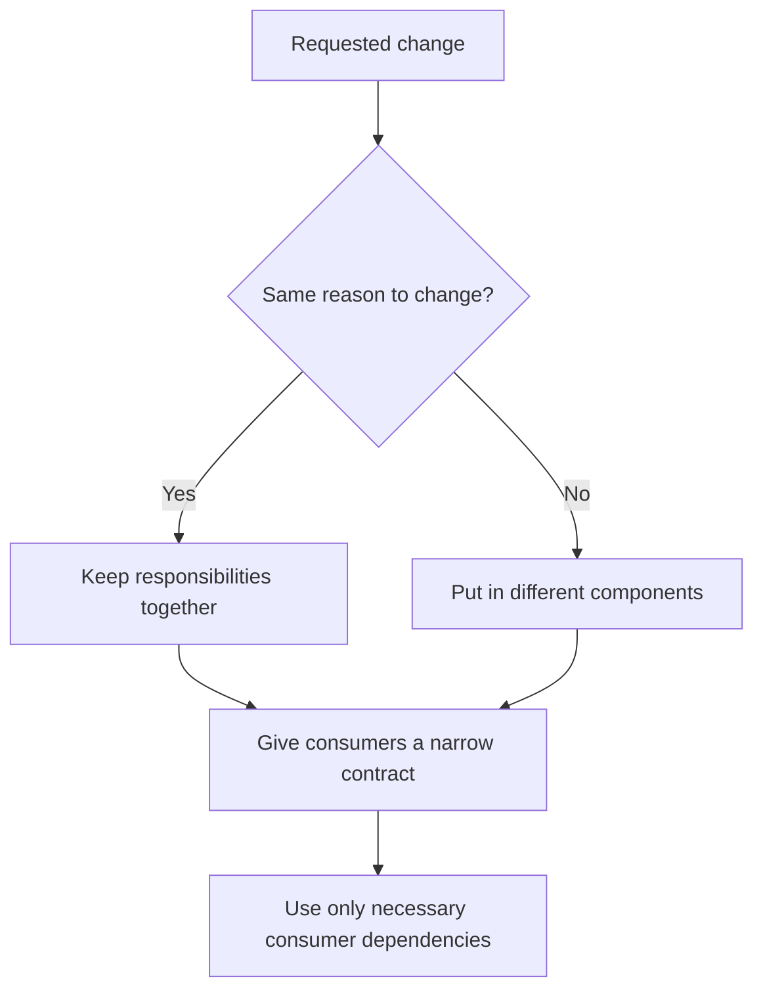

# P017 — High Cohesion, Low Coupling

## Definition

Put related responsibilities and related state in one component. Use the smallest number of weak
dependencies necessary for system operation.

Cohesion measures internal relation. Coupling measures component dependence.

**Aliases:** strong cohesion and loose coupling, functional cohesion and weak coupling.

## Provenance

**Classification:** established principle.

Stevens, Myers, and Constantine gave definitions for coupling and cohesion in structured design
during the 1970s. Practitioners then gave the short maxim. No one source contains the maxim.

## Decision rule

Put elements that change for the same reason in one component. Use the smallest stable contract
that preserves necessary behavior to connect components.

## How to apply

- Use change history and domain ownership to find cohesive boundaries.
- Keep each invariant with its related state.
- Pass only data or capability that is necessary for a collaborator. Do not share mutable global data.
- Examine cross-module change patterns, dependency cycles, and wide interfaces.
- Coupling metrics give evidence only. Make sure that each result agrees with domain knowledge.

## Diagram



## Language examples

The two examples keep price rules cohesive. Checkout depends only on a narrow quote contract.

Python:

```python
class U32(int):
    def __new__(cls, value: int):
        if type(value) is not int or not 0 <= value <= 0xFFFF_FFFF:
            raise ValueError("value must be u32")
        return int.__new__(cls, value)
class Quoter:
    def quote(self, subtotal: U32) -> U32: raise NotImplementedError
class Pricing(Quoter):
    def quote(self, subtotal: U32) -> U32:
        return U32(subtotal - (10 if subtotal >= 100 else 0))
def checkout_total(quoter: Quoter, subtotal: U32) -> U32:
    return quoter.quote(subtotal)
```

Rust:

```rust
trait Quoter {
    fn quote(&self, subtotal: u32) -> u32;
}
struct Pricing;
impl Quoter for Pricing {
    fn quote(&self, subtotal: u32) -> u32 {
        subtotal - if subtotal >= 100 { 10 } else { 0 }
    }
}
fn checkout_total(quoter: &impl Quoter, subtotal: u32) -> u32 {
    quoter.quote(subtotal)
}
```

## Boundaries and tensions

Each system has some coupling. Event buses, generic data maps, and duplicate state can
hide coupling.

A definition that puts too many responsibilities together can make a large component. Use explicit
dependencies, not implicit coordination. Select a design that gives component independence and transaction consistency.

## Examples

### Positive application

A pricing component owns discount rules and their necessary inputs. Checkout uses only a narrow
quote contract. Checkout does not use pricing tables or cache details.

### Misuse or counterexample

Two services send many events to each other and share a database. These services do not make synchronous
calls. This fact does not make the services loosely coupled.

### Athena or agent workflow

A skill-local helper does one parsing task and gives a stable CLI. The skill uses only that
CLI. Other skills do not import private helper code.

## Related principles

- [P016 — Separation of Concerns](p016-separation-of-concerns.md)
- [P018 — Information Hiding](p018-information-hiding.md)
- [P019 — Explicit Contracts](p019-explicit-contracts.md)

## References

### Source information

- [Stevens, Myers, and Constantine, "Structured Design" (1974)](https://doi.org/10.1147/sj.132.0115)
  gives module coupling and cohesion categories.

### Applicable information

- [Microsoft Azure Architecture Center, "Design for evolution"](https://learn.microsoft.com/en-us/azure/architecture/guide/design-principles/design-for-evolution)
  shows how cohesion and loose coupling let one service change without changes to other services.

### More information

- [SEI, "Modifiability Tactics" (2007)](https://www.sei.cmu.edu/documents/778/2007_005_001_14858.pdf)
  gives an analysis of responsibility, coupling, cohesion, and change propagation.

[Back to the engineering principles catalog](../README.md#p017)
