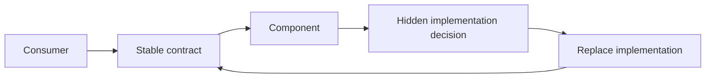

# P018 — Information Hiding

## Definition

Give consumers a stable contract and hide implementation decisions that can change.
Consumers use only the component guarantees. They do not use the component representation, algorithm,
dependency, or operational details.

**Aliases:** encapsulation of design decisions, implementation hiding.

## Provenance

**Classification:** established principle.

David Parnas used information hiding as a module decomposition criterion in 1972. Encapsulation
is a related principle. Language-level access control does not hide each implementation
decision that can change.

## Decision rule

Give consumers only the facts that they must use. Keep each implementation decision that can change
behind the boundary.

## How to apply

- Find possible change points, for example storage formats, vendors, algorithms, and cache
  policy.
- Publish operations and semantic guarantees. Do not publish internal fields or dependency objects.
- Do not use shared tables or mutable aliases to give access to private representations.
- Before you change an implementation, do tests of the public contract.
- Record each specified escape path and its compatibility cost.

## Diagram



## Language examples

The two examples give store operations to consumers and hide the map representation.

Python:

```python
class TokenStore:
    def __init__(self) -> None:
        self._tokens: dict[str, str] = {}

    def save(self, user: str, token: str) -> None:
        self._tokens[user] = token

    def load(self, user: str) -> str | None:
        return self._tokens.get(user)
```

Rust:

```rust
use std::collections::HashMap;

pub struct TokenStore { tokens: HashMap<String, String> }
impl TokenStore {
    pub fn new() -> Self { Self { tokens: HashMap::new() } }
    pub fn save(&mut self, user: String, token: String) {
        self.tokens.insert(user, token);
    }
    pub fn load(&self, user: &str) -> Option<&str> {
        self.tokens.get(user).map(String::as_str)
    }
}
```

## Boundaries and tensions

Information hiding must show behavior that is necessary for correct operation. This behavior includes
side effects, ownership, latency, failure modes, and consistency guarantees.

Without evidence for more than one possible implementation, do not make an abstraction.
Observability can show safe diagnostic facts. It must not show mutable internals or sensitive
data.

## Examples

### Positive application

A repository publishes `save` and `load` operations. The repository owns its schema and migration
details. Callers do not write SQL or use table names.

### Misuse or counterexample

A wrapper makes its fields private and returns its mutable collection. Consumers can use that
representation and corrupt it.

### Athena or agent workflow

A skill invokes a specified helper command and interprets its exit contract. It does not import
private helper modules or use log text that is not part of the exit contract.

## Related principles

- [P016 — Separation of Concerns](p016-separation-of-concerns.md)
- [P017 — High Cohesion, Low Coupling](p017-high-cohesion-low-coupling.md)
- [P019 — Explicit Contracts](p019-explicit-contracts.md)

## References

### Source information

- [Parnas, "On the Criteria To Be Used in Decomposing Systems into Modules" (1972)](https://doi.org/10.1145/361598.361623)
  recommends modules that hide design decisions, not process-step modules.

### Applicable information

- [Oracle, "Strong Encapsulation in the JDK"](https://docs.oracle.com/en/java/javase/25/migrate/migrating-jdk-8-later-jdk-releases.html)
  gives a platform boundary that hides unsupported internals from consumers.

### More information

- [SEI, "Software Architecture"](https://www.sei.cmu.edu/software-architecture/)
  gives explicit structural decisions and conformance during system evolution.

[Back to the engineering principles catalog](../README.md#p018)
