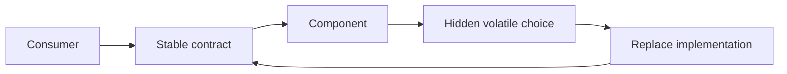

# P018 — Information Hiding

## Definition

Expose a stable contract and conceal implementation decisions that are likely to change. Consumers
need only the component guarantees. They do not need its representation, algorithm, dependency, or
operational details.

**Aliases:** encapsulation of design decisions, implementation hiding.

## Provenance

**Classification:** established principle.

David Parnas defined information hiding as a module decomposition criterion in 1972. Encapsulation
is closely related. Language-level access control alone does not hide every volatile decision.

## Decision rule

Expose only the facts that consumers must use. Keep each volatile choice behind the boundary.

## How to apply

- Identify probable change points such as storage formats, vendors, algorithms, and cache policy.
- Publish operations and semantic guarantees instead of internal fields or dependency objects.
- Prevent access to private representations through shared tables or mutable aliases.
- Protect implementation changes with contract tests before you change a public contract.
- Document each intentional escape path and its compatibility cost.

## Diagram



## Language examples

The two examples expose store operations and conceal the map representation.

Python:

```python
class TokenStore:
    def __init__(self) -> None:
        self._tokens: dict[str, str] = {}

    def save(self, user: str, token: str) -> None:
        self._tokens[user] = token

    def load(self, user: str) -> str | None:
        return self._tokens.get(user)
```

Rust:

```rust
use std::collections::HashMap;

pub struct TokenStore { tokens: HashMap<String, String> }
impl TokenStore {
    pub fn new() -> Self { Self { tokens: HashMap::new() } }
    pub fn save(&mut self, user: String, token: String) {
        self.tokens.insert(user, token);
    }
    pub fn load(&self, user: &str) -> Option<&str> {
        self.tokens.get(user).map(String::as_str)
    }
}
```

## Boundaries and tensions

Information hiding must expose behavior that callers need for correct use. This behavior includes
side effects, ownership, latency, failure modes, and consistency guarantees.

The principle does not justify a speculative abstraction for every possible implementation.
Observability can expose safe diagnostic facts. It must not expose mutable internals or sensitive
data.

## Examples

### Positive application

A repository exposes `save` and `load` operations. The repository owns its schema and migration
details. Callers do not construct SQL or use table names.

### Misuse or counterexample

A wrapper marks its fields as private and returns its mutable collection. Consumers can still use
that representation and corrupt it.

### Athena or agent workflow

A skill invokes a documented helper command and interprets its exit contract. It does not import
private helper modules or use incidental log text.

## Related principles

- [P016 — Separation of Concerns](p016-separation-of-concerns.md)
- [P017 — High Cohesion, Low Coupling](p017-high-cohesion-low-coupling.md)
- [P019 — Explicit Contracts](p019-explicit-contracts.md)

## References

### Origin and history

- [Parnas, "On the Criteria To Be Used in Decomposing Systems into Modules" (1972)](https://doi.org/10.1145/361598.361623)
  favors modules that conceal design decisions rather than process-step modules.

### Current guidance

- [Oracle, "Strong Encapsulation in the JDK"](https://docs.oracle.com/en/java/javase/25/migrate/migrating-jdk-8-later-jdk-releases.html)
  documents a platform boundary that protects unsupported internals from consumers.

### Further reading

- [SEI, "Software Architecture"](https://www.sei.cmu.edu/software-architecture/)
  describes explicit structural decisions and conformance during system evolution.

[Back to the engineering principles catalog](../README.md#p018)
