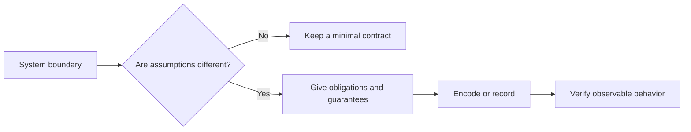

# P019 — Explicit Contracts

## Definition

When ambiguity can cause defects, give boundary obligations and guarantees. A contract
includes all properties that are necessary for correct operation.

These properties can include inputs, outputs, preconditions, postconditions, invariants, units,
ownership, mutability, side effects, concurrency, and failures.

**Aliases:** interface contract, behavioral contract.

## Provenance

**Classification:** Athena synthesis.

Bertrand Meyer's Design by Contract gives a related formal foundation. It is not a full
alias. Meyer made preconditions, postconditions, and invariants part of the method.

This principle also includes operational and ownership properties.

## Decision rule

Two parties can make different assumptions about a boundary. Before operation, encode or record each
material assumption.

## How to apply

- Give accepted and rejected inputs. Give units, ranges, nullability, and encoding.
- Give observable outputs, side effects, order, consistency, and error categories.
- When applicable, put contracts in types, schemas, assertions, tests, or protocol definitions.
- Give the owner and lifetime of mutable data and resources.
- Version external contracts. Each semantic change is a compatibility decision.

## Diagram



## Language examples

The two examples accept signed-64 integer inputs and return typed errors for values not in that
range.

Python:

```python
I64_MIN, I64_MAX = -(1 << 63), (1 << 63) - 1
class OutOfRangeError(ValueError): ...
class NegativeRequestError(ValueError): ...
class InsufficientCapacityError(ValueError): ...

def reserve_bytes(requested: int, capacity: int) -> int:
    if type(requested) is not int or type(capacity) is not int or not (I64_MIN <= requested <= I64_MAX and I64_MIN <= capacity <= I64_MAX):
        raise OutOfRangeError("signed-64 range required")
    if requested < 0:
        raise NegativeRequestError("negative request")
    if requested > capacity:
        raise InsufficientCapacityError("insufficient capacity")
    return capacity - requested
```

Rust:

```rust
enum ReserveError { OutOfRange, NegativeRequest, InsufficientCapacity }

fn reserve_bytes(requested: i128, capacity: i128) -> Result<i64, ReserveError> {
    let range = i64::MIN as i128..=i64::MAX as i128;
    if !range.contains(&requested) || !range.contains(&capacity) { return Err(ReserveError::OutOfRange); }
    if requested < 0 { return Err(ReserveError::NegativeRequest); }
    if requested > capacity { return Err(ReserveError::InsufficientCapacity); }
    Ok((capacity - requested) as i64)
}
```

## Boundaries and tensions

Full prose is not necessary for each internal helper. Contract detail changes with ambiguity, risk,
and consumer count.

A schema cannot contain all semantic promises. Generated documentation does not replace executable
verification. Do not show implementation details that can change in contract coverage reports.

## Examples

### Positive application

A batch API uses bytes for sizes. It rejects negative values and preserves input order. It
returns a typed partial-failure result and preserves caller-owned data.

### Misuse or counterexample

An endpoint publishes a JSON shape. The endpoint does not give retry behavior. Callers do not know if a retry
can duplicate a write.

### Athena or agent workflow

A skill gives necessary inputs, permitted capabilities, success evidence, and safe failure output.
A host can invoke the skill without guesses about hidden preconditions.

## Related principles

- [P018 — Information Hiding](p018-information-hiding.md)
- [P020 — Executable Architecture](p020-executable-architecture.md)
- [P029 — Generalize Error Policy; Preserve Specific Cause](p029-generalize-error-policy-preserve-specific-cause.md)

## References

### Source information

- [Meyer, "Applying Design by Contract" (1992)](https://doi.org/10.1109/2.161279)
  gives software reliability through explicit client and supplier obligations.

### Applicable information

- [JSON Schema specification, Draft 2020-12](https://json-schema.org/specification)
  gives a machine-readable vocabulary for JSON structure and validation.
- [OpenAPI Specification v3.2.0](https://spec.openapis.org/oas/v3.2.0.html)
  gives versioned contracts for HTTP operations, parameters, request bodies, responses, and
  schemas.

### More information

- [RFC 9457, "Problem Details for HTTP APIs" (2023)](https://www.rfc-editor.org/rfc/rfc9457.html)
  shows a stable error contract with general problem types and event-specific detail.

[Back to the engineering principles catalog](../README.md#p019)
