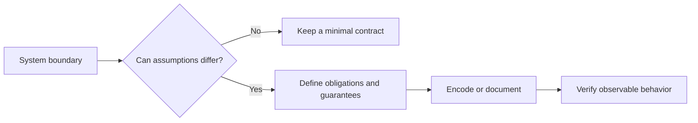

# P019 — Explicit Contracts

## Definition

State boundary obligations and guarantees when ambiguity can cause defects. A useful contract
covers all properties that affect correct use.

These properties can include inputs, outputs, preconditions, postconditions, invariants, units,
ownership, mutability, side effects, concurrency, and failures.

**Aliases:** interface contract, behavioral contract.

## Provenance

**Classification:** Athena synthesis.

Bertrand Meyer's Design by Contract provides a related formal foundation. It is not an exact
alias. Meyer formalized preconditions, postconditions, and invariants.

This principle extends that vocabulary to operational and ownership properties in modern systems.

## Decision rule

Two parties can make different reasonable assumptions about a boundary. Encode or document each
material assumption before use.

## How to apply

- Define accepted and rejected inputs. State units, ranges, nullability, and encoding.
- Specify observable outputs, side effects, order, consistency, and error categories.
- Express contracts in types, schemas, assertions, tests, or protocol definitions when practical.
- Name the owner and lifetime of mutable data and resources.
- Version external contracts. Treat each semantic change as a compatibility decision.

## Diagram



## Language examples

The two examples define valid input and an explicit error contract for byte reservations.

Python:

```python
class ReserveError(ValueError):
    pass

class NegativeRequestError(ReserveError):
    pass

class InsufficientCapacityError(ReserveError):
    pass

def reserve_bytes(requested: int, capacity: int) -> int:
    if requested < 0:
        raise NegativeRequestError("negative request")
    if requested > capacity:
        raise InsufficientCapacityError("insufficient capacity")
    return capacity - requested
```

Rust:

```rust
enum ReserveError { NegativeRequest, InsufficientCapacity }

fn reserve_bytes(requested: i64, capacity: i64) -> Result<i64, ReserveError> {
    if requested < 0 {
        return Err(ReserveError::NegativeRequest);
    }
    if requested > capacity {
        return Err(ReserveError::InsufficientCapacity);
    }
    Ok(capacity - requested)
}
```

## Boundaries and tensions

Not every internal helper needs exhaustive prose. Match contract detail to ambiguity, risk, and
consumer count.

A schema cannot express every semantic promise. Generated documentation does not replace
executable verification. Do not expose volatile implementation details only to claim full contract
coverage.

## Examples

### Positive application

A batch API states that sizes use bytes. It rejects negative values and preserves input order. It
returns a typed partial-failure result and preserves caller-owned data.

### Misuse or counterexample

An endpoint publishes a JSON shape but omits retry behavior. Callers do not know whether a retry
can duplicate a write.

### Athena or agent workflow

A skill defines required inputs, permitted capabilities, success evidence, and safe failure output.
A host can invoke the skill without guesses about hidden preconditions.

## Related principles

- [P018 — Information Hiding](p018-information-hiding.md)
- [P020 — Executable Architecture](p020-executable-architecture.md)
- [P029 — Generalize Error Policy; Preserve Specific Cause](p029-generalize-error-policy-preserve-specific-cause.md)

## References

### Origin and history

- [Meyer, "Applying Design by Contract" (1992)](https://doi.org/10.1109/2.161279)
  presents software reliability through explicit client and supplier obligations.

### Current guidance

- [JSON Schema specification, Draft 2020-12](https://json-schema.org/specification)
  provides a machine-readable vocabulary for JSON structure and validation.
- [OpenAPI Specification v3.2.0](https://spec.openapis.org/oas/v3.2.0.html)
  defines versioned contracts for HTTP operations, parameters, request bodies, responses, and
  schemas.

### Further reading

- [RFC 9457, "Problem Details for HTTP APIs" (2023)](https://www.rfc-editor.org/rfc/rfc9457.html)
  demonstrates a stable error contract with general problem types and event-specific detail.

[Back to the engineering principles catalog](../README.md#p019)
