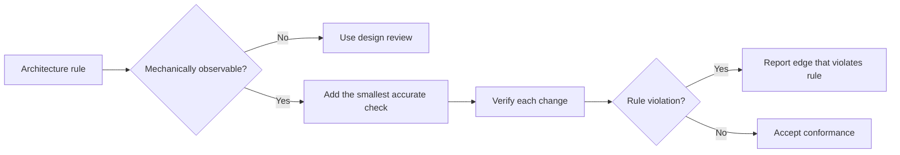

# P020 — Executable Architecture

## Definition

Encode important architectural constraints in mechanisms that verify implementation conformance.
Possible mechanisms include tests, type systems, schemas, static analysis, dependency rules, CI
policy, and runtime guards.

Documentation gives the explanation. Executable checks detect drift.

**Aliases:** architecture fitness functions, architecture tests, automated architecture
governance.

## Provenance

**Classification:** practitioner heuristic.

No one source gives this architectural practice. Ford, Parsons, and Kua give architecture fitness
functions. Tools before their work also enforced dependency and conformance rules.

## Decision rule

When a mechanically observable architecture violation can cause material risk, add the smallest
accurate check. Put the check at the nearest feedback boundary.

## How to apply

- Select a small number of important qualities or dependency rules.
- Select the lowest-cost mechanism that verifies the rule, for example a compiler, linter, test, or
  CI check.
- Make failure output identify the violated rule and the related dependency or artifact.
- Add the rule and its check in the same change.
- After an approved architecture change, revise the check. Revise the rule and implementation in
  the same change.

## Diagram



## Language examples

The two examples make the same dependency direction an executable rule.

Python:

```python
ALLOWED = {("api", "domain"), ("storage", "domain")}

def dependency_allowed(source: str, target: str) -> bool:
    return (source, target) in ALLOWED

def test_domain_cannot_depend_on_api() -> None:
    assert not dependency_allowed("domain", "api")
```

Rust:

```rust
const ALLOWED: [(&str, &str); 2] = [("api", "domain"), ("storage", "domain")];

fn dependency_allowed(source: &str, target: &str) -> bool {
    ALLOWED.contains(&(source, target))
}

#[test]
fn domain_cannot_depend_on_api() {
    assert!(!dependency_allowed("domain", "api"));
}
```

## Boundaries and tensions

Some architectural properties are not computable. A proxy metric can give a pass result to incorrect
behavior or reject correct designs. Human review must examine semantics and trade-offs.

Do not use prose-string tests, snapshot inventories, or dependency rules about file layout. Such
checks prevent layout changes that do not change architecture. They do not verify a consumer-related boundary.

## Examples

### Positive application

A dependency test rejects imports from the domain layer into transport adapters. The test gives the
edge that violates the rule. The architecture document gives the explanation for the direction.

### Misuse or counterexample

A test fails when a document does not have a specified heading. The test gives incorrect evidence of
modularity enforcement. The test prevents word changes but does not verify architectural behavior.

### Athena or agent workflow

Athena's validator finds canonical skill entry points and rejects host-specific skill mirrors. The
repository policy gives the boundary. The validator prevents distribution drift.

## Related principles

- [P019 — Explicit Contracts](p019-explicit-contracts.md)
- [P021 — Evolutionary and Reversible Design](p021-evolutionary-and-reversible-design.md)
- [P027 — Deterministic and Hermetic Tests](p027-deterministic-and-hermetic-tests.md)

## References

### Source information

- [Ford, Parsons, and Kua, *Building Evolutionary Architectures*, second-edition sample](https://www.thoughtworks.com/content/dam/thoughtworks/documents/books/bk_building_evolutionary_architectures_second_edition_free_chapter.pdf)
  gives information about fitness functions as objective checks for architectural change.

### Applicable information

- [ArchUnit User Guide](https://www.archunit.org/userguide/html/000_Index.html)
  gives executable dependency, layer, cycle, and custom architecture rules for Java systems.
- [SEI, "Software Architecture"](https://www.sei.cmu.edu/software-architecture/)
  gives conformance analysis and fitness evaluation after architecture changes.

### More information

- [Thoughtworks, *Building Evolutionary Architectures* sample chapter](https://www.thoughtworks.com/content/dam/thoughtworks/documents/books/bk_building_evolutionary_architectures_en.pdf)
  gives automated and manual fitness functions and their trade-offs.

[Back to the engineering principles catalog](../README.md#p020)
