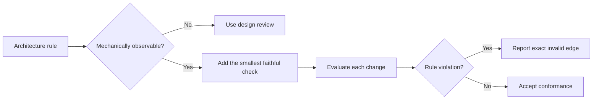

# P020 — Executable Architecture

## Definition

Encode important architectural constraints in mechanisms that can evaluate the implementation.
Possible mechanisms include tests, type systems, schemas, static analysis, dependency rules, CI
policy, and runtime guards.

Documentation explains intent. Executable checks detect drift.

**Aliases:** architecture fitness functions, architecture tests, automated architecture
governance.

## Provenance

**Classification:** practitioner heuristic.

This architectural technique has no single verified origin. Ford, Parsons, and Kua popularized
architecture fitness functions as part of evolutionary architecture. Earlier tools also enforced
dependency and conformance rules.

## Decision rule

Add the smallest reliable check when a mechanically observable architecture violation can create
material risk. Place the check at the closest practical feedback boundary.

## How to apply

- Select a few important qualities or dependency rules.
- Choose the least costly faithful mechanism, such as a compiler, linter, test, or CI check.
- Make failure output identify the violated rule and the relevant dependency or artifact.
- Add the rule and its check in the same change.
- Revise the check after an intentional architecture change. Revise the rule and implementation in
  the same change.

## Diagram



## Language examples

The two examples make the same dependency direction an executable rule.

Python:

```python
ALLOWED = {("api", "domain"), ("storage", "domain")}

def dependency_allowed(source: str, target: str) -> bool:
    return (source, target) in ALLOWED

def test_domain_cannot_depend_on_api() -> None:
    assert not dependency_allowed("domain", "api")
```

Rust:

```rust
const ALLOWED: [(&str, &str); 2] = [("api", "domain"), ("storage", "domain")];

fn dependency_allowed(source: &str, target: &str) -> bool {
    ALLOWED.contains(&(source, target))
}

#[test]
fn domain_cannot_depend_on_api() {
    assert!(!dependency_allowed("domain", "api"));
}
```

## Boundaries and tensions

Not every architectural property is computable. A proxy metric can reward poor behavior or reject
sound designs. Human review must assess semantics and trade-offs.

Avoid prose-string tests, snapshot inventories, and brittle dependency rules. Such checks freeze
incidental layout instead of a consumer-relevant boundary.

## Examples

### Positive application

A dependency test rejects imports from the domain layer into transport adapters. It reports the
exact invalid edge. The architecture document explains why the direction matters.

### Misuse or counterexample

A test requires a specific document heading and claims to enforce modularity. The test freezes
words but does not check architectural behavior.

### Athena or agent workflow

Athena's validator finds canonical skill entry points and rejects host-specific skill mirrors. The
repository policy explains the boundary. The validator prevents distribution drift.

## Related principles

- [P019 — Explicit Contracts](p019-explicit-contracts.md)
- [P021 — Evolutionary and Reversible Design](p021-evolutionary-and-reversible-design.md)
- [P027 — Deterministic and Hermetic Tests](p027-deterministic-and-hermetic-tests.md)

## References

### Origin and history

- [Ford, Parsons, and Kua, *Building Evolutionary Architectures*, second-edition sample](https://www.thoughtworks.com/content/dam/thoughtworks/documents/books/bk_building_evolutionary_architectures_second_edition_free_chapter.pdf)
  explains fitness functions as objective checks for architectural change.

### Current guidance

- [ArchUnit User Guide](https://www.archunit.org/userguide/html/000_Index.html)
  documents executable dependency, layer, cycle, and custom architecture rules for Java systems.
- [SEI, "Software Architecture"](https://www.sei.cmu.edu/software-architecture/)
  describes conformance analysis and repeated fitness evaluation as architecture practices.

### Further reading

- [Thoughtworks, *Building Evolutionary Architectures* sample chapter](https://www.thoughtworks.com/content/dam/thoughtworks/documents/books/bk_building_evolutionary_architectures_en.pdf)
  surveys automated and manual fitness functions and their trade-offs.

[Back to the engineering principles catalog](../README.md#p020)
