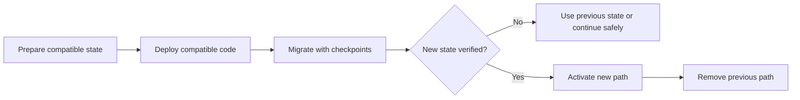

# P021 — Evolutionary and Reversible Design

## Definition

Change a system through incremental, behavior-preserving, and migration-safe steps. Keep a tested
method to use the previous state again or continue to a safe state.

During a transition, compatible versions can operate together. Use evidence from small
changes, not evidence from one large rewrite.

**Aliases:** evolutionary design, incremental architecture, reversible change.

## Provenance

**Classification:** Athena synthesis.

Sources for this synthesis include evolutionary design, continuous delivery, expand-and-contract
migrations, and restoration practices. No one source gives the full principle.

## Decision rule

Select the smallest sequence of verifiable changes. Each change must preserve service. Until
verification of the new state succeeds, keep a tested recovery path.

## How to apply

- Divide work at compatibility boundaries. Keep each merged state operational.
- When risks are different, use different steps for preparation, activation, migration, and cleanup.
- When evidence shows a compatibility risk, use additive schema changes, dual reads, dual writes,
  feature controls, or adapters.
- Before activation of a risky change, give restoration or forward recovery.
- After evidence shows that there are no consumers, remove transition mechanisms.

## Diagram



## Language examples

The two examples accept previous and new names during one compatible migration period.

Python:

```python
def read_name(old_name: str, new_name: str | None) -> str:
    return new_name if new_name is not None else old_name


def write_names(value: str) -> tuple[str, str]:
    return value, value
```

Rust:

```rust
fn read_name<'a>(old_name: &'a str, new_name: Option<&'a str>) -> &'a str {
    new_name.unwrap_or(old_name)
}

fn write_names(value: String) -> (String, String) {
    (value.clone(), value)
}
```

## Boundaries and tensions

Reversibility has costs and limits. A legal notice, secret disclosure, resource consumption, or destructive
migration can prevent reversal. Find each irreversible point and put it near the end of the
sequence.

Do not keep compatibility without a specified end or dual-write complexity for a small local change.
If the previous version is safe and has a low restoration cost, use that version again.

## Examples

### Positive application

A schema change first adds a nullable column. Compatible readers and writers accept each version. A
checkpoint process migrates the data.

The team selects the new column only after validation. The team removes the previous column in the
last step.

### Misuse or counterexample

A team says that a flag-protected rewrite is reversible. But activation converts all stored data to a
format that the previous release cannot read.

### Athena or agent workflow

An agent makes one small change and runs the repository gate. After verification of the artifact and
its targets succeeds, the agent publishes only with applicable authority. Without user approval, it
does not do destructive cleanup. After user approval, it uses the guarded tidy workflow.

## Related principles

- [P020 — Executable Architecture](p020-executable-architecture.md)
- [P026 — Regression Before Repair](p026-regression-before-repair.md)
- [P027 — Deterministic and Hermetic Tests](p027-deterministic-and-hermetic-tests.md)

## References

### Source information

- [Fowler, "Original Strangler Fig Application" (2004)](https://martinfowler.com/bliki/OriginalStranglerFigApplication.html)
  gives replacement in steps around a legacy system, without one cutover rewrite.

### Applicable information

- [Google Engineering Practices, "Small CLs"](https://google.github.io/eng-practices/review/developer/small-cls.html)
  gives an explanation of how small changes simplify work.

### More information

- [Ford, Parsons, and Kua, *Building Evolutionary Architectures*, second-edition sample](https://www.thoughtworks.com/content/dam/thoughtworks/documents/books/bk_building_evolutionary_architectures_second_edition_free_chapter.pdf)
  gives evolutionary architecture as guided, incremental change across more than one dimension.

[Back to the engineering principles catalog](../README.md#p021)
