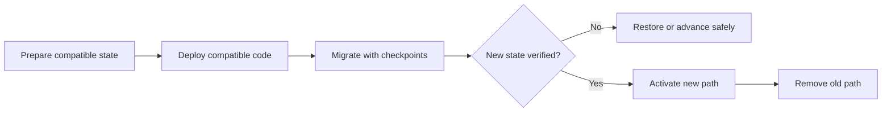

# P021 — Evolutionary and Reversible Design

## Definition

Change a system through incremental, behavior-preserving, and migration-safe steps. Maintain a
practical method to restore the prior state or advance to a safe state.

Compatible versions can coexist during a transition when necessary. Prefer evidence from small
changes to one large rewrite.

**Aliases:** evolutionary design, incremental architecture, reversible change.

## Provenance

**Classification:** Athena synthesis.

This synthesis has practitioner roots in evolutionary design, continuous delivery,
expand-and-contract migrations, and restoration practices. No single source defines this exact
combined principle.

## Decision rule

Choose the smallest sequence of independent, verifiable changes that preserves service. Maintain
a tested recovery path until evidence proves the new state.

## How to apply

- Divide work at compatibility boundaries. Keep every merged state usable.
- Separate preparation, activation, migration, and cleanup when risks differ.
- Use additive schema changes, dual reads, dual writes, feature controls, or adapters when evidence
  justifies them.
- Define restoration or forward recovery before activation of a risky change.
- Remove transition mechanisms after evidence confirms that no consumer remains.

## Diagram



## Language examples

The two examples support old and new names during one compatible migration period.

Python:

```python
def read_name(old_name: str, new_name: str | None) -> str:
    return new_name if new_name is not None else old_name


def write_names(value: str) -> tuple[str, str]:
    return value, value
```

Rust:

```rust
fn read_name<'a>(old_name: &'a str, new_name: Option<&'a str>) -> &'a str {
    new_name.unwrap_or(old_name)
}

fn write_names(value: String) -> (String, String) {
    (value.clone(), value)
}
```

## Boundaries and tensions

Reversibility has costs and limits. A legal notice, secret disclosure, resource use, or destructive
migration can prevent reversal. Identify each irreversible point and place it late in the sequence.

Do not retain indefinite compatibility or dual-write complexity for a cheap local change. Restore
the prior version when that option is safe and simple.

## Examples

### Positive application

A schema change first adds a nullable column. Compatible readers and writers accept each version. A
checkpoint process migrates the data.

The team selects the new column only after validation. The team removes the old column last.

### Misuse or counterexample

A team calls a flag-protected rewrite reversible. However, activation converts all stored data to a
format that the old release cannot read.

### Athena or agent workflow

An agent makes one focused change and runs the repository gate. The agent delays publication or
destructive cleanup until verification confirms the artifact and targets.

## Related principles

- [P020 — Executable Architecture](p020-executable-architecture.md)
- [P026 — Regression Before Repair](p026-regression-before-repair.md)
- [P027 — Deterministic and Hermetic Tests](p027-deterministic-and-hermetic-tests.md)

## References

### Origin and history

- [Fowler, "Original Strangler Fig Application" (2004)](https://martinfowler.com/bliki/OriginalStranglerFigApplication.html)
  describes gradual replacement around a legacy system instead of one cutover rewrite.

### Current guidance

- [Google Engineering Practices, "Small CLs"](https://google.github.io/eng-practices/review/developer/small-cls.html)
  explains why self-contained changes simplify review, validation, merge, and restoration.

### Further reading

- [Ford, Parsons, and Kua, *Building Evolutionary Architectures*, second-edition sample](https://www.thoughtworks.com/content/dam/thoughtworks/documents/books/bk_building_evolutionary_architectures_second_edition_free_chapter.pdf)
  presents evolutionary architecture as guided, incremental change across multiple dimensions.

[Back to the engineering principles catalog](../README.md#p021)
