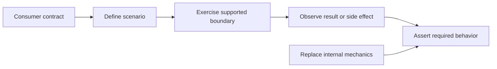

# P022 — Test Behavior, Not Implementation

## Definition

Assert the observable contract of the tested system. Do not assert private methods, incidental data
structures, exact internal call sequences, or other replaceable mechanics.

If a refactor preserves behavior, its behavior tests usually remain unchanged.

**Aliases:** black-box-oriented testing, implementation-agnostic testing.

## Provenance

**Classification:** practitioner heuristic.

Consumer and provider contract testing is a related but distinct technique. It is not an alias for
this broader heuristic.

Black-box testing predates modern unit test frameworks. Many test communities developed advice
against implementation-detail tests. No single origin defines this formulation.

## Decision rule

Assert what a caller or user can observe under the contract. Assert an internal interaction only
when the contract requires that interaction.

## How to apply

- Name the scenario and expected result before you select an assertion.
- Exercise a public or supported boundary at the narrowest useful level.
- Observe return values, durable state, emitted events, or specified side effects.
- Use fakes or stubs to control dependencies. Do not specify irrelevant call sequences.
- Retain structural tests only for real constraints such as dependency direction or security.

## Diagram



## Language examples

The two tests assert stable order without inspection of the sort implementation.

Python:

```python
def order_records(records: list[tuple[str, int]]) -> list[tuple[str, int]]:
    return sorted(records, key=lambda record: record[1])

def test_order_is_stable() -> None:
    records = [("first", 2), ("second", 1), ("third", 2)]
    assert order_records(records) == [("second", 1), ("first", 2), ("third", 2)]
```

Rust:

```rust
fn order_records(records: &mut Vec<(&str, u32)>) {
    records.sort_by_key(|record| record.1);
}

#[test]
fn order_is_stable() {
    let mut records = vec![("first", 2), ("second", 1), ("third", 2)];
    order_records(&mut records);
    assert_eq!(records, vec![("second", 1), ("first", 2), ("third", 2)]);
}
```

## Boundaries and tensions

A consumer defines observable behavior. An audit event, transaction boundary, or idempotency key
can be an observable obligation. An end user does not need direct access to that obligation.

Black-box system tests alone can be slow and imprecise. Combine test levels. Preserve exact output
assertions when the output format is the contract.

## Examples

### Positive application

A sort test supplies records and asserts documented order and stability. It does not inspect the
sort algorithm or its temporary collection.

### Misuse or counterexample

A test mocks every collaborator and requires an exact sequence of private calls. A safe refactor
combines two internal steps, and the test fails.

### Athena or agent workflow

A helper test asserts exit status, structured output, and file effects. It does not require exact
log sentences or private function names.

## Related principles

- [P023 — Parameterized / Table-Driven Testing](p023-parameterized-table-driven-testing.md)
- [P026 — Regression Before Repair](p026-regression-before-repair.md)
- [P027 — Deterministic and Hermetic Tests](p027-deterministic-and-hermetic-tests.md)

## References

### Origin and history

- [Fowler, "Mocks Aren't Stubs" (2007)](https://martinfowler.com/articles/mocksArentStubs.html)
  analyzes state verification, interaction verification, and refactor costs from coupled
  expectations.

### Current guidance

- [Microsoft, ".NET unit testing best practices"](https://learn.microsoft.com/en-us/dotnet/core/testing/unit-testing-best-practices)
  recommends tests of public behavior and resilient tests that treat private methods as details.
- [Testing Library, "Guiding Principles"](https://testing-library.com/docs/guiding-principles/)
  bases UI tests on actual software use instead of component internals.

### Further reading

- [Google Engineering Practices, "What to look for in a code review"](https://google.github.io/eng-practices/review/reviewer/looking-for.html)
  asks reviewers to confirm that tests detect broken behavior and remain simple.

[Back to the engineering principles catalog](../README.md#p022)
