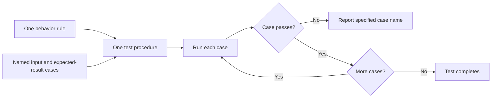

# P023 — Parameterized / Table-Driven Testing

## Definition

Put one behavior rule in one test procedure. Apply that rule to more than one named case with inputs, expected
results, and related context.

This structure uses one test procedure for its examples.

**Aliases:** data-driven tests, test tables, parameterized tests, theories.

## Provenance

**Classification:** established principle.

Test frameworks and language communities used data-driven tests before the tools available today. The name
is applicable to two forms. No one source started the method.

## Decision rule

When cases are different mainly because of data, use one clear test procedure. Give each case its
own name.

## How to apply

- Give each case a diagnostic name that gives the case condition.
- Store explicit expected results. Do not calculate them with production logic.
- Include usual, nondefault, empty, missing, rejected, and boundary cases.
- Keep setup and assertions small for each case. Use a different test for cases that apply a
  different rule.
- Isolate mutable case data. Make each failure identify the specified case.

## Diagram



## Language examples

The two examples apply one normalization rule to the same named cases.

Python:

```python
def normalize(value: str) -> str:
    return value.strip().lower()

def test_normalize_cases() -> None:
    cases = [("trim", " Yes ", "yes"), ("case", "NO", "no"), ("empty", " ", "")]
    for name, given, expected in cases:
        assert normalize(given) == expected, name
```

Rust:

```rust
fn normalize(value: &str) -> String {
    value.trim().to_lowercase()
}

#[test]
fn normalize_cases() {
    let cases = [("trim", " Yes ", "yes"), ("case", "NO", "no"), ("empty", " ", "")];
    for (name, given, expected) in cases {
        assert_eq!(normalize(given), expected, "{name}");
    }
}
```

## Boundaries and tensions

When cases use different workflows or many conditional fields, a large table can hide the test objective.
Do not put different integration scenarios in one loop only to remove lines.

Parameterization adds coverage for selected examples. It does not include all inputs. It does not
replace property tests or boundary analysis.

## Examples

### Positive application

A parser test uses one public operation for some named cases. Cases include a usual value,
whitespace, empty input, malformed syntax, and maximum length.

### Misuse or counterexample

One table contains flags that select different setup, invocation, and assertion branches. The test
loop becomes a second implementation that is not easy to understand.

### Athena or agent workflow

A validator uses named cases for accepted frontmatter, a missing field, an unknown field, and malformed
YAML. Each case uses one invocation and result check.

## Related principles

- [P022 — Test Behavior, Not Implementation](p022-test-behavior-not-implementation.md)
- [P024 — Boundary-Value Testing](p024-boundary-value-testing.md)
- [P025 — Property-Based Testing for Invariants](p025-property-based-testing-for-invariants.md)

## References

### Source information

- [Go project, "TableDrivenTests"](https://go.dev/wiki/TableDrivenTests)
  records the Go practice of shared test logic with full named case data.

### Applicable information

- [pytest, "How to parametrize fixtures and test functions"](https://docs.pytest.org/en/stable/how-to/parametrize.html)
  gives parameter sets, generated cases, fixtures, and per-case marks.
- [JUnit User Guide, "Parameterized Classes and Tests"](https://docs.junit.org/current/writing-tests/parameterized-classes-and-tests.html)
  gives parameter sources, argument conversion, and named invocations.

### More information

- [Microsoft, ".NET unit testing best practices"](https://learn.microsoft.com/en-us/dotnet/core/testing/unit-testing-best-practices)
  shows the difference between duplicate test logic and named input and expected-result cases.

[Back to the engineering principles catalog](../README.md#p023)
