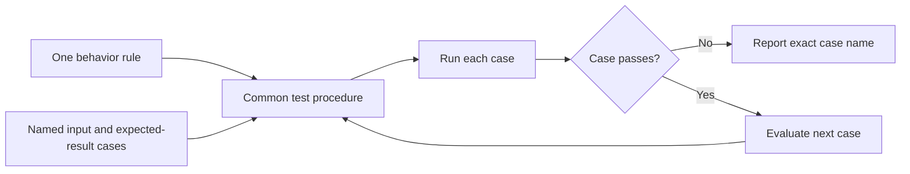

# P023 — Parameterized / Table-Driven Testing

## Definition

Express one behavior rule once. Apply that rule to multiple named cases with inputs, expected
results, and relevant context.

This structure separates the common test procedure from its examples.

**Aliases:** data-driven tests, test tables, parameterized tests, theories.

## Provenance

**Classification:** established principle.

Data-driven tests appeared in several early frameworks and language communities. The combined name
describes two common forms. It has no single verified origin.

## Decision rule

Use one clear test procedure when cases differ mainly in data. Give each case an independent name.

## How to apply

- Give every case a diagnostic name that states its distinct condition.
- Store explicit expected results. Do not calculate them with production logic.
- Include representative normal, nondefault, empty, missing, invalid, and boundary cases.
- Keep setup and assertions small for each case. Separate cases that express another rule.
- Isolate mutable case data. Make each failure identify the exact case.

## Diagram



## Language examples

The two examples apply one normalization rule to the same named cases.

Python:

```python
def normalize(value: str) -> str:
    return value.strip().lower()

def test_normalize_cases() -> None:
    cases = [("trim", " Yes ", "yes"), ("case", "NO", "no"), ("empty", " ", "")]
    for name, given, expected in cases:
        assert normalize(given) == expected, name
```

Rust:

```rust
fn normalize(value: &str) -> String {
    value.trim().to_lowercase()
}

#[test]
fn normalize_cases() {
    let cases = [("trim", " Yes ", "yes"), ("case", "NO", "no"), ("empty", " ", "")];
    for (name, given, expected) in cases {
        assert_eq!(normalize(given), expected, "{name}");
    }
}
```

## Boundaries and tensions

A large table can conceal intent when cases require different workflows or many conditional fields.
Do not force different integration scenarios into one loop only to remove lines.

Parameterization adds coverage for selected examples. It is not exhaustive. It does not replace
property tests or boundary analysis.

## Examples

### Positive application

A parser test uses one public operation for several named cases. Cases cover a normal value,
whitespace, empty input, malformed syntax, and maximum length.

### Misuse or counterexample

One table contains flags that select different setup, invocation, and assertion branches. The test
loop becomes a second implementation that is difficult to understand.

### Athena or agent workflow

A validator uses named cases for valid frontmatter, a missing field, an unknown field, and malformed
YAML. Every case uses one invocation and result check.

## Related principles

- [P022 — Test Behavior, Not Implementation](p022-test-behavior-not-implementation.md)
- [P024 — Boundary-Value Testing](p024-boundary-value-testing.md)
- [P025 — Property-Based Testing for Invariants](p025-property-based-testing-for-invariants.md)

## References

### Origin and history

- [Go project, "TableDrivenTests"](https://go.dev/wiki/TableDrivenTests)
  records the established Go practice of separate test logic and full named cases.

### Current guidance

- [pytest, "How to parametrize fixtures and test functions"](https://docs.pytest.org/en/stable/how-to/parametrize.html)
  documents parameter sets, generated cases, fixtures, and per-case marks.
- [JUnit User Guide, "Parameterized Classes and Tests"](https://docs.junit.org/current/writing-tests/parameterized-classes-and-tests.html)
  documents parameter sources, argument conversion, and named invocations.

### Further reading

- [Microsoft, ".NET unit testing best practices"](https://learn.microsoft.com/en-us/dotnet/core/testing/unit-testing-best-practices)
  contrasts duplicate test logic with named input and expected-result cases.

[Back to the engineering principles catalog](../README.md#p023)
