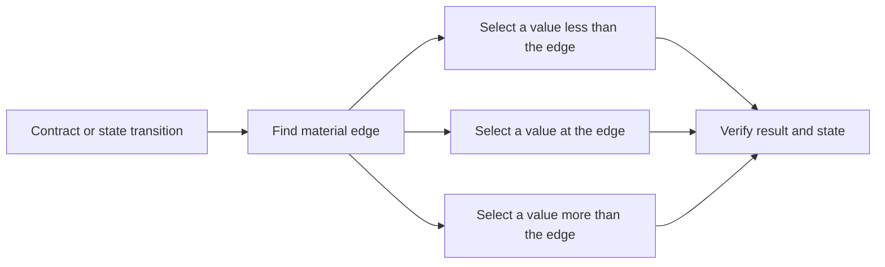

# P024 — Boundary-Value Testing

## Definition

Exercise values at and near transitions, limits, and equivalence partition edges. Defects frequently
occur where behavior changes.

Applicable cases include values less than, equal to, and more than a threshold. Also include zero,
one, empty, full, minimum, maximum, overflow, and rejected states.

**Aliases:** boundary value analysis, limit testing, edge testing.

## Provenance

**Classification:** established principle.

Boundary value analysis has a long history in software test literature and certification syllabi.
Evidence does not give one author as the first person to apply this analysis. Athena gives no first author.

## Decision rule

For each input partition or state transition with a material edge, select cases on each side and
at the edge. Include representations that can overflow or become empty.

## How to apply

- Use contracts, types, protocols, resource limits, and state transitions to find boundaries.
- When the contract has last accepted, first rejected, and transition values, test them.
- When evidence shows an interaction, include adjacent boundary combinations.
- After rejection, verify returned behavior and state preservation.
- When examples cannot include the boundary space, use generated or combinatorial methods.

## Diagram



## Language examples

The two examples verify the same values less than the minimum, at the limits, and more than the
maximum.

Python:

```python
def accepts_batch(size: int) -> bool:
    return 0 <= size <= 100

def test_batch_boundaries() -> None:
    cases = [(-1, False), (0, True), (99, True), (100, True), (101, False)]
    for size, expected in cases:
        assert accepts_batch(size) is expected
```

Rust:

```rust
fn accepts_batch(size: i32) -> bool {
    (0..=100).contains(&size)
}

#[test]
fn batch_boundaries() {
    let cases = [(-1, false), (0, true), (99, true), (100, true), (101, false)];
    for (size, expected) in cases {
        assert_eq!(accepts_batch(size), expected);
    }
}
```

## Boundaries and tensions

Tests must use boundary values from correct partitions. Boundary tests do not replace
usual values between boundaries, semantic invariants, failure injection, or security
abuse cases.

Do not apply `n - 1`, `n`, and `n + 1` without domain analysis. A continuous, wrapped, or encoded
domain can make a different definition of adjacency necessary.

## Examples

### Positive application

A batch limit lets a request contain 100 items. Tests include 0, 1, 99, 100, and 101 items. The rejection test
shows that rejection cannot write only part of the batch.

### Misuse or counterexample

A test includes the maximum integer but ignores the API unit. The API applies its limit after UTF-8
encoding. Character count and byte count can be different.

### Athena or agent workflow

A bounded workflow test includes zero iterations, one iteration, the configured maximum, and one
iteration more than the maximum. That case must give a clear terminal failure.

## Related principles

- [P023 — Parameterized / Table-Driven Testing](p023-parameterized-table-driven-testing.md)
- [P025 — Property-Based Testing for Invariants](p025-property-based-testing-for-invariants.md)
- [P028 — Test Failure Paths, Not Just Success Paths](p028-test-failure-paths.md)

## References

### Source information

- [NIST, "Fault Classes and Error Detection in Specification Based Testing" (1998)](https://www.nist.gov/publications/fault-classes-and-error-detection-specification-based-testing)
  examines specification conditions that can show specified fault classes.

### Applicable information

- [ISTQB Certified Tester Foundation Level Syllabus v4.0.1](https://istqb.org/wp-content/uploads/2024/11/ISTQB_CTFL_Syllabus_v4.0.1.pdf)
  gives two-value and three-value analysis at and near equivalence partition boundaries.

### More information

- [NIST, "Software Fault Complexity and Implications for Software Testing"](https://www.nist.gov/publications/software-fault-complexity-and-implications-software-testing)
  gives evidence for coverage of interactions in a small group of conditions.

[Back to the engineering principles catalog](../README.md#p024)
