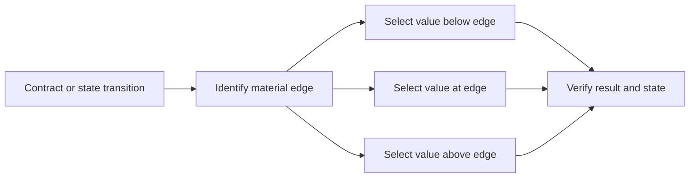

# P024 — Boundary-Value Testing

## Definition

Exercise values at and near transitions, limits, and equivalence partition edges. Defects often
occur where behavior changes.

Relevant cases include values below, at, and above a threshold. Also consider zero, one, empty,
full, minimum, maximum, overflow, and invalid states.

**Aliases:** boundary value analysis, limit testing, edge testing.

## Provenance

**Classification:** established principle.

Boundary value analysis has a long history in software test literature and certification syllabi.
Evidence does not attribute its first use to one author. Athena makes no origin claim.

## Decision rule

For each input partition or state transition with a material edge, select cases on each side and
at the edge. Include representations that can overflow or become empty.

## How to apply

- Derive boundaries from contracts, types, protocols, resource limits, and state transitions.
- Test the last accepted, first rejected, and exact transition values when they exist.
- Include adjacent boundary combinations when their interaction is plausible.
- Verify returned behavior and state preservation after rejection.
- Use generated or combinatorial methods when examples cannot cover the boundary space.

## Diagram



## Language examples

The two examples verify the same cases below, at, and above the accepted range.

Python:

```python
def accepts_batch(size: int) -> bool:
    return 0 <= size <= 100

def test_batch_boundaries() -> None:
    cases = [(-1, False), (0, True), (99, True), (100, True), (101, False)]
    for size, expected in cases:
        assert accepts_batch(size) is expected
```

Rust:

```rust
fn accepts_batch(size: i32) -> bool {
    (0..=100).contains(&size)
}

#[test]
fn batch_boundaries() {
    let cases = [(-1, false), (0, true), (99, true), (100, true), (101, false)];
    for (size, expected) in cases {
        assert_eq!(accepts_batch(size), expected);
    }
}
```

## Boundaries and tensions

Correct partitions determine the value of boundary tests. Boundary tests do not replace
representative interior cases, semantic invariants, failure injection, or security abuse cases.

Do not apply `n - 1`, `n`, and `n + 1` without domain analysis. A continuous, wrapped, or encoded
domain can require another definition of adjacency.

## Examples

### Positive application

A batch limit permits 100 items. Tests cover 0, 1, 99, 100, and 101 items. The rejection test
confirms that 101 items cause no partial write.

### Misuse or counterexample

A test covers the maximum integer but ignores the API unit. The API applies its limit after UTF-8
encoding. Character count and byte count can differ.

### Athena or agent workflow

A bounded workflow test covers zero iterations, one iteration, the configured maximum, and one
excess iteration. The excess case must produce a clear terminal failure.

## Related principles

- [P023 — Parameterized / Table-Driven Testing](p023-parameterized-table-driven-testing.md)
- [P025 — Property-Based Testing for Invariants](p025-property-based-testing-for-invariants.md)
- [P028 — Test Failure Paths, Not Just Success Paths](p028-test-failure-paths.md)

## References

### Origin and history

- [NIST, "Fault Classes and Error Detection in Specification Based Testing" (1998)](https://www.nist.gov/publications/fault-classes-and-error-detection-specification-based-testing)
  examines specification conditions that can expose specific fault classes.

### Current guidance

- [ISTQB Certified Tester Foundation Level Syllabus v4.0.1](https://istqb.org/wp-content/uploads/2024/11/ISTQB_CTFL_Syllabus_v4.0.1.pdf)
  defines two-value and three-value analysis around equivalence partition boundaries.

### Further reading

- [NIST, "Software Fault Complexity and Implications for Software Testing"](https://www.nist.gov/publications/software-fault-complexity-and-implications-software-testing)
  provides evidence for systematic coverage of interactions among a small number of conditions.

[Back to the engineering principles catalog](../README.md#p024)
