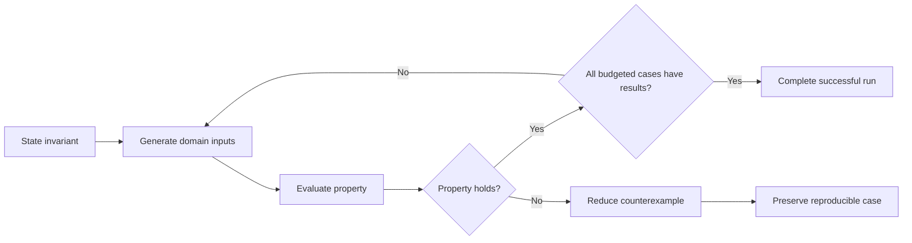

# P025 — Property-Based Testing for Invariants

## Definition

State behavior as properties that must hold across a broad input domain. Generate many inputs and
reduce each failure to a small counterexample.

Parsers, serializers, algorithms, transformations, protocols, and state machines often benefit
from this method.

**Aliases:** generative property testing, QuickCheck-style testing.

## Provenance

**Classification:** established principle.

Random tests and specification-based generators predate QuickCheck. The 2000 paper by Claessen and
Hughes established the modern library pattern of generators, properties, and shrinking.

## Decision rule

Encode an invariant when it states correctness more generally than example cases. Generate valid
and invalid inputs from the real domain. Preserve reproducible failures.

## How to apply

- State a meaningful property such as round-trip equivalence, order, conservation, or a state
  invariant.
- Create generators that represent the domain and include difficult shapes.
- Define invalid combinations directly. Do not discard most generated inputs.
- Reduce each failure to a small counterexample. Preserve useful counterexamples as regression
  cases.
- Record seeds and control external state so each failure remains reproducible.

## Diagram



## Language examples

The two examples generate integer sequences and verify the same reverse round-trip property.

Python:

```python
from hypothesis import given
from hypothesis import strategies as st

@given(st.lists(st.integers()))
def test_reverse_round_trip(value: list[int]) -> None:
    encoded = list(reversed(value))
    assert list(reversed(encoded)) == value
```

Rust:

```rust
use proptest::prelude::*;

proptest! {
    #[test]
    fn reverse_round_trip(value in proptest::collection::vec(any::<i32>(), 0..100)) {
        let encoded: Vec<_> = value.iter().rev().copied().collect();
        let decoded: Vec<_> = encoded.iter().rev().copied().collect();
        prop_assert_eq!(decoded, value);
    }
}
```

## Boundaries and tensions

High case volume cannot correct a weak property or biased generator. Property tests complement
named examples, boundary cases, proofs, fuzz tests, and integration tests.

Do not restate the implementation as the oracle. A finite successful run does not prove a property
over an unbounded domain.

## Examples

### Positive application

A serializer property generates valid domain values. It verifies that decode after encode returns
an equivalent value. Each failure reports a small, reproducible counterexample.

### Misuse or counterexample

A sort property checks only output length. An implementation can return repeated copies of one
element and still pass this weak property.

### Athena or agent workflow

A parser helper generates valid frontmatter maps with different key orders. The property verifies
the same normalized contract without undeclared file or network access.

## Related principles

- [P022 — Test Behavior, Not Implementation](p022-test-behavior-not-implementation.md)
- [P024 — Boundary-Value Testing](p024-boundary-value-testing.md)
- [P027 — Deterministic and Hermetic Tests](p027-deterministic-and-hermetic-tests.md)

## References

### Origin and history

- [Claessen and Hughes, "QuickCheck: A Lightweight Tool for Random Testing of Haskell Programs" (2000)](https://doi.org/10.1145/351240.351266)
  introduced the influential generator and property library design.

### Current guidance

- [Hypothesis documentation, API reference](https://hypothesis.readthedocs.io/en/latest/reference/api.html)
  documents generation, targeted exploration, stateful invariants, and shrinking controls.

### Further reading

- [Google XLS, "Exhaustive QuickCheck and fuzz tests"](https://google.github.io/xls/dslx_reference/#quickcheck)
  contrasts property generation, exhaustive checks for small domains, and coverage-guided fuzz
  tests.

[Back to the engineering principles catalog](../README.md#p025)
