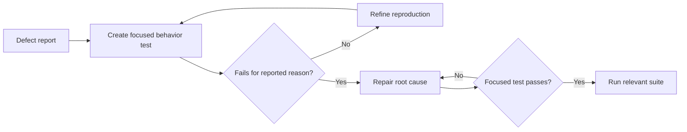

# P026 — Regression Before Repair

## Definition

When practical, create an automated test that reproduces a reported defect before you repair the
implementation. Confirm that the test fails for the reported reason.

After the repair, confirm that the test passes. Keep the test in the suite to detect recurrence.

**Aliases:** bug-reproduction test, failing regression test.

## Provenance

**Classification:** practitioner heuristic.

Regression tests predate automated unit test frameworks. Test-first defect repair is an established
technique in TDD and maintenance practice. This exact formulation has no verified single origin.

## Decision rule

Before a repair, capture the smallest supported behavior that reproduces the defect. Demonstrate
that the test fails against the unrepaired revision.

## How to apply

- Reproduce the symptom at the closest reliable test level.
- Run the new test before implementation work. Confirm the reason for its failure.
- Minimize the fixture, but preserve the defect condition.
- Repair the root cause. Then run the focused test and the relevant suite.
- Name the test for behavior so it remains useful after implementation changes.

## Diagram



## Language examples

The two examples preserve the same empty-input regression after the mean calculation repair.

Python:

```python
def mean(values: list[float]) -> float | None:
    if not values:
        return None
    return sum(values) / len(values)

def test_empty_input_returns_none() -> None:
    assert mean([]) is None
```

Rust:

```rust
fn mean(values: &[f64]) -> Option<f64> {
    if values.is_empty() {
        return None;
    }
    Some(values.iter().sum::<f64>() / values.len() as f64)
}

#[test]
fn empty_input_returns_none() {
    assert_eq!(mean(&[]), None);
}
```

## Boundaries and tensions

"When practical" matters. Production containment, destructive failures, nondeterministic races,
or unavailable dependencies can require immediate safe mitigation. Use a model-based reproduction
when direct reproduction is unsafe.

Do not write a test that copies the defective implementation or requires an accidental symptom. A
test that exists only after repair gives weaker evidence. Its sensitivity to the original defect
remains unverified.

A regression test is RED on the unrepaired revision and GREEN after repair. A characterization
test starts GREEN and records existing behavior before a behavior-preserving refactor. These tests
have related but distinct purposes.

## Examples

### Positive application

A parser report includes one malformed input. A focused public API test first reproduces the
exception. The test passes after the parser returns the documented structured error.

### Misuse or counterexample

A developer adds a test after the code change. The test passes on each revision. It does not prove
regression sensitivity.

### Athena or agent workflow

An agent records the failed command and output. The agent makes the minimal repair and reruns that
test. Then the agent runs the repository gate.

## Related principles

- [P021 — Evolutionary and Reversible Design](p021-evolutionary-and-reversible-design.md)
- [P022 — Test Behavior, Not Implementation](p022-test-behavior-not-implementation.md)
- [P027 — Deterministic and Hermetic Tests](p027-deterministic-and-hermetic-tests.md)
- [P091 — Test-Driven Development](p091-test-driven-development.md)

## References

### Origin and history

- [Beck, *Test-Driven Development: By Example* (2002)](https://www.pearson.com/en-us/subject-catalog/p/Beck-Test-Driven-Development-By-Example/P200000009421/9780321146533)
  established a widely used test-first cycle that also applies to defect repair.

### Current guidance

- [Google Engineering Practices, "Small CLs"](https://google.github.io/eng-practices/review/developer/small-cls.html)
  recommends tests for behavior changes and missing behavioral coverage before a refactor.

### Further reading

- [Microsoft, ".NET unit testing best practices"](https://learn.microsoft.com/en-us/dotnet/core/testing/unit-testing-best-practices)
  explains regression protection and repeatable, self-checking tests.

[Back to the engineering principles catalog](../README.md#p026)
