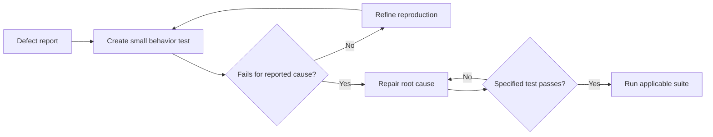

# P026 — Regression Before Repair

## Definition

If safe defect reproduction is possible before implementation repair, add an automated test.
Make sure that the test fails for the reported cause.

After the repair, make sure that the test passes. Keep the test in the suite to detect recurrence.

**Aliases:** bug-reproduction test, failing regression test.

## Provenance

**Classification:** practitioner heuristic.

Automated unit test frameworks followed regression tests. Test-first defect repair is a method in
TDD and maintenance practice. No one source first gave this formulation.

## Decision rule

Before a repair, capture the smallest contract behavior that reproduces the defect. Make sure
that the unrepaired revision causes the test to fail.

## How to apply

- Reproduce the symptom at the nearest stable test level.
- Before implementation work, run the new test. Make sure that it fails for the reported cause.
- Use the smallest fixture that reproduces the defect.
- Preserve the defect condition.
- Repair the root cause. Then run the specified test and the applicable suite.
- Give the test a behavior name that continues to help after implementation changes.

## Diagram



## Language examples

The two examples preserve the same empty-input regression after the mean calculation repair.

Python:

```python
def mean(values: list[float]) -> float | None:
    if not values:
        return None
    return sum(values) / len(values)

def test_empty_input_returns_none() -> None:
    assert mean([]) is None
```

Rust:

```rust
fn mean(values: &[f64]) -> Option<f64> {
    if values.is_empty() {
        return None;
    }
    Some(values.iter().sum::<f64>() / values.len() as f64)
}

#[test]
fn empty_input_returns_none() {
    assert_eq!(mean(&[]), None);
}
```

## Boundaries and tensions

Safe reproduction is not possible in each case. Production containment, destructive failures,
nondeterministic races, or unavailable dependencies can make safe mitigation necessary before reproduction.
When reproduction with the production dependency is not safe, use a model-based reproduction.

Do not write a test that copies the defective implementation or depends on an accidental symptom. A
test added only after repair gives weaker evidence. No evidence shows its sensitivity to the
reported defect.

A regression test is RED on the unrepaired revision and GREEN after repair. A characterization
test starts GREEN and records behavior before a behavior-preserving refactor. These tests have
related but different objectives.

## Examples

### Positive application

A parser report includes one malformed input. A small test of the public API first reproduces the
exception. The test passes after the parser returns the specified structured error.

### Misuse or counterexample

A developer adds a test after the code change. The test passes on each revision. It does not give
evidence of regression sensitivity.

### Athena or agent workflow

An agent records the failed command and output. The agent makes the smallest necessary repair. Then,
the agent runs that test again. If the test passes, the agent runs the repository gate.

## Related principles

- [P021 — Evolutionary and Reversible Design](p021-evolutionary-and-reversible-design.md)
- [P022 — Test Behavior, Not Implementation](p022-test-behavior-not-implementation.md)
- [P027 — Deterministic and Hermetic Tests](p027-deterministic-and-hermetic-tests.md)
- [P091 — Test-Driven Development](p091-test-driven-development.md)

## References

### Source information

- [Beck, *Test-Driven Development: By Example* (2002)](https://www.pearson.com/en-us/subject-catalog/p/Beck-Test-Driven-Development-By-Example/P200000009421/9780321146533)
  gives a widely used test-first cycle that also applies to defect repair.

### Applicable information

- [Google Engineering Practices, "Small CLs"](https://google.github.io/eng-practices/review/developer/small-cls.html)
  gives pre-refactor guidance for tests of behavior changes and missing behavioral coverage.

### More information

- [Microsoft, ".NET unit testing best practices"](https://learn.microsoft.com/en-us/dotnet/core/testing/unit-testing-best-practices)
  gives information about regression protection and repeatable, self-checking tests.

[Back to the engineering principles catalog](../README.md#p026)
